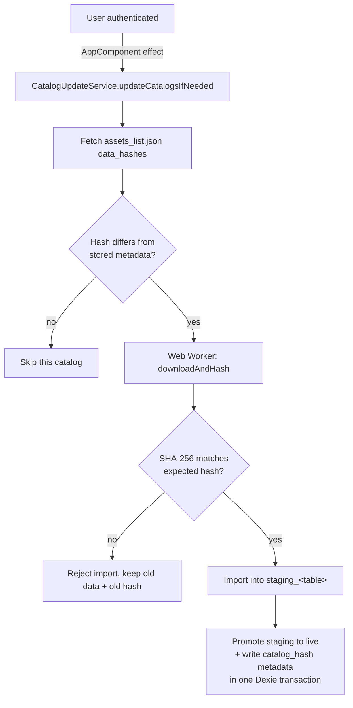

# Catalog Update Process

Catalog reference data (cables, chains, attachments, lines, maintenance teams,
obstacle configuration) is stored offline in Dexie/IndexedDB and refreshed by a
mechanism that is **independent from the application update** described in
[Application Update Process](application_update.md). Catalogs must keep
refreshing even if the user refuses (or has not yet accepted) an application
update, so nobody is stuck on stale reference data while waiting for a large
application bundle to download.

## Overview

Source files:

- `stellar/src/app/shared/catalog/services/catalog-update.service.ts` — orchestrator.
- `stellar/src/app/shared/catalog/csv-import/internal/verified-download.helpers.ts` — download + SHA-256 hashing.
- `stellar/src/app/shared/catalog/csv-import/internal/run-worker-import.helpers.ts` — staging import + atomic promotion.
- `stellar/src/app/infrastructure/database/app-database.versions.ts` — staging table schema (`STAGING_TABLE_PREFIX`).
- `stellar/scripts/create_assets_list_for_service_worker.py` — generates `data_hashes` in `assets_list.json`.

Catalog data files live in `stellar/public/data/*.csv` and
`stellar/public/data/obstacle_configuration.json`. They are excluded from the
application asset manifest (`files`) — the service worker never precaches or
downloads them (see [Application Update Process](application_update.md)) —
and instead get a per-file SHA-256 entry under `data_hashes` in
`assets_list.json`.

## Update mechanism

### 1. Trigger — after authentication only

`CatalogUpdateService.updateCatalogsIfNeeded()` is triggered once by
`AppComponent`, as soon as `AuthService.currentUser()` becomes truthy, ahead of
the application first-install/update-available logic. It is a strict no-op
(no network call, no import) while the user is not authenticated.

### 2. Hash comparison — only changed catalogs are downloaded

For each of the six catalogs (`maintenance-teams.csv`, `lines.csv`,
`cables.csv`, `chains.csv`, `attachments.csv`, `obstacle_configuration.json`),
the service compares the hash from `assets_list.json`'s `data_hashes` against
`metadata.get('catalog_hash:<filename>')` already stored in Dexie. A catalog is
only downloaded and imported when the hash is missing or different. If the
manifest exposes no `data_hashes` at all (legacy fallback), every catalog is
re-imported unconditionally.

### 3. Verified download — one fetch, incremental SHA-256

`downloadAndHash()` fetches the catalog exactly once (`cache: 'no-store'`),
feeding an incremental SHA-256 hasher (`hash-wasm`) chunk by chunk as the body
streams in, and returns both the raw `Blob` and the resulting hex digest. If
`expectedHash` is provided and does not match, the import is rejected
**before** anything is written to Dexie — the previous catalog data and its
recorded hash are left untouched.

### 4. Staging import, then atomic promotion

The verified content is parsed (PapaParse for CSV, `JSON.parse` for the
obstacle configuration) and written only into `staging_<table>` tables — never
directly into the live tables. Once staging is fully populated,
`promoteStagingToLive()` copies staging into the live table(s) in bounded
batches and writes `catalog_hash:<filename>` to `metadata`, all inside a
**single Dexie transaction**. A catalog's data and its recorded hash therefore
always change together, or not at all; a failed/interrupted import leaves the
previous catalog data fully usable offline.

### 5. Per-catalog isolation

A failure on one catalog (network error, hash mismatch, parse error) is logged
via `LoggerService` and surfaced to the user via `NotificationService`, but
never blocks the other catalogs from updating.

## Related documentation

- [Application Update Process](application_update.md) — service worker,
  versioned cache activation, and the three authorized update intents
  (`confirmUpdate`, `forceUpdateFromAdmin`, `installFirstLaunch`).
- [Offline Database](offline_database.md) — Dexie/`StorageService` conventions.
