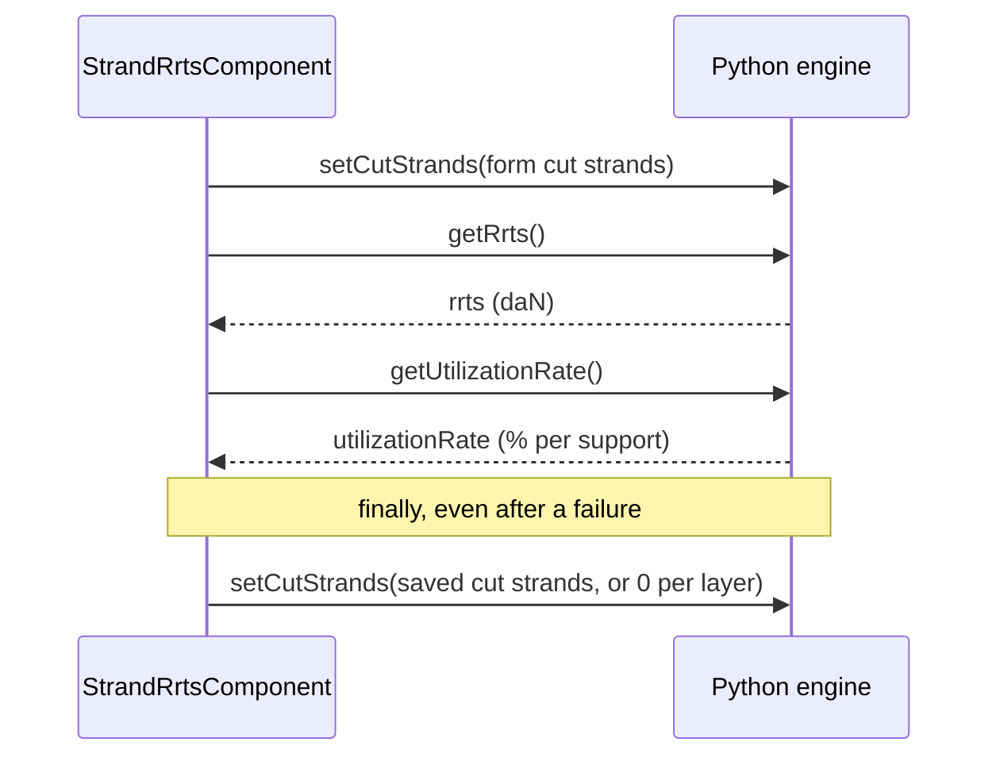

# RRTS cut strands — technical design

The **Strand RRTS** tool computes the residual rated tensile strength (RRTS) of the section's cable
once some of its strands are cut, and the max working load that follows. The user enters the cut
strands of each cable layer, the dialog runs the calculation in the Python engine, and a single
entry can be saved per section. Alongside it, the staff presence of the selected load case sets
the engine's **high safety**, which weighs on every working load the engine returns, the studio's
included.

---

## Key files at a glance

Paths are relative to `src/app/`, except `stellar-engine/`, relative to the repository root.

| File | Purpose |
|---|---|
| `features/studio/core/presentation/components/top-toolbar/top-toolbar.component.ts` | Entry point: **Strand RRTS** entry of the **Tools** menu |
| `features/studio/toolbar/presentation/services/toolbar-dialog.service.ts` | Registers the `'strand-rrts'` tool and hosts it in the toolbar dialog |
| `features/studio/toolbar/presentation/components/strand-rrts/strand-rrts.component.ts` | Dialog: form, calculation, save and delete, engine cut strands |
| `features/studio/toolbar/presentation/components/strand-rrts/strand-rrts.helpers.ts` | Status of the new max working load, and conversion of the form cut strands to the engine input and to the saved entry |
| `features/studio/toolbar/presentation/components/strand-rrts/strand-rrts.constantes.ts` | Form bounds and defaults, catalog keys of the strand counts, status icons |
| `features/studio/toolbar/presentation/components/strand-rrts/strand-rrts.interfaces.ts` | Types of the form value, the results and the status |
| `shared/domain/models/section.model.ts` | Saved entry, stored on the section |
| `core/services/section/section-geometry.helpers.ts` | `sanitizeSectionGeometry()` drops an entry whose span no longer exists |
| `core/services/plot/plot.service.ts` | High safety of the engine study |
| `core/services/worker_python/tasks/types.ts` | Task inputs and outputs |
| `core/services/worker_python/tasks/python-scripts/api.py` | Task entry points |
| `stellar-engine/src/stellar_engine/core/cut_strands.py` | Engine functions |

---

## Engine side

### The model

The calculation belongs to mechaphlowers: `CableArray` delegates it to its tensile strength model,
`AdditiveLayerRts`, which reads the cable catalog columns `rts_cable`, `rts_layer_1` to
`rts_layer_8`, `nb_strand_layer_1` to `nb_strand_layer_8` and `safety_coefficient`.

$$RRTS = RTS_{cable} - \sum_{i=1}^{8} cut\_strands_i \times rts\_layer_i$$

$$utilization\_rate_{span} = \frac{T_{max,span} \times safety\_coefficient}{RRTS} \times 100$$

- `safety_coefficient` falls back to `1.5` when the catalog has none. With high safety on, it is
  multiplied by `options.data.safety_security_factor` (`1.5`).
- The RRTS is global to the section: cut strands on one span lower the strength used for every
  span. This is why the span, reference support and distance of an entry take no part in the
  calculation.
- A missing `rts_cable`, or a missing `rts_layer_i` on a layer with cut strands, raises
  `RtsDataNotAvailable`.

The cut strands and the high safety are **state of the engine study**: they stay until set again,
and every later utilization rate uses them, `refreshProjection()`'s included. The engine study
created by `Task.initLit` starts with the mechaphlowers defaults, no cut strands and high safety
off, but the application applies the high safety of the selected load case right after: it is on
for a new study, which has no selected load case (see *High safety*).

### Tasks

Defined in `stellar_engine/core/cut_strands.py` and exposed through `api.py`:

| Task | Python function | Input | Output |
|---|---|---|---|
| `setCutStrands` | `set_cut_strands` | `{ cutStrands: number[] }`, one value per catalog layer (8) | `{ success: true }` |
| `getRrts` | `get_rrts` | — | `{ rrts }`, in **daN** (mechaphlowers returns N) |
| `getUtilizationRate` | `get_utilization_rate` | — | `{ utilizationRate: number[] }`, in %, one per support, `NaN` for the last one, which starts no span |
| `setHighSafety` | `set_high_safety` | `{ highSafety: boolean }` | `{ success: true }` |
| `getCutStrands` | `get_cut_strands` | — | `{ cutStrands: number[] }`, not used by the application |

`set_cut_strands` raises a `ValueError`, built from `_Errors.cut_strands_*`, when the input does
not hold one value per catalog layer, or when a value is not finite, not an integer, negative, or
above the strand count of its layer.

Engine errors do not reject: `WorkerPythonService.runTask()` resolves with `{ result, error }`.
The dialog's private `runTask()` throws on `error`, so a sequence of tasks stops at the failing
one.

The application loads the stellar-engine **wheel**, not its sources: after changing
`cut_strands.py`, rebuild it with `npm run set-up-mechaphlowers:engine-only` (see the
{doc}`Set-up Mechaphlowers Guide <../installation/setup-mechaphlowers-guide>`).

---

## Data model

Defined in `shared/domain/models/section.model.ts`.

```typescript
// Linked to the span starting at spanUuid, or to the whole section when spanUuid is null
interface RrtsCutStrandsData {
  spanUuid: string | null;
  supportRef: 'LEFT' | 'RIGHT' | null;
  distanceSupportRef: number | null;
  // Cut strands per cable layer, index 0 = layer 1
  cutStrands: number[];
  addMarking: boolean;
}

interface Section {
  // …
  /** Saved RRTS cut strands, a single one per section */
  rrts_cut_strands?: RrtsCutStrandsData | null;
}
```

- A section holds **one** entry: saving replaces it, deleting sets it to `null`.
- As for obstacles and floors, a span is identified by the uuid of its left support. Without
  span, the entry applies to the whole section, with `supportRef: null`,
  `distanceSupportRef: null` and `addMarking: false`.
- `cutStrands` holds a value for **every** catalog layer, `0` for the layers without strands, as
  required by the `setCutStrands` array input: a saved entry goes to the engine as is. The form
  only has the layers with strands: `toCatalogCutStrands()` spreads its values over the 8 catalog
  layers.
- The results (RRTS, new max working load) are not persisted. They are calculated again when the
  dialog opens on a saved entry.

### Section geometry

`sanitizeSectionGeometry()`, applied by `SectionService.createOrUpdateSection()`, drops the entry
when its `spanUuid` no longer starts a span: the support was deleted, or it became the last one of
the section. `removedGeometryBoundObjects` is then `true`, and the study page shows the
`study.notifications.geometry-objects-updated` warning. An entry linked to the whole section
(`spanUuid: null`) is always kept.

---

## The dialog

### Hosting

The **Tools** menu entry calls `ToolbarDialogService.openTool('strand-rrts')`, and the toolbar
dialog renders `StrandRrtsComponent` through `ngComponentOutlet`. The component hands its
`#header` and `#footer` templates to the dialog with `ToolbarDialogService.setTemplates()`: the
title goes in the header, **Delete** and **Save** in the footer.

The component is created when the dialog opens and destroyed when it closes: unsaved inputs and
results do not survive a close.

### Information

| Field | Source |
|---|---|
| Cable name | `section.cable_name` |
| Current max working load | `maxOf(litData.output_parameters.utilization_rate)`: the studio's **Working load** in **Max section** mode |
| Staff presence | `personnelPresence` of the selected load case, read from the study's copy of the section as the menu bar does; `true` without selected load case |

`section` is `PlotSpanService.section()` and `litData` is `PlotService.litData()`.

### Form

| Control | Rules |
|---|---|
| `span` | Optional, clearable. Options from `PlotSpanService.getSpanOptionsWithIndex()`, value `{ index, uuid }` |
| `supportRef` | `LEFT` or `RIGHT`, options from `PlotSpanService.getSupportOptions()`. Set to `LEFT` when a span is selected while it is empty, kept when switching spans |
| `distanceSupportRef` | Optional. From 0 to `DISTANCE_MAX` (5000 m, fixed, not the span length), 2 decimals |
| `cutStrands` | `FormArray`, one control per layer with strands. Required, from 0 to the strand count of the layer, integer (`maxDecimalsValidator(0)`), `DEFAULT_CUT_STRANDS` (0) by default |
| `addMarking` | Boolean |

- `supportRef`, `distanceSupportRef` and `addMarking` are disabled without span. A subscription
  to `span.valueChanges` enables them when a span is selected, and resets and disables them when
  it is cleared.
- `layers()` is a `computed` over a `resource` loading the catalog cable
  (`CablesService.getCable()`). It holds one entry per `nb_strand_layer_n` above 0, each with its
  own `FormControl`, and an effect puts them in the form with `form.setControl('cutStrands', …)`.
  Without any layer (cable loading, no strand data, catalog read failure), a message replaces the
  inputs and **Calculate** is disabled.
- Error messages show once a control is `dirty`, on input rather than on blur, through
  `getNumberInputErrorParams()`.

### Loading the saved entry

`savedEntry` is a `computed` over `section.rrts_cut_strands`, compared with lodash `isEqual`: the
section object is replaced after every save, and only a content change matters. An effect on
`savedEntry()` and `layers()` loads it into the form:

1. Patch `supportRef`, `distanceSupportRef` and `addMarking`.
2. Set `span` last, so the span rules apply to the saved values: the dependent fields are
   disabled for a whole-section entry, and a span entry without reference support gets `LEFT`.
3. Set the control of each layer from `entry.cutStrands[layer - 1]`.
4. Once the layers are loaded, and if nothing has been calculated yet, run `calculate()`. It gets
   the results to display, which are not saved, then sends the saved cut strands back to the
   engine, as every calculation does: from then on, the engine holds the saved values, with no gap
   between the saved entry and the engine study.

After a save, the effect loads the entry again, but does not calculate: `calculatedValue` is set,
the results shown were calculated from that very entry, and `save()` has already sent it to the
engine (see *Save and delete*).

Effects run in creation order: the effect that puts the cut strands controls in the form is
declared first, so the controls exist when the entry is loaded.

### Calculation



- `calculate()` returns early on an invalid form, without layers, or while busy.
- `newWorkLoad` is `maxOf(utilizationRate.filter(Number.isFinite))`: the `NaN` of the last
  support is dropped, and the value is `null` when no rate is left.
- On success, `results` is set and `calculatedValue` keeps a snapshot of `form.getRawValue()`.
- On a failure at any step, restoring the saved cut strands included, `results` and
  `calculatedValue` are cleared, the error is logged through `LoggerService`, and a
  `failed-to-calculate` toast is shown.

**Invariant:** outside a calculation, the engine holds the **saved** cut strands (`0` per layer
without saved entry), never the ones being edited, so the studio never shows unsaved cut strands.
`applySavedCutStrands()` restores them in `finally`, and save and delete send the new saved state.

### Status of the new max working load

`getWorkLoadStatus()` maps the value to an icon of `WORK_LOAD_ICONS`, with the same 75 % and 100 %
thresholds as the studio's **Working load**:

| New max working load | Status | Icon | Colour |
|---|---|---|---|
| `null` | `null` | `counter_0` | grey |
| 0 to 75 % | `ok` | `check` | green (`--main-success`) |
| above 75 %, up to 100 % | `warning` | `exclamation` | orange (`--main-warning`) |
| below 0 % or above 100 % | `error` | `close_small` | red (`--main-error`) |
| `NaN` | `unknown` | `question_mark` | grey. `maxOf()` never returns `NaN`, so the dialog does not reach it |

Each icon carries an aria label (`studio.rrts-cut-strands.result-new-working-load-*`). The results
are rendered inside an `<output>` element that stays on the page even without results: screen
readers only announce content added to a live region that already exists.

### Save and delete

- **Save** is enabled only while `calculatedValue` deep-equals the current raw form value
  (`canSave`). Any change after a calculation, span, distance or marking included, calls for a new
  calculation, so a saved entry never disagrees with the results shown.
- `save()` persists the section with `rrts_cut_strands: toCutStrandsData(calculatedValue, layers)`
  through `SectionService.createOrUpdateSection()`, sets it on `PlotSpanService.section`, shows a
  `saved` toast, then sends the new saved cut strands to the engine.
- `delete()` does the same with `rrts_cut_strands: null`: the engine goes back to `0` per layer.
- If the engine rejects the new saved state, the entry stays saved (or deleted), and a separate
  `failed-to-sync` toast says the studio was not updated.
- If persisting fails, neither the section nor the engine changes, and a `failed-to-save` or
  `failed-to-delete` toast is shown.
- `isBusy` (calculating, saving or deleting) disables **Calculate**, **Save** and **Delete**: each
  of them sets the engine cut strands, so they run one at a time.

---

## High safety

High safety belongs to the engine study, not to the dialog. It follows the staff presence of the
selected load case, and applies to every working load the engine returns, the studio's
**Working load** included. `PlotService` handles it:

- `selectedChargeHighSafety`, a `computed`, returns the `personnelPresence` of the charge matching
  `section.selected_charge_uuid`, or `true` without selected charge: staff is then assumed
  present, the safest case.
- `initSectionStudio()` applies it right after `Task.initLit`, which creates the engine study with
  the mechaphlowers default, high safety off. A new study has no selected charge, so it gets high
  safety on. The value is read `untracked` at that point, as the selected charge may have changed
  during `initLit`.
- An effect calls `syncHighSafety()` when the value changes. The studio section is reloaded from
  the database after every charge change (selection, creation, duplication, deletion, edition in
  the loads table), so this single effect covers them all. It does nothing outside the studio,
  before an engine study exists (`highSafety === null`), or when the value is unchanged; otherwise
  it sends `setHighSafety`, then refreshes the projection.
- `applyHighSafety()` caches the value **before** sending the task: the worker runs tasks in
  order, so the last request wins. On error, it rolls back only if no newer request replaced it.
- The cache is reset to `null` by `resetAll()` and at the start of `initSectionStudio()`.

The menu bar's staff indicator follows the same default: without selected load case, it shows
**Staff is present**.

---

## Tests

| File | Covers |
|---|---|
| `strand-rrts.component.spec.ts` | Information, surface controls, span dependent fields, calculation (task sequence, saved state restored, errors, busy lock, calculation on opening), save, delete, results |
| `strand-rrts.helpers.spec.ts` | Status thresholds, cut strands spread over the catalog layers, saved shape |
| `core/services/plot/plot.service.spec.ts` | `high safety`: after `initLit`, default without charge, charge changes, concurrent requests |
| `core/services/section/section-geometry.helpers.spec.ts` | `RRTS cut strands`: entries dropped with their span, whole-section entries kept |
| `stellar-engine/test/core/test_cut_strands.py` | Input validation, RRTS in daN, utilization rates |

Run the front-end tests with `npx vitest run <file>`, and the engine tests with `make test` in
`stellar-engine/`.

---

## Known limitations

- Saved cut strands are not sent to the engine when the studio loads a section: until the dialog
  calculates, saves or deletes, the engine holds `0` per layer. Replaying them at load is left to
  a follow-up.
- Setting the engine cut strands does not refresh the projection: the studio's **Working load**,
  and the dialog's current max working load, only take them into account at the next
  `refreshProjection()`.
- The span, reference support, distance and marking are only stored: no marker is drawn on the
  studio plot, and the studio's cut strand indicator (`isGlobalCutStrand`) is still hard-coded to
  `false`. Both are left to a follow-up ticket.
- The **Layers detail** button is a disabled placeholder.
- `DISTANCE_MAX` is a fixed 5000 m, not the length of the selected span.
