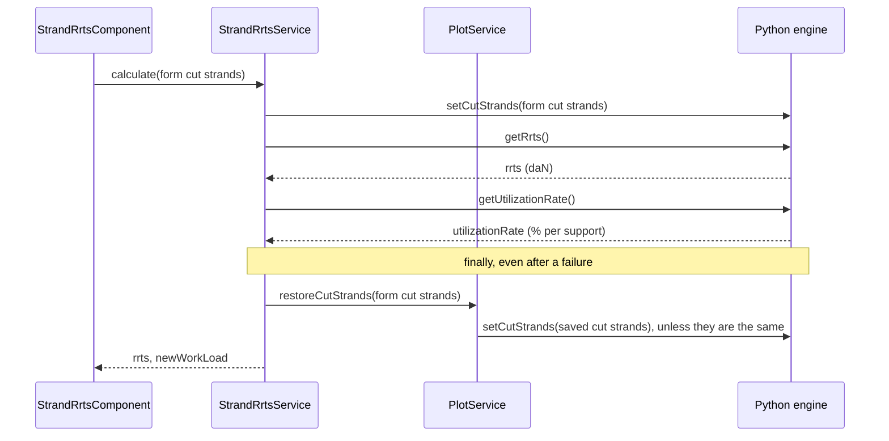

# RRTS cut strands — technical design

The **Strand RRTS** tool computes the residual rated tensile strength (RRTS) of the section's cable
once some of its strands are cut, and the max working load that follows. The user enters the cut
strands of the first three cable layers, the dialog runs the calculation in the Python engine, and
a single entry can be saved per section. Alongside it, the staff presence of the selected load case sets
the engine's **high safety**, which weighs on every working load the engine returns, the studio's
included.

---

## Key files at a glance

Paths are relative to `src/app/`, except `stellar-engine/`, relative to the repository root.

| File | Purpose |
|---|---|
| `features/studio/core/presentation/components/top-toolbar/top-toolbar.component.ts` | Entry point: **Strand RRTS** entry of the **Tools** menu |
| `features/studio/toolbar/presentation/services/toolbar-dialog.service.ts` | Registers the `'strand-rrts'` tool, hosts it in the toolbar dialog, and passes it its mode (`StrandRrtsContext`) |
| `features/studio/toolbar/presentation/components/strand-rrts/strand-rrts.component.ts` | Dialog: form, calculation, save and delete, view mode |
| `features/studio/toolbar/presentation/components/strand-rrts/strand-rrts.helpers.ts` | Status of the new max working load, and conversion of the form cut strands to the engine input and to the saved entry |
| `features/studio/toolbar/presentation/components/strand-rrts/strand-rrts.constantes.ts` | Form bounds and defaults, shown layers, status icons |
| `features/studio/toolbar/presentation/components/strand-rrts/strand-rrts.interfaces.ts` | Types of the form value and the status |
| `features/studio/toolbar/application/services/strand-rrts.service.ts` | Runs the RRTS calculation in the engine, then has `PlotService` give it the saved cut strands back |
| `features/studio/toolbar/application/services/strand-rrts.interfaces.ts` | Type of the results |
| `features/studio/core/presentation/pages/studio-page/studio-page.component.ts` | Shows the cut strand indicator |
| `shared/domain/models/section.model.ts` | Saved entry, stored on the section |
| `shared/domain/helpers/cut-strands.helpers.ts` | Catalog keys of the strand counts, engine input of a saved entry, whether cut strands cut anything |
| `core/services/section/section-geometry.helpers.ts` | `sanitizeSectionGeometry()` drops an entry whose span no longer exists, or saved on another cable |
| `shared/components/studio/section/helpers/createCutStrandsAnnotations.ts` | Marking drawn on the studio plot |
| `shared/components/studio/section/helpers/createCutStrandsAnnotations.constantes.ts` | Color, icon, pixel offsets and dash pattern of the marking, hover label |
| `shared/components/studio/section/helpers/createCutStrandsAnnotations.interfaces.ts` | Click payload of the marking |
| `shared/components/studio/section/helpers/spanAnchor.ts` | Point of a span at a distance from a support, shared with the cable modification annotations |
| `shared/components/studio/section/section-plot.component.ts` | Passes the saved entry to the plot, opens the tool when the marking is clicked, in view mode in a preview |
| `core/services/plot/plot-span.service.ts` | `savedCutStrands`: the saved entry, shared by the studio and the dialog |
| `core/services/plot/plot.service.ts` | High safety and saved cut strands of the engine study, cut strand indicator |
| `core/services/worker_python/tasks/types.ts` | Task inputs and outputs |
| `core/services/worker_python/tasks/python-scripts/api.py` | Task entry points |
| `stellar-engine/src/stellar_engine/core/cut_strands.py` | Engine functions |

---

## Engine side

### The model

The calculation belongs to mechaphlowers: `CableArray` delegates it to its tensile strength model,
`AdditiveLayerRts`, which reads the cable catalog columns `rts_cable`, `rts_layer_1` to
`rts_layer_8`, `nb_strand_layer_1` to `nb_strand_layer_8` and `safety_coefficient`.

$$RRTS = RTS_{cable} - \sum_{i=1}^{8} cut\_strands_i \times rts\_layer_i$$

$$utilization\_rate_{span} = \frac{T_{max,span} \times safety\_coefficient}{RRTS} \times 100$$

- `safety_coefficient` falls back to `1.5` when the catalog has none. With high safety on, it is
  multiplied by `options.data.safety_security_factor` (`1.5`).
- The RRTS is global to the section: cut strands on one span lower the strength used for every
  span. This is why the span, reference support and distance of an entry take no part in the
  calculation.
- A missing `rts_cable`, or a missing `rts_layer_i` on a layer with cut strands, raises
  `RtsDataNotAvailable`.

The cut strands and the high safety are **state of the engine study**: they stay until set again,
and every later utilization rate uses them, `refreshProjection()`'s included. The engine study
created by `Task.initLit` starts with the mechaphlowers defaults, no cut strands and high safety
off, but the application applies the high safety of the selected load case right after: it is on
for a new study, which has no selected load case (see *High safety*). The saved cut strands follow
right after it (see *Saved cut strands in the engine study*).

### Tasks

Defined in `stellar_engine/core/cut_strands.py` and exposed through `api.py`:

| Task | Python function | Input | Output |
|---|---|---|---|
| `setCutStrands` | `set_cut_strands` | `{ cutStrands: number[] }`, one value per catalog layer (8) | `{ success: true }` |
| `getRrts` | `get_rrts` | — | `{ rrts }`, in **daN** (mechaphlowers returns N) |
| `getUtilizationRate` | `get_utilization_rate` | — | `{ utilizationRate: number[] }`, in %, one per support, `NaN` for the last one, which starts no span |
| `setHighSafety` | `set_high_safety` | `{ highSafety: boolean }` | `{ success: true }` |
| `getCutStrands` | `get_cut_strands` | — | `{ cutStrands: number[] }`, not used by the application |

`set_cut_strands` raises a `ValueError`, built from `_Errors.cut_strands_*`, when the input does
not hold one value per catalog layer, or when a value is not finite, not an integer, negative, or
above the strand count of its layer.

Engine errors do not reject: `WorkerPythonService.runTask()` resolves with `{ result, error }`.
The private `runTask()` of `StrandRrtsService` throws on `error`, so a calculation stops at the
failing task.

The application loads the stellar-engine **wheel**, not its sources: after changing
`cut_strands.py`, rebuild it with `npm run set-up-mechaphlowers:engine-only` (see the
{doc}`Set-up Mechaphlowers Guide <../installation/setup-mechaphlowers-guide>`).

---

## Data model

Defined in `shared/domain/models/section.model.ts`.

```typescript
// Linked to the span starting at spanUuid, or to the whole section when spanUuid is null
interface RrtsCutStrandsData {
  spanUuid: string | null;
  supportRef: 'LEFT' | 'RIGHT' | null;
  distanceSupportRef: number | null;
  // Cut strands per cable layer, index 0 = layer 1
  cutStrands: number[];
  addMarking: boolean;
}

interface Section {
  // …
  /** Saved RRTS cut strands, a single one per section */
  rrts_cut_strands?: RrtsCutStrandsData | null;
}
```

- A section holds **one** entry: saving replaces it, deleting sets it to `null`.
- As for obstacles and floors, a span is identified by the uuid of its left support. Without
  span, the entry applies to the whole section, with `supportRef: null`,
  `distanceSupportRef: null` and `addMarking: false`.
- `cutStrands` holds a value for **every** catalog layer, `0` for the layers without strands, as
  required by the `setCutStrands` array input: a saved entry goes to the engine as is, through
  `toEngineCutStrands()`, which gives `0` on every layer without entry. The form only has the
  layers with strands among the first `MAX_SHOWN_LAYER` (3): `toCatalogCutStrands()` spreads its
  values over the 8 catalog layers, with `0` for all the others.
- The results (RRTS, new max working load) are not persisted. They are calculated again when the
  dialog opens on a saved entry.

### Section geometry and cable

`sanitizeSectionGeometry()`, applied by `SectionService.createOrUpdateSection()`, drops the entry:

- when its `spanUuid` no longer starts a span: the support was deleted, or it became the last one
  of the section. An entry linked to the whole section (`spanUuid: null`) is kept;
- when the section's cable changes: the cut strands count strands of the layers of the cable they
  were saved on. `createOrUpdateSection()` passes the stored section, and the entry is dropped
  only if it is the stored one: an entry coming with the new cable, in an imported section, is
  kept.

`removedGeometryBoundObjects` is then `true`, and the study page shows the
`study.notifications.geometry-objects-updated` warning.

---

## The dialog

### Hosting

The **Tools** menu entry calls `ToolbarDialogService.openTool('strand-rrts')`, and the toolbar
dialog renders `StrandRrtsComponent` through `ngComponentOutlet`. The component hands its
`#header` and `#footer` templates to the dialog with `ToolbarDialogService.setTemplates()`: the
title goes in the header, **Delete** and **Save** in the footer.

`openTool('strand-rrts', { mode })` takes a `StrandRrtsContext`, kept in
`ToolbarDialogService.strandRrtsContext` until the dialog closes. Without context, the tool opens
in edit mode. In **view mode** (`isViewMode()`), opened from the marking of a section preview (see
*Marking on the studio plot*), the dialog shows the saved entry without any way to change it:

- every input is read-only (`readonly` on the inputs, the selects and the checkbox), and the span
  cannot be cleared;
- the **Layers detail** and **Calculate** buttons are not rendered, and the footer is not handed
  to the dialog, so **Delete** and **Save** do not show either;
- the calculation still runs on opening, so the results of the saved entry are shown.

The component is created when the dialog opens and destroyed when it closes: unsaved inputs and
results do not survive a close.

### Information

| Field | Source |
|---|---|
| Cable name | `section.cable_name` |
| Current max working load | `maxOf(litData.output_parameters.utilization_rate)`: the studio's **Working load** in **Max section** mode |
| Staff presence | `personnelPresence` of the selected load case, read from the study's copy of the section as the menu bar does; `true` without selected load case |

`section` is `PlotSpanService.section()` and `litData` is `PlotService.litData()`.

### Form

| Control | Rules |
|---|---|
| `span` | Optional, clearable. Options from `PlotSpanService.getSpanOptionsWithIndex()`, value `{ index, uuid }` |
| `supportRef` | `LEFT` or `RIGHT`, options from `PlotSpanService.getSupportOptions()`. Set to `LEFT` when a span is selected while it is empty, kept when switching spans |
| `distanceSupportRef` | Optional. From 0 to `DISTANCE_MAX` (5000 m, fixed, not the span length), 2 decimals |
| `cutStrands` | `FormArray`, one control per layer with strands among the first `MAX_SHOWN_LAYER` (3). Required, from 0 to the strand count of the layer, integer (`maxDecimalsValidator(0)`), `DEFAULT_CUT_STRANDS` (0) by default |
| `addMarking` | Boolean |

- `supportRef`, `distanceSupportRef` and `addMarking` are disabled without span. A subscription
  to `span.valueChanges` enables them when a span is selected, and resets and disables them when
  it is cleared.
- `layers()` is a `computed` over a `resource` loading the catalog cable
  (`CablesService.getCable()`). It holds one entry per `nb_strand_layer_n` above 0 among the first
  `MAX_SHOWN_LAYER`, each with its own `FormControl`, and an effect puts them in the form with `form.setControl('cutStrands', …)`.
  Without any layer (cable loading, no strand data, catalog read failure), a message replaces the
  inputs and **Calculate** is disabled.
- Error messages show once a control is `dirty`, on input rather than on blur, through
  `getNumberInputErrorParams()`.

### Loading the saved entry

`savedEntry` is `PlotSpanService.savedCutStrands`, a `computed` over `section.rrts_cut_strands`
compared with lodash `isEqual`: the section object is replaced after every save, and only a content
change matters. `PlotService` reads the same `computed`. An effect on `savedEntry()` and `layers()`
loads the entry into the form:

1. Patch `supportRef`, `distanceSupportRef` and `addMarking`.
2. Set `span` last, so the span rules apply to the saved values: the dependent fields are
   disabled for a whole-section entry, and a span entry without reference support gets `LEFT`.
3. Set the control of each layer from `entry.cutStrands[layer - 1]`.
4. Once the layers are loaded, and if nothing has been calculated yet, run `calculate()`. It gets
   the results to display, which are not saved, then has the engine take the saved cut strands
   back, as every calculation does.

After a save, the effect loads the entry again, but does not calculate: `calculatedValue` is set,
and the results shown were calculated from that very entry.

Effects run in creation order: the effect that puts the cut strands controls in the form is
declared first, so the controls exist when the entry is loaded.

### Calculation



- `calculate()` returns early on an invalid form, without layers, or while busy.
- `newWorkLoad` is `maxOf(utilizationRate.filter(Number.isFinite))`: the `NaN` of the last
  support is dropped, and the value is `null` when no rate is left.
- On success, `results` is set and `calculatedValue` keeps a snapshot of `form.getRawValue()`.
- On a failure of a calculation task, `results` and `calculatedValue` are cleared, the error is
  logged through `LoggerService`, and a `failed-to-calculate` toast is shown.
- Giving the saved cut strands back is `PlotService`'s job, and it reports its own failures (see
  *Saved cut strands in the engine study*): the results of a successful calculation are kept.

**Invariant:** outside a calculation, the engine holds the **saved** cut strands (`0` per layer
without saved entry), never the ones being edited, so the studio never shows unsaved cut strands.

### Status of the new max working load

`getWorkLoadStatus()` maps the value to an icon of `WORK_LOAD_ICONS`, with the same 75 % and 100 %
thresholds as the studio's **Working load**:

| New max working load | Status | Icon | Colour |
|---|---|---|---|
| `null` | `null` | `counter_0` | grey |
| 0 to 75 % | `ok` | `check` | green (`--main-success`) |
| above 75 %, up to 100 % | `warning` | `exclamation` | orange (`--main-warning`) |
| below 0 % or above 100 % | `error` | `close_small` | red (`--main-error`) |
| `NaN` | `unknown` | `question_mark` | grey. `maxOf()` never returns `NaN`, so the dialog does not reach it |

Each icon carries an aria label (`studio.rrts-cut-strands.result-new-working-load-*`). The results
are rendered inside an `<output>` element that stays on the page even without results: screen
readers only announce content added to a live region that already exists.

### Save and delete

- **Save** is enabled only while `calculatedValue` deep-equals the current raw form value, the
  marking aside (`canSave`). Any change to the cut strands, span, reference support or distance
  after a calculation calls for a new one, so a saved entry never disagrees with the results shown.
  `addMarking` takes no part in the calculation: switching it keeps **Save** available.
- `save()` persists the section with `rrts_cut_strands: toCutStrandsData(form.getRawValue(), layers)`
  (the calculated value, with the marking as it is now) through
  `SectionService.createOrUpdateSection()`, sets it on `PlotSpanService.section`, shows a `saved`
  toast, then awaits `PlotService.syncCutStrands()`.
- `delete()` does the same with `rrts_cut_strands: null`.
- Awaiting `syncCutStrands()` keeps the dialog busy until the engine study and the studio outputs
  follow the new saved state, so no calculation of the dialog slips in between. If the engine
  rejects it, the entry stays saved (or deleted), and `PlotService` shows a `failed-to-sync` toast.
- If persisting fails, the section does not change, the engine is left alone, and a
  `failed-to-save` or `failed-to-delete` toast is shown.
- `isBusy` (calculating, saving or deleting) disables **Calculate**, **Save** and **Delete**, so
  they run one at a time.

---

## Saved cut strands in the engine study

The saved cut strands belong to the engine study, like high safety: `PlotService` applies them, so
the studio shows them without the dialog being open.

- `savedCutStrands`, a `computed` compared with `isEqual`, is the engine input of the saved entry:
  `toEngineCutStrands(PlotSpanService.savedCutStrands())`. A change of the marking or of the
  location alone does not change it.
- `initSectionStudio()` applies them right after high safety, before the first projection: a new
  engine study has no cut strands, so nothing is sent without saved entry, or with `0` on every
  layer. They are read `untracked` at that point, as the entry may have changed during `initLit`.
  The section preview gets them too.
- `syncCutStrands()` updates the engine study when the saved entry changes: an effect calls it on
  every change of `savedCutStrands`, and the dialog awaits it after a save or a delete. It does
  nothing outside the studio, before `initSectionStudio()` has created the engine study, or while
  the engine study still belongs to the previous section (`currentSectionUuid`): when the studio
  opens, the section can briefly be the preview's, and `initSectionStudio()` applies the new
  section's entry anyway. Otherwise, it sends `setCutStrands` when the engine study holds other
  cut strands, then refreshes the projection when the outputs were calculated without the saved
  ones. It skips the refresh when the studio was left (`resetAll()`), or a newer request replaced
  this one, in the meantime.
- `restoreCutStrands(calculated)`, called by `StrandRrtsService` after every calculation, records
  that the engine study holds the calculated cut strands, then brings it back to the saved ones the
  same way, in the studio as in a preview. A calculation made with the saved ones needs no task.
- `applyCutStrands()` caches the value **before** sending the task, as `applyHighSafety()` does. On
  error, it rolls back only if no newer request replaced it, logs the error, and shows a
  `failed-to-sync` toast in the studio. The next request retries: saving the same entry again, for
  example.
- The cache is reset to `null` by `resetAll()` and at the start of `initSectionStudio()`.
- `refreshProjection()` records the cut strands the outputs are calculated with
  (`projectedCutStrands`). `isCutStrandApplied`, a `computed` over them with `hasCutStrand()`, is
  `true` when at least one layer has a cut strand: it only changes once the outputs account for
  the cut strands.
- `StudioPageComponent.isGlobalCutStrand` reads `isCutStrandApplied`, and drives the scissors icon
  next to the studio's **Working load**: red when cut (`--main-error`), grey otherwise
  (`--grey-400`). The **Working load** itself needs no wiring: it reads `utilization_rate`, which
  carries the cut strands, in **Span** and in **Max section** mode.

---

## Marking on the studio plot

A saved entry whose `addMarking` is `true` draws a marking on the studio plot, in 2D and in 3D.
`addMarking` can only be ticked once a span is selected, so a marking always has a span;
`createCutStrandsAnnotations()` still draws nothing for an entry without one.

`SectionPlotComponent` passes the section's `rrts_cut_strands` to `createPlot()`, which adds the
marking to the 2D layout and to the 3D scene. They follow the saved entry, not the form: the
marking appears when the dialog saves, and disappears when the entry is deleted or saved without
the box ticked. Nothing is drawn when the span is outside the displayed supports (`startSupport` ≤
span index < `endSupport`).

### Where it hangs from

| Distance to the reference support | Anchor point |
|---|---|
| Empty | The highest point of the reference support (`supportRef`, left by default): the marking stands above the support itself |
| Given | The point of the cable at that distance from the reference support |

The point of the cable comes from `resolveAnchorCoord()` (`spanAnchor.ts`), the lookup the cable
modification annotations use. It interpolates the span polyline at the x of the distance, measured
from the first point of the polyline (`LEFT`) or the last one (`RIGHT`). It is a stopgap, see
*Known limitations*. No engine task is involved yet.

### What it looks like

- A scissors icon, `CUT_STRANDS_OFFSET_Y` pixels above its anchor point, in `#7D5A9F` (primary
  600), with a **Cut strands** label on hover (`shared.studio.cut-strands-marking`).
- A dashed line of the same color joining the anchor point to the icon.
- Clicking the icon opens the RRTS tool, through the `plotly_clickannotation` handler of
  `SectionPlotComponent` and the `{ type: 'cutStrands' }` payload of the icon. The dashes do not
  capture events.

The section plot also renders the **Graphical view** of the section form, on the study page:
`StudioComponent` passes its `isPreview` input on to `SectionPlotComponent`. That form edits a copy
of the section, and the study page hosts a toolbar dialog too, so a click there opens the tool in
view mode: `openTool('strand-rrts', { mode: isPreview() ? 'view' : 'edit' })`.

Both offsets are in pixels, not in data units: the gap stays the same at any zoom level or camera
angle. This rules out the usual tools for the dashed line:

- In 2D, `createCutStrandsShapes()` draws it as a single Plotly shape, a `line` sized in pixels
  (`xsizemode` and `ysizemode` set to `pixel`) and anchored on the data point (`xanchor`,
  `yanchor`), dashed with the `CUT_STRANDS_DASH_LENGTH` and `CUT_STRANDS_DASH_GAP` pattern.
- In 3D, shapes do not exist, and a Plotly annotation arrow cannot be dashed. The line is therefore
  a series of arrow-only annotations, one per dash: each one's tail is `end` pixels above the
  anchor, and its `standoff` moves its tip `start` pixels away from it.

---

## High safety

High safety belongs to the engine study, not to the dialog. It follows the staff presence of the
selected load case, and applies to every working load the engine returns, the studio's
**Working load** included. `PlotService` handles it:

- `selectedChargeHighSafety`, a `computed`, returns the `personnelPresence` of the charge matching
  `section.selected_charge_uuid`, or `true` without selected charge: staff is then assumed
  present, the safest case.
- `initSectionStudio()` applies it right after `Task.initLit`, which creates the engine study with
  the mechaphlowers default, high safety off. A new study has no selected charge, so it gets high
  safety on. The value is read `untracked` at that point, as the selected charge may have changed
  during `initLit`.
- An effect calls `syncHighSafety()` when the value changes. The studio section is reloaded from
  the database after every charge change (selection, creation, duplication, deletion, edition in
  the loads table), so this single effect covers them all. It does nothing outside the studio,
  before an engine study exists (`highSafety === null`), or when the value is unchanged; otherwise
  it sends `setHighSafety`, then refreshes the projection.
- `applyHighSafety()` caches the value **before** sending the task: the worker runs tasks in
  order, so the last request wins. On error, it rolls back only if no newer request replaced it.
- The cache is reset to `null` by `resetAll()` and at the start of `initSectionStudio()`.

The menu bar's staff indicator follows the same default: without selected load case, it shows
**Staff is present**.

---

## Tests

| File | Covers |
|---|---|
| `strand-rrts.component.spec.ts` | Information, surface controls, span dependent fields, calculation (task sequence, saved state given back, errors, busy lock, calculation on opening), save (marking aside, studio awaited), delete, view mode, results |
| `strand-rrts.helpers.spec.ts` | Status thresholds, cut strands spread over the catalog layers, saved shape |
| `strand-rrts.service.spec.ts` | Calculation: task sequence, RRTS, highest rate, last support ignored, saved cut strands given back even after a failure |
| `shared/domain/helpers/cut-strands.helpers.spec.ts` | Engine input of a saved entry, whether cut strands cut anything |
| `studio-page.component.spec.ts` | `isGlobalCutStrand` follows `PlotService`, and the scissors icon with it |
| `createCutStrandsAnnotations.spec.ts` | Marking: nothing to draw, anchor with and without distance from either support, axes mapping, icon, click payload, 3D dashes, 2D shape |
| `createPlot.spec.ts`, `section-plot.component.spec.ts`, `studio.component.spec.ts` | The marking reaches the 2D layout and the 3D scene, the saved entry reaches `createPlot()`, a click opens the tool, in view mode in a preview |
| `toolbar-dialog.service.spec.ts` | The RRTS tool context, kept until the dialog closes |
| `core/services/plot/plot.service.spec.ts` | `high safety`: after `initLit`, default without charge, charge changes, concurrent requests. `cut strands`: at studio load, after a save or a delete, previous section, failures and retries, studio left, after a calculation |
| `core/services/section/section-geometry.helpers.spec.ts`, `section.service.spec.ts` | `RRTS cut strands`: entries dropped with their span or their cable, whole-section entries and entries of a new cable kept |
| `stellar-engine/test/core/test_cut_strands.py` | Input validation, RRTS in daN, utilization rates |

Run the front-end tests with `npx vitest run <file>`, and the engine tests with `make test` in
`stellar-engine/`.

---

## Known limitations

- The marking of a distance is placed in TypeScript, by `resolveAnchorCoord()`, and differs from
  where the engine places a load at the same distance. The engine turns the distance into a ratio
  of the support-to-support span length, applied between the hanging points; the lookup reads it as
  an x offset in the plot frame. On a synthetic section, the gap to the engine's own load node was
  about 1 m on a straight line, and up to about 14 m on spans that are not parallel to the x axis
  of the plot (line angle). Without distance, the placement is not affected. The cable modification
  annotations share the helper and the flaw. Moving the placement to the engine, with mechaphlowers,
  is tracked in a separate ticket.
- Only the first three layers are shown, but the studio applies a saved entry as is: an entry saved
  before this limit, with cut strands on a later layer, stays in force until it is saved again, and
  the dialog does not show those values.
- The marking is drawn from the saved entry only, whatever its cut strands: an entry that ticks
  **Add a marking** with `0` cut strands on every layer is still marked.
- The marking is kept at a fixed pixel distance from its anchor: when the anchor is near the top of
  the plot, the icon can fall outside it.
- The dashed line crosses the support number when the marking hangs from a support.
- The **Layers detail** button is a disabled placeholder.
- In view mode, the calculation on opening runs in the preview's engine study, built from the
  section form as it is being edited: its results follow the unsaved changes of the form.
- `DISTANCE_MAX` is a fixed 5000 m, not the length of the selected span.
