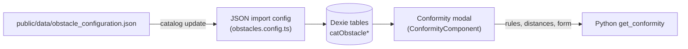

# Configuring conformity

The conformity check of an obstacle is **entirely driven by one catalog file**,
`public/data/obstacle_configuration.json`. It declares which obstacle types can be checked, which
regulatory rules apply to them, the legal distances per voltage, the climatic condition of each
rule and the wind zones. No code change is needed to add an obstacle type, a rule or a wind
zone.

This page describes the file. How the engine uses it is described in {doc}`conformity`; what the
user sees is described in the {doc}`user guide <../user_guide/conformity>`.

---

## From the file to the check



- The file is a **catalog**: it is refreshed by the catalog update, not by the application update
  (see {doc}`app/catalog_update`). Its SHA-256 is listed in `data_hashes` of `assets_list.json`,
  generated by `npm run create-assets-list-for-service-worker` (part of `npm run build`).
- The import is a **replace-mode** JSON import (`createObstaclesConfig()` in
  `src/app/shared/catalog/csv-import/configs/obstacles.config.ts`): the six tables below are
  cleared and rewritten in one Dexie transaction, so the file is the single source of truth.
- The payload is checked by `assertObstacleConfigurationJson()` before anything is written. A
  malformed file is rejected with an error such as
  `Obstacle configuration: obstacles[3].redZone must be a boolean`, and the previous catalog
  stays in place.

| JSON part | Dexie table | Entity |
|---|---|---|
| `obstacles[]` (name, details) | `catObstacleTypes` | `CatalogObstacleTypeEntity` |
| `obstacles[]` (`redZone`, `conformity`) | `catObstacleConfigurations` | `CatalogObstacleConfigurationEntity` |
| `obstacles[].distances[]` | `catObstacleDistances` | `CatalogObstacleDistanceEntity` |
| `rules[]` | `catObstacleRuleDefinitions` | `CatalogObstacleRuleDefinitionEntity` |
| `windZone.values[]` | `catObstacleWindZones` | `CatalogObstacleWindZoneEntity` |
| `repartitionTemperatureFields`, `lateralTemperatureFields`, `windZone.default`, `intermediatePointPositions` | `catObstacleConformityConfig` (one row, key `main`) | `CatalogObstacleConformityConfigEntity` |

Entities are in `src/app/infrastructure/database/entities/`, the JSON-to-entity mapping in
`src/app/shared/catalog/csv-import/configs/obstacles.config.helpers.ts`.

---

## File layout

```json
{
  "obstacles": [ /* one entry per obstacle type */ ],
  "rules": [ /* one entry per regulatory rule */ ],
  "repartitionTemperatureFields": { "defaultValue": 70 },
  "lateralTemperatureFields": { "defaultValue": 65, "ruleType": "RULE_2", "message": "..." },
  "windZone": { "default": "200", "values": [ /* wind zones */ ] },
  "intermediatePointPositions": [0.33, 0.66]
}
```

All six top-level keys are mandatory.

---

## Obstacle types: `obstacles[]`

```json
{
  "obstacleType": "vegetation",
  "obstacleName": "Vegetation",
  "details": "Isolated tree or vegetation (...)",
  "redZone": true,
  "conformity": "vegetation",
  "distances": [
    {
      "ruleType": "RULE_1",
      "active": true,
      "overhang": { "63": 1.1, "90": 1.2, "150": 1.3, "225": 1.4, "400": 1.5 },
      "lateral":  { "63": 0.6, "90": 0.7, "150": 0.8, "225": 0.9, "400": 1.0 }
    }
  ]
}
```

| Field | Type | Meaning |
|---|---|---|
| `obstacleType` | string | Technical identifier, stored in `Obstacle.type`. Must be unique. |
| `obstacleName` | string | Label shown in the obstacle type dropdown. |
| `details` | string | Description of the obstacle type. |
| `redZone` | boolean | Whether the **Red zone presence** checkbox is shown in the Conformity modal for this obstacle type. See [Red zone](#conformity-config-red-zone). |
| `conformity` | `"overhang"`, `"cable_track"`, `"vegetation"` or `null` | Graph type, which also selects how the engine builds the zone. See [Graph types](#conformity-config-graph-types). |
| `distances` | array | Legal distances per rule. An empty array makes the obstacle type **not eligible**. |

### Eligibility

The **Conformity** button of the obstacle form checks, in `ObstaclesFormComponent.openConformityModal()`,
that the obstacle is saved, that the study has an electric tension level, and that
`catObstacleDistances` holds **at least one row** for the obstacle type. An obstacle type with
`"distances": []` (high-clearance areas, silo proximity in the shipped file) is therefore
refused with *obstacle type '…' is not eligible for conformity control*.

A type with distances but `"conformity": null` opens the modal, but the calculation is refused
with *Cannot calculate conformity: obstacle type has no conformity configuration*. Keep
`distances` empty **and** `conformity` `null` together.

(conformity-config-graph-types)=
### Graph types

| `conformity` | Figure | Distances to provide |
|---|---|---|
| `overhang` | Horizontal line | `overhang` only: `lateral` is `null` |
| `vegetation` | Trench | `overhang` and `lateral` |
| `cable_track` | Disks | `overhang` and `lateral` |

The type also drives the table: the **lateral** columns are hidden for `overhang`, and the
**Minimum distance case** block is only shown for `cable_track`.

:::{warning}
The engine builds a scenario for a direction only when its distance is not `null`. A
`cable_track` obstacle without `lateral` distances would get intermediate points without any
distance, which the figure cannot draw. Always give both distances to `vegetation` and
`cable_track` obstacles.
:::

### Distances: `distances[]`

| Field | Type | Meaning |
|---|---|---|
| `ruleType` | string | Must match the `ruleType` of an entry of `rules[]`. |
| `active` | boolean | The rule is **pre-selected** in the conformity multiselect. The user can still select an inactive rule. |
| `overhang` | map or `null` | Minimum vertical distance (m) per voltage. `null`: the rule has no overhang constraint. |
| `lateral` | map or `null` | Minimum horizontal distance (m) per voltage. `null`: the rule has no lateral constraint. |

A distance map is keyed by the voltage in kV, **as a string**: `"63"`, `"90"`, `"150"`,
`"225"`, `"400"`. The engine picks the entry matching the voltage of the section
(`voltage_idr`, e.g. `"400 KV"`). **A non-null map must hold the five keys**: a missing key fails
the calculation. Another voltage is not supported by the engine: it would need a new entry in
`ElectricTensionMapper` (`stellar-engine/src/stellar_engine/entities/conformity.py`).

The order of the entries of `distances[]` is not significant: the rules reach the engine in the
order Dexie returns them, which is the order of the `[obstacle_type+rule_type]` primary key
(alphabetical by `ruleType`). This order is the stacking priority of the figure.

---

## Rules: `rules[]`

```json
{
  "ruleType": "RULE_2",
  "ruleName": "RULE_2",
  "color": "#FFA500",
  "lateralPoint":  { "temperature": null, "pressure": "WindZoneInput", "redZone": true },
  "overhangPoint": { "temperature": null, "pressure": 0,              "redZone": false }
}
```

| Field | Type | Meaning |
|---|---|---|
| `ruleType` | string | Technical identifier, primary key of `catObstacleRuleDefinitions`. |
| `ruleName` | string | Label shown in the multiselect and the table headers. |
| `color` | string | Zone color, **`#rrggbb`** (6 hexadecimal digits: the figure parses it to build an `rgba()`). |
| `lateralPoint` | point | Climatic condition of the cable for the **lateral** check. |
| `overhangPoint` | point | Climatic condition of the cable for the **overhang** check. |

A rule referenced by `distances[]` but absent from `rules[]` shows its `ruleType` as label, and
has **no result**: it is never sent to the engine as a climatic condition, so its column stays
empty with the compliance *Unknown*.

### Climatic point

Each point defines the **state of the cable** in which its position is measured.

| Field | Value | Effect |
|---|---|---|
| `temperature` | number (°C) | Fixed temperature of the rule. |
| | `null` | The temperature typed by the user is used: **Repartition temperature** for `overhangPoint`, **Lateral distance temperature** for `lateralPoint`. |
| `pressure` | number (Pa) | Fixed wind pressure of the rule. |
| | `"WindZoneInput"` | The pressure of the wind zone chosen by the user. |
| `redZone` | boolean | Forwarded to the engine, not used. See [Red zone](#conformity-config-red-zone). |

The full overwrite chain, with the cases the engine tests, is in
{ref}`conformity-overwrite-rules`.

---

## Wind zones: `windZone`

```json
"windZone": {
  "default": "200",
  "values": [
    { "label": "200",     "normal": 200, "redZone": 300 },
    { "label": "300",     "normal": 300, "redZone": 400 },
    { "label": "300-400", "normal": 300, "redZone": 400 }
  ]
}
```

| Field | Meaning |
|---|---|
| `default` | Label selected when the modal opens. It must be one of the `label`s. |
| `values[].label` | Label shown in the **Wind zone** select. Unique. |
| `values[].normal` | Wind pressure (Pa) of the zone. |
| `values[].redZone` | Wind pressure (Pa) of the zone when the obstacle is in a red zone. |

(conformity-config-red-zone)=
### Red zone

The red zone is a **wind pressure increase**, and it is entirely resolved by the application
before calling the engine:

1. The obstacle type has `"redZone": true`: the **Red zone presence** checkbox is shown.
2. The user selects a wind zone and ticks, or not, the checkbox.
3. `ConformityComponent.effectiveWindPressure` takes `values[].redZone` when the box is ticked
   and `values[].normal` otherwise.
4. This value is sent as `form.windPressure`. It replaces every `"WindZoneInput"` pressure of the
   rules, **for all selected rules**.

The engine only validates `redZonePresence` and forwards the `redZone` flag of the climatic
points; it applies no red zone logic of its own. The flags `rules[].lateralPoint.redZone` and
`rules[].overhangPoint.redZone` are required by the schema and kept in the catalog, but no code
reads them: they do not restrict the rules that get the red zone pressure.

---

## Scalar settings

| Key | Meaning |
|---|---|
| `repartitionTemperatureFields.defaultValue` | Initial value (°C) of **Repartition temperature**. |
| `lateralTemperatureFields.defaultValue` | Initial value (°C) of **Lateral distance temperature**. Mandatory, finite number. |
| `lateralTemperatureFields.ruleType` | Rule whose name prefixes the **Lateral distance temperature** label. Its `lateralPoint.temperature` is only the fallback initial value, when `defaultValue` is missing from the stored configuration. |
| `lateralTemperatureFields.message` | Hint displayed under **Lateral distance temperature**. |
| `intermediatePointPositions` | Fractions in `]0, 1[` locating the intermediate cable states of the `cable_track` graph. `[0.33, 0.66]` gives four intermediate points. Ignored for the other graph types. |

:::{note}
The initial lateral temperature is `lateralTemperatureFields.defaultValue`, whatever the
`temperature` of the rule `lateralTemperatureFields.ruleType` (`null` for `RULE_2` in the shipped
file). A rule with a fixed `lateralPoint.temperature` ignores the field when calculating.
:::

The two temperature fields accept 0 to 250 °C with at most 2 decimals
(`CONFORMITY_BOUNDS` in `conformity.constantes.ts`).

---

## Recipes

### Add an obstacle type

1. Add an entry to `obstacles[]` with a new `obstacleType`, a `conformity` graph type, and one
   `distances[]` entry per rule, with the five voltages.
2. Check that every `ruleType` exists in `rules[]`.

### Add a rule

1. Add an entry to `rules[]` with a new `ruleType` and a `color` not used by the other rules.
2. Add a `distances[]` entry with this `ruleType` to each obstacle type that must be checked
   against it.

### Change a distance or a climatic condition

Edit the value. Nothing else is needed: the next catalog update rewrites the tables.

### Check the change

- `npm run test -- obstacles.config` runs the import spec (validation and mapping).
- `npm run test -- conformity` runs the modal and figure specs.
- Open the study, an obstacle of the type, and the **Conformity** modal: the multiselect lists
  the rules of `distances[]` with the `active` ones selected.

---

## Related documentation

- {doc}`conformity` — the Python conformity module and the TypeScript layer driven by its output.
- {doc}`app/catalog_update` — how the catalog reaches the offline database.
- {doc}`../user_guide/conformity` — the conformity check as the user sees it.
