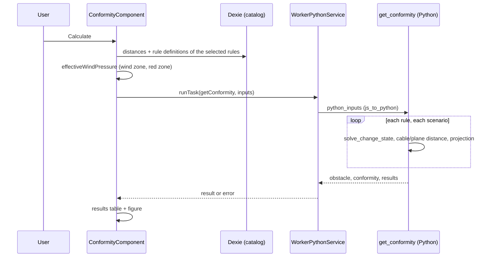

# Conformity — engine module and application layer

The **conformity** check tells whether an obstacle (tree, building, road, ground…) stays far
enough from the cable of a span, under the climatic conditions fixed by regulatory rules. The
application collects the inputs and the catalog data, the Python engine simulates the cable in
each climatic condition and measures its distance to the obstacle, and the application displays
what the engine returns, as a table and a cross-section figure.

This page covers both sides:

- [The Python module](#conformity-python-module): inputs, overwrite rules, scenarios, computation, output.
- [The TypeScript layer](#conformity-typescript-layer): how the output drives
  the table, the figure and the form.

The catalog file that configures the check is described in {doc}`configure_conformity`; the user
point of view is in the {doc}`user guide <../user_guide/conformity>`.

---

## Key files at a glance

Paths are relative to `src/app/`, except `stellar-engine/`, relative to the repository root.

| File | Purpose |
|---|---|
| `stellar-engine/src/stellar_engine/core/conformity/simulation.py` | `get_conformity()`: the entry point, orchestrates the whole computation |
| `stellar-engine/src/stellar_engine/core/conformity/scenarios.py` | Climatic points, **overwrite rules**, and the scenario builder |
| `stellar-engine/src/stellar_engine/core/conformity/compute.py` | Result classes, zone geometry, compliance |
| `stellar-engine/src/stellar_engine/entities/conformity.py` | Input classes with validation, output writers, tension mapper |
| `stellar-engine/src/stellar_engine/entities/errors.py` | `ObstacleNotFoundError` |
| `stellar-engine/test/plot/` | Tests of the module (`conftest.py` holds the input factories) |
| `core/services/worker_python/tasks/python-scripts/api.py` | `get_conformity()` task entry, converts the JS inputs |
| `core/services/worker_python/tasks/types.ts` | `ConformityTaskInput` and `ConformityTaskOutput` |
| `features/studio/obstacles/presentation/components/conformity/conformity.component.ts` | The modal: form, input building, results |
| `features/studio/obstacles/presentation/components/conformity/conformity.component.html` | Form, results table, figure container |
| `features/studio/obstacles/presentation/components/conformity/conformity.constantes.ts` | Table rows, form bounds |
| `features/studio/obstacles/presentation/components/conformity/conformity.model.ts` | `ConformityRuleResult`, `ResultRow`, `ConformityOption` |
| `features/studio/obstacles/presentation/components/conformity/conformity-plot.model.ts` | `ConformityPlotResponse`: the figure data contract |
| `features/studio/obstacles/presentation/components/conformity/helpers/createConformityPlot.ts` | Plotly rendering of the figure |
| `features/studio/obstacles/presentation/components/obstaclesForm/obstaclesForm.component.ts` | Eligibility checks and modal hosting |
| `shared/domain/models/obstacle.model.ts` | `ConformityFormData`, the inputs saved with the obstacle |

---

## Overview



The engine knows nothing about the catalog: it receives, already filtered and resolved, the
rules, the distances and the form values. The application selects and resolves; the engine
simulates and measures.

---

(conformity-python-module)=
## The Python module

### Layout

| Module | Contents |
|---|---|
| `entities/conformity.py` | Inputs: `RuleDistanceInput`, `ConformityParametersInput`, `ElectricTensionMapper`, `TensionRules`. Outputs: `ObstacleOutput`, `ConformityWriter`, `TableResultWriter`. |
| `core/conformity/scenarios.py` | `TargetState`, `Scenario`, `ClimaticPoint`, `RuleClimaticCondition`, `build_scenario()`, `build_scenario_bulk()`. |
| `core/conformity/compute.py` | `Point2D`, `ZoneCorner`, `ZonePlot`, `ZoneConformity`, `ConformityPlotRules`, `ConformityTableResult`, `ConformityResult`. |
| `core/conformity/simulation.py` | `get_conformity()`. |

The `get_conformity` task of `api.py` converts the JS object with `js_to_python()`, calls
`conformity_simulation.get_conformity(python_inputs, study)` on the global engine study, and
returns its dictionary.

(conformity-input-contract)=
### Input contract

`get_conformity(python_inputs, study)` reads five keys:

```python
{
    "obstacle": {                       # the Obstacle domain object
        "uuid": "…", "supportIndex": 0, "name": "…", "type": "vegetation",
        "altitudeType": "absolute", "lateralDistanceType": "SPAN_AXIS",
        "referenceSupport": "LEFT", "positions": [{"x": 10, "y": 5, "z": 65}],
    },
    "electricTension": "400 KV",
    "form": {
        "windZone": "200", "windPressure": 200, "windMinus": False,
        "redZonePresence": False, "repartitionTemperature": 70,
        "lateralDistanceTemperature": 68, "selectedConformityRules": ["RULE_1"],
        "conformityPlot": "vegetation", "intermediatePoints": [],
    },
    "rulesClimaticConditions": [
        {
            "ruleType": "RULE_1", "ruleName": "RULE_1",
            "lateralPoint":  {"temperature": 17,   "pressure": "WindZoneInput", "red_zone": False},
            "overhangPoint": {"temperature": None, "pressure": 0,               "red_zone": False},
        }
    ],
    "rulesDistances": [
        {
            "ruleType": "RULE_1",
            "lateral":  {"63": 0.6, "90": 0.7, "150": 0.8, "225": 0.9, "400": 1.0},
            "overhang": {"63": 1.1, "90": 1.2, "150": 1.3, "225": 1.4, "400": 1.5},
        }
    ],
}
```

| Key | Used for | Validation |
|---|---|---|
| `obstacle.uuid` | Finds the obstacle in the study, and names it in the output. | `ObstacleNotFoundError` when the study does not hold it. |
| `obstacle.supportIndex` | Selects the span: the plane frame uses supports `supportIndex` and `supportIndex + 1`, and so does the cable curve. | — |
| `electricTension` | Label such as `"400 KV"`, mapped by `ElectricTensionMapper` to the code `"400"` (`63`, `90`, `150`, `225`, `400`). | `ValueError` when missing, not a string, or unknown. |
| `form` | `ConformityParametersInput.from_dict()`. See below. | `ValueError` on a missing or wrongly typed field. |
| `rulesClimaticConditions` | One `RuleClimaticCondition` per rule: `ruleType`, `ruleName`, `lateralPoint`, `overhangPoint` (each with `temperature`, `pressure`, `red_zone`). | `ValueError` on a missing field. |
| `rulesDistances` | `RuleDistanceInput`: `ruleType`, `lateral`, `overhang` (voltage code → distance). A `null` distance becomes `{}` with a warning. | `ValueError` when a field is missing. |

Form fields:

| Field | Type | Role |
|---|---|---|
| `windPressure` | number | Pressure (Pa) given to every `"WindZoneInput"` point. Resolved by the application. |
| `windMinus` | boolean | Negates the lateral pressure. |
| `repartitionTemperature` | number | Temperature of the overhang points with no temperature. |
| `lateralDistanceTemperature` | number | Temperature of the lateral points with no temperature. |
| `conformityPlot` | `"vegetation"`, `"cable_track"`, `"overhang"` | Sets the intermediate scenarios, the radius and the zone geometry. |
| `intermediatePoints` | number[] | Fractions locating the intermediate states, `cable_track` only. Optional, `[]` by default. |
| `windZone`, `redZonePresence` | string, boolean | Required and type-checked, **not used by the computation**. See [Red zone](#conformity-red-zone). |
| `selectedConformityRules` | string[] | Required and type-checked, **not used to filter**: the engine computes the rules it receives. |

An empty `rulesDistances`, or empty `rulesClimaticConditions`, makes `get_conformity` log a
warning and return `{}`. The application cannot reach this case: the modal does not open for an
obstacle type without distances.

(conformity-overwrite-rules)=
### Overwrite rules

The catalog fixes part of the climatic condition of each rule, and the user supplies the rest.
These rules decide which value wins. They are applied by `ClimaticPoint`,
`RuleClimaticCondition.build_rules_climatic_conditions()` and `build_scenario()`, and each one is
covered by a test of `test_scenarios_integration.py`.

| # | Input | Rule |
|---|---|---|
| 1 | `pressure` is `"WindZoneInput"` | Replaced by `form.windPressure`. |
| 2 | `pressure` is a number | Kept as is: **never overwritten**. |
| 3 | `overhangPoint.temperature` is `null` | Replaced by `form.repartitionTemperature`. |
| 4 | `overhangPoint.temperature` is a number | Kept. |
| 5 | `lateralPoint.temperature` is `null` | Replaced by `form.lateralDistanceTemperature`, for the `lateral` and the `lateral_inverse` scenarios. |
| 6 | `lateralPoint.temperature` is a number | Kept, for both lateral scenarios. |
| 7 | `form.windMinus` is `true` | The lateral pressure is **negated**, after rule 1. The overhang pressure is never negated. |
| 8 | Lateral scenario built | A `lateral_inverse` scenario is added with the **opposite** lateral pressure, same temperature, same distance. |
| 9 | `lateral` distance is `null` | No lateral and no `lateral_inverse` scenario. |
| 10 | `overhang` distance is `null` | No `overhang` scenario. |
| 11 | `form.conformityPlot` is `cable_track` | Intermediate scenarios are added (see below). Otherwise `intermediatePoints` is ignored. |
| 12 | Security distance | `rule.lateral[code]` or `rule.overhang[code]`, with `code` from `electricTension`. |
| 13 | Rule with no distance row | Skipped with a warning: no scenario. |

`windPressure` is resolved **per call**: a `"WindZoneInput"` rule is built from the pressure given
at that moment, nothing is kept between two calls (`test_get_conformity_does_not_leak_wind_pressure`).

Worked example, `cable_track`, lateral pressure 30 Pa, overhang pressure 0, fractions
`[0.33, 0.66]`. For a fraction $f$, the two intermediate pressures are interpolated from the
overhang pressure towards the lateral pressure and its opposite:

$$p = p_{overhang}\,(1-f) \pm p_{lateral}\,f$$

| Scenario | Wind pressure (Pa) |
|---|---|
| `lateral_inverse` | -30 |
| `intermediate` (f = 0.66, towards the opposite) | -19.8 |
| `intermediate` (f = 0.33, towards the opposite) | -9.9 |
| `overhang` | 0 |
| `intermediate` (f = 0.33) | 9.9 |
| `intermediate` (f = 0.66) | 19.8 |
| `lateral` | 30 |

With `windMinus`, the same seven pressures are produced and the `lateral` and `lateral_inverse`
signs are swapped (`test_cable_track_intermediate_wind_pressures`). The temperature of an
intermediate scenario is the one of the lateral point, and its security distance is the lateral
one.

#### Overwrites made by the application

Before the engine is called, the application also decides some values:

| Value | Rule |
|---|---|
| `form.windPressure` | The `redZone` pressure of the selected wind zone when **Red zone presence** is ticked, the `normal` one otherwise. `null` when no wind zone is selected, which the engine rejects. |
| `form.intermediatePoints` | `intermediatePointPositions` of the catalog, whatever the graph type. |
| `form.conformityPlot` | The `conformity` of the obstacle type in the catalog. |
| `rulesDistances`, `rulesClimaticConditions` | Only the **selected** rules, taken from the catalog as is. |
| Initial form values | Saved data first, then the catalog defaults, see [Form population](#conformity-form-population). |

(conformity-red-zone)=
### Red zone

The red zone is **implemented in the TypeScript layer**, not in the engine, and it reaches the
engine as a wind pressure:

- the catalog gives each wind zone a `normal` and a `redZone` pressure;
- `ConformityComponent.effectiveWindPressure` picks one according to the
  **Red zone presence** checkbox, which is only shown when the obstacle type has `redZone: true`;
- the picked pressure is sent as `form.windPressure` and resolves the `"WindZoneInput"` pressure
  of every rule.

The engine therefore needs no red zone logic. It validates `form.redZonePresence` (boolean) and
carries `red_zone` through `ClimaticPoint`, but neither changes a scenario. The `redZone` flags
of the climatic points of a rule are not read by any code: the red zone pressure applies to all
the selected rules.

### Scenarios

`build_scenario_bulk()` builds, for each rule, the list of `Scenario` objects the simulation
runs. A scenario holds the rule, the `conformity_point`, the security distance and the
`TargetState` (temperature in °C, wind pressure in Pa).

| `conformity_point` | Built when | Distance used |
|---|---|---|
| `lateral` | lateral distance is set | lateral |
| `lateral_inverse` | lateral distance is set | lateral |
| `overhang` | overhang distance is set | overhang |
| `intermediate` | `cable_track`, two per fraction of `intermediatePoints` | lateral |

Scenarios per rule: `2 + 1` for a rule with both distances, `2` lateral only, `1` overhang only,
plus `2 × len(intermediatePoints)` for `cable_track`. With `[0.33, 0.66]` a `cable_track` rule
has 7 scenarios and a `vegetation` rule 3 (`test_both_lateral_and_overhang_produces_three_scenarios`,
`test_cable_track_with_intermediate_points_produces_intermediate_scenarios`).

### Computation

`get_conformity()` runs these steps:

1. **Read and validate** the inputs. Errors are logged and re-raised.
2. **Build the objects**: the `TensionRules` per rule (distances at the voltage of the study),
   the `ConformityPlotRules` (zone and radius logic of the graph type), and the scenarios.
3. **Define the plane**. A `DistanceEngine` is given the span frame (ground supports
   `supportIndex` and `supportIndex + 1`). The plane is **vertical and perpendicular to the span
   axis, through the obstacle point**: `u_plane` is horizontal in it, `v_plane` is vertical.
   The obstacle point is the **first position** of the obstacle.
4. **Run every scenario**:
   - `study.solve_change_state(wind_pressure, new_temperature)` moves the cable to the
     scenario state;
   - the cable curve of the span is given to the distance engine, which intersects it with the
     plane and measures the distance between the obstacle point and the cable point:
     `distance_projection_u` (horizontal) and `distance_projection_v` (vertical), both absolute;
   - the cable point is projected in the plane and stored in the zone of the rule, with a radius;
   - the table result of the rule receives the compliance and, for `lateral` and `overhang`
     only, the values of the table.
5. **Add the obstacle point**, projected in the plane.
6. **Build the zone** of each rule from its points (`ConformityPlotRules.get_zone()`).
7. **Serialize** with `ConformityWriter`.

The engine study is moved to each scenario state and **is not restored** by the function.

### Output

```python
{
    "obstacle": {"name": "<uuid>", "points": [{"x": 20.0, "y": 30.0}]},
    "conformity": {                       # one entry per rule, in the order of rulesDistances
        "RULE_1": {
            "zonePlot": {
                "zonePoints": [{"LowerLeft": {"x": 9.0, "y": 47.2}}, {"LowerRight": {"x": 12.2, "y": 47.2}},
                               {"UpperRight": {"x": 12.2, "y": 51.1}}, {"UpperLeft": {"x": 9.0, "y": 51.1}}],
                "zoneBorder": [{"x": 9.0, "y": 51.1}, {"x": 9.0, "y": 47.2},
                               {"x": 12.2, "y": 47.2}, {"x": 12.2, "y": 51.1}],
            },
            "points": [{"x": 11.2, "y": 49.6, "radius": 1.0}, {"x": 10.0, "y": 48.7, "radius": 1.0}],
        }
    },
    "results": {"RULE_1": {"overhangCableAltitude": 49.6, "...": "..."}},
}
```

The coordinates are those of the plane: `x` is the horizontal coordinate in the plane (the
distance to the line axis of the figure) and `y` is the altitude.

#### `conformity[rule]`

- `points`: the cable point of **each scenario**, in the order the scenarios ran. `radius` is the
  security distance of the scenario for `cable_track`, and `1.0` for the other graph types.
- `zonePlot`: the zone of the rule, see below. The corners are always given, in the order
  `LowerLeft`, `LowerRight`, `UpperRight`, `UpperLeft`.

#### Zone geometry (`ConformityPlotRules.get_zone()`)

With $d_{lat}$ and $d_{over}$ the lateral and overhang distances of the rule (0 when `null`):

| Graph type | Zone | `zoneBorder` |
|---|---|---|
| `vegetation` | Box around the points, extended by $d_{lat}$ left and right and $d_{over}$ above and below. | Left side, bottom, right side: `UpperLeft`, `LowerLeft`, `LowerRight`, `UpperRight` (a trench). |
| `overhang` | A flat line: $y$ is the lowest point minus $d_{over}$. Width: the points extended by $d_{lat}$. | The four corners, all at the same `y`. |
| `cable_track` | Computed, but not drawn. | `[]` |

When the zone has no width (all points have the same `x` and no lateral distance), it is given a
width of 10 m centered on the points (`test_zero_width_zone_gets_minimum_width_centered_on_point`).
A rule with no point gets no zone: its `zonePlot` stays empty.

#### `results[rule]`

Built by `ConformityTableResult` and `TableResultWriter`. Every key is always present; a value
the scenarios did not produce is `null`.

| Key | Value |
|---|---|
| `overhangCableAltitude` | Altitude of the cable point in the `overhang` scenario. |
| `lateralCableAltitude` | Horizontal coordinate (`x`) of the cable point in the `lateral` scenario. |
| `overhangCableLineAxisDistance` | Vertical distance obstacle to cable, `overhang` scenario. |
| `lateralCableLineAxisDistance` | Horizontal distance obstacle to cable, `lateral` scenario. |
| `overhangDistanceToComply`, `lateralDistanceToComply` | Security distance of the rule at the voltage. |
| `overhangComplianceAltitude` | `overhangCableAltitude - overhangDistanceToComply`: the highest altitude the obstacle may reach under the cable. |
| `lateralComplianceLineAxisDistance` | `lateralCableLineAxisDistance - lateralDistanceToComply`: the horizontal margin, negative when too close. |
| `overhangTemperature`, `lateralTemperature` | Temperature of the `overhang` / `lateral` scenario (°C). |
| `overhangWindPressure`, `lateralWindPressure` | Wind pressure of the `overhang` / `lateral` scenario (Pa). |
| `overhangMinimalDistance`, `lateralMinimalDistance` | Same value as the corresponding `…CableLineAxisDistance`. |
| `conformityCompliance` | `true` / `false`, or `null` when the rule has no scenario. |

:::{note}
Only the `lateral` and `overhang` scenarios feed the table values. The `lateral_inverse` and
`intermediate` scenarios only add **points to the figure** and **a compliance verdict**.
:::

#### Compliance

Each scenario with a security distance records one verdict, with a **strict** comparison:

| Scenario | Compared with the distance |
|---|---|
| `lateral`, `lateral_inverse`, `intermediate` | `distance_projection_u` (horizontal) |
| `overhang` | `distance_projection_v` (vertical) |

`conformityCompliance` is `true` when **all** the verdicts of the rule are true
(`ConformityTableResult.conformity_compliance_status`). The figure zone is a visual aid; the
verdict is this per-axis test (`test_compliance_false_when_lateral_inverse_does_not_comply`,
`test_compliance_false_when_intermediate_does_not_comply`).

### Errors

| Case | Result |
|---|---|
| Missing, non-string or unknown `electricTension` | `ValueError` |
| Missing or invalid `form`, `rulesDistances` or `rulesClimaticConditions` field | `ValueError` |
| `conformityPlot` not in the three graph types | `ValueError` |
| Obstacle `uuid` not in the study | `ObstacleNotFoundError` (a `ValueError`) |
| Empty `rulesDistances` or `rulesClimaticConditions` | `{}` and a warning |
| A non-null distance map without the voltage key | `KeyError` |

`WorkerPythonService.runTask()` never rejects: it resolves with `{ result, error }`, and the
component turns `error` into a notification.

### Known limitations

These are the behaviors of the current implementation, worth knowing before extending it.

- **Single obstacle point.** The distance plane and the measures use the first position of the
  obstacle. For an obstacle with several points, the **Obstacle's point** select of the modal is
  saved with the form (`selectedPoint`) but is **not sent** to the engine.
- **`lateralCableAltitude`** holds a horizontal coordinate, not an altitude, despite its name and
  its table label.
- **`…MinimalDistance`** duplicates the line axis distances of the `lateral` and `overhang`
  scenarios: it is **not** a minimum over the intermediate scenarios.
- `ConformityTableResult.overhang_compliance_line_axis_distance` is computed from
  `lateral_distance_to_comply` and is not part of the output.

### Tests

Run them from `stellar-engine/`:

```bash
uv run pytest test/plot
```

| File | Covers |
|---|---|
| `test_scenarios_integration.py` | The [overwrite rules](#conformity-overwrite-rules), scenario counts per rule, intermediate pressures, voltage mapping, `get_conformity()` end to end for the three graph types, errors and input validation. |
| `test_conformity_points.py` | Output structure: one `conformity` and `results` entry per rule, `radius` per graph type, point counts, zone structure, compliance is a boolean. |
| `test_conformity_compute.py` | Zone geometry of the three graph types, minimum zone width, compliance logic, `get_radius()`. |
| `conftest.py` | Factories building fresh inputs: `make_form`, `make_rule`, `make_distances`, `make_obstacle`, `make_python_inputs`, plus `build_scenarios` and `run_conformity`. |

`make_form()` defaults to wind zone `"200"`, pressure 200, `windMinus` off, repartition
temperature 70, lateral temperature 68 and the `vegetation` graph. A new test builds its inputs
with the factories and overrides only what it checks:

```python
python_inputs = make_python_inputs(
    "accessible_building",
    make_form(conformityPlot="cable_track", intermediatePoints=[0.33, 0.66]),
    [make_rule("RULE_1")],
    [make_distances("RULE_1")],
)
result = run_conformity(python_inputs)
```

The application loads the stellar-engine **wheel**, not its sources: after changing the module,
rebuild it with `npm run set-up-mechaphlowers:engine-only`.

---

(conformity-typescript-layer)=
## The TypeScript layer driven by the Python output

`ConformityComponent` is the whole layer. It lives in the **Conformity** dialog of the obstacle
form, and the shape of the Python output decides what it keeps, shows and re-renders.

### Opening the dialog

`ObstaclesFormComponent.openConformityModal()` lists every unmet condition and shows them in one
warning list instead of opening the dialog:

- the obstacle is saved (it has a `uuid`);
- its type has at least one `catObstacleDistances` row;
- the section has an electric tension level (`voltage_idr`).

(conformity-form-population)=
### Form population

The form is `selectedPoint`, `windZone`, `windMinus`, `redZonePresence`,
`repartitionTemperature`, `lateralDistanceTemperature` and `conformity` (the selected rules). The
`populateForm` effect fills it with these priorities:

1. the **saved data** of the obstacle (`Obstacle.conformityData`, `ConformityFormData`);
2. otherwise the **catalog defaults**: `windZone.default`, `repartitionTemperatureFields.defaultValue`,
   the lateral temperature of the rule named by `lateralTemperatureFields.ruleType`, and the rules
   whose `active` is true;
3. when the obstacle changes, **every** field is reset and the results are cleared. For the same
   obstacle, only the fields **still empty** are filled, so defaults that arrive late from Dexie
   never overwrite what the user typed.

The wind zone, the two checkboxes, the temperature fields and the multiselect are editable; the
obstacle fields are read-only recaps. The **Calculate** button needs a valid form, and a selected point when the
obstacle has several. The temperatures are required, between 0 and 250 °C, with 2 decimals.

### Building the engine input

`calculate()` reads the form and the catalog and builds a `ConformityTaskInput`
(`types.ts`), exactly the contract of [Input contract](#conformity-input-contract):

```ts
{
  obstacle,                                  // the whole obstacle
  electricTension: section.voltage_idr,
  form: { …form values, windPressure: effectiveWindPressure(),
          conformityPlot: conformityType, intermediatePoints },
  rulesClimaticConditions: rules.map(r => ({ ruleType, ruleName, lateralPoint, overhangPoint })),
  rulesDistances: distances.map(d => ({ ruleType, lateral, overhang }))
}
```

Both lists are limited to the **selected** rules. The `color` of the rules is not sent: it stays
in the component (`_ruleColorsByType`) and styles the figure.

### What is kept from the output

The output is split in three and stored in three signals, set together:

| Output | Signal | Used by |
|---|---|---|
| `results` | `_conformityResults` (read through `conformityResults`) | The table. |
| `obstacle`, `conformity` | `_conformityPlotData` (`ConformityPlotResponse`) | The figure. |
| (catalog `color`) | `_ruleColorsByType` | The figure. |

The results section is rendered only while `conformityResults()` is not `null`. Results are
cleared when the dialog closes and when another obstacle is opened, and **never persisted**: only
the form values are saved (**Save**, `ObstacleFormService.saveConformityData()`). On reopening, an
obstacle with saved data and a valid form is **recalculated automatically** (`autoCalculate`).

### The results table

The table is driven by `ConformityRuleResult` (`conformity.model.ts`, same shape as the Python
`results`) and by the declarative rows of `conformity.constantes.ts`.

- **Columns**: for each rule **selected in the multiselect**, an *overhang* column and, unless the
  obstacle type is `overhang` (`showLateralColumn`), a *lateral* column.
- **Rows** (`getConformityCommonRows()`): each row maps a label and unit to an `overhangKey` and
  a `lateralKey` of `results`.

| Row | Overhang key | Lateral key |
|---|---|---|
| Cable altitude | `overhangCableAltitude` | `lateralCableAltitude` |
| Cable line axis distance | `overhangCableLineAxisDistance` | `lateralCableLineAxisDistance` |
| Distance to comply | `overhangDistanceToComply` | `lateralDistanceToComply` |
| Compliance altitude | `overhangComplianceAltitude` | — |
| Compliance line axis distance | — | `lateralComplianceLineAxisDistance` |

- **Conformity compliance** row: a single cell per rule (it spans both columns), read with
  `getConformityCompliance()`: `true` shows *Yes*, `false` *No*, `null` *Unknown*.
- **Minimum distance case** block, for `cable_track` only (`getConformityCableTrackRows()`):
  temperature, wind pressure and minimal distance, from `overhangTemperature`/`lateralTemperature`,
  `overhangWindPressure`/`lateralWindPressure` and `overhangMinimalDistance`/`lateralMinimalDistance`.
- A value is read with `getValue(rule, key)`: a `null`, missing or non-numeric value gives an
  **empty cell**. Numbers are shown with `number: '1.0-2'`.

Because the columns follow the multiselect and the values follow the last calculation, a rule
selected **after** the calculation has an empty column and the compliance *Unknown*, until the
user calculates again.

### The figure

`createConformityPlot()` draws the cross-section of `conformity` and `obstacle` with Plotly, into
`#conformity-plot`. The `renderPlot` effect re-runs it when the plot data, the rule selection,
the colors or the graph type change, so **ticking or unticking a rule adds or removes its zone
immediately, without a new calculation**.

- Only the rules selected in the multiselect are drawn. The key order of `conformity` is the
  stacking priority: the first rule is drawn on top.
- **`overhang` and `vegetation`**: a filled zone (`zonePlot.zonePoints`, rule color, 20 % opacity),
  its bright border (`zonePlot.zoneBorder`), and the cable `points` as markers.
- **`cable_track`**: no zone. Each `points` entry is a **disk** of the rule color, with the
  `radius` in data units, and a marker at its center. Zones are ignored.
- The **obstacle** point is always drawn on top, as a diamond.
- Both axes keep the same scale (`scaleanchor`), so a radius in meters is a true circle.
- Hovering a point shows `x` and `y` in meters.

The figure can be enlarged to fill the dialog; the form and the table are then collapsed and
the plot follows its container with a `ResizeObserver`.

### Errors

`calculate()` stops and notifies with `NotificationService` when the obstacle type has no
`conformity`. For the other failures it also sets `calculationError`:

| Case | Message |
|---|---|
| The obstacle type has no `conformity` | `studio.conformity.no-conformity-config-error` (notification only) |
| `voltage_idr` missing | *Missing electric tension*, via `calculation-failed-error` |
| `runTask()` resolves with `error`, or with no result | the engine message, via `calculation-failed-error` |

The loading state is exposed with `isCalculating`, and the results are announced to assistive
technologies through a polite `<output>` live region.

### Tests

| Spec | Covers |
|---|---|
| `conformity.component.spec.ts` | Form population, wind pressure and red zone, input building, results, saved data, errors. |
| `helpers/createConformityPlot.spec.ts` | Traces and shapes per graph type, rule selection, stacking order. |
| `obstacles.config.spec.ts` | Validation and mapping of `obstacle_configuration.json`. |
| `obstaclesForm.component.spec.ts` | Eligibility conditions and dialog opening. |

Run one with `npm run test -- conformity.component`.

### Extending the check

**Add a result row.** Add the key to the Python `ConformityTableResult` and `TableResultWriter`,
to `ConformityRuleResult` (`conformity.model.ts`) and `ConformityTaskOutput` (`types.ts`), then add
a `ResultRow` in `conformity.constantes.ts` with its label in `public/i18n/*.json`.

**Add a graph type.** Add the value to the Python `Literal` of `conformity_plot`, to
`ConformityPlotRules.get_zone()` and `get_radius()`, to the validation of
`ConformityParametersInput.from_dict()`, to `ObstacleConformityType` and `ALLOWED_CONFORMITY`
(`obstacles.config.helpers.ts`), and handle it in `createConformityPlot()`.

---

## Related documentation

- {doc}`configure_conformity` — the `obstacle_configuration.json` catalog.
- {doc}`app/engine_worker` — how tasks reach the Python engine.
- {doc}`../user_guide/conformity` — the conformity check as the user sees it.
