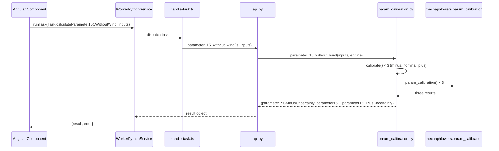

# Parameter at 15°C without wind

## Purpose

The **Parameter at 15°C without wind** tab calculates the cable parameter at a standardized condition (15°C temperature, zero wind) from field measurement inputs. The calculation uses the mechaphlowers `param_calibration` function to perform a single Newton-Raphson step with finite-difference derivative, yielding three results: a central estimate and uncertainty bounds (minus/plus).

## Component & Files

- **Angular component**: `src/app/features/studio/field-measuring/presentation/components/parameter-calculation-15-without-wind/parameter-calculation-15-without-wind.component.ts` and `.html`
- **Data model**: `src/app/shared/domain/models/field-measure.model.ts` (interfaces `FieldMeasure`, `Parameter15CResult`, `ManualParameterCalculation15CWithoutWind`)
- **Worker task**: `src/app/core/services/worker_python/tasks/types.ts` (enum `Task.calculateParameter15CWithoutWind`)
- **Task dispatcher**: `src/app/core/services/worker_python/tasks/handle-task.ts` (maps to Python function `parameter_15_without_wind`)
- **Python API**: `src/app/core/services/worker_python/tasks/python-scripts/api.py`
- **Stellar Engine**: `stellar-engine/src/stellar_engine/tools/param_calibration.py` (module-level function `parameter_15_without_wind`)
- **Inputs dataclass**: `stellar-engine/src/stellar_engine/entities/inputs.py` (class `ParameterCalibrationInputs`)
- **Initial Condition service**: `src/app/core/services/initial-condition/initial-condition.service.ts` (method `addInitialCondition`)

## Sequence Diagram



## Inputs

The component accepts four measurement values and a span index:

| Name | Type | Source (Auto) | Source (Manual) | Unit | Description |
|---|---|---|---|---|---|
| Measured parameter | `number` | `outputs.papoto.parameter` | Manual input | m | The cable sag or extension measured via PAPOTO or other method; denoted $P$ |
| Parameter uncertainty | `number` | `outputs.papoto.uncertainty` | Manual input | m | Measurement uncertainty in the parameter; denoted $Inc_P$ |
| Cable temperature | `number` | `outputs.cableTemperature.cableTemperature` | Manual input | °C | The cable temperature at measurement time; denoted $T$ |
| Temperature uncertainty | `number` | `outputs.cableTemperature.cableTemperatureUncertainty` | Manual input | °C | Measurement uncertainty in temperature; denoted $Inc_T$ |
| Span index | `number` | `data.span[0]` (first selected span) | Fixed | — | Index of the span used for calibration |

### Auto vs Manual Mode

- **Auto**: reads four values from prior tabs' computed outputs (`papoto`, `cableTemperature`)
- **Manual**: user enters all four values via input fields

On switch from **Auto** to **Manual**, only fields that remain unset are pre-filled from auto values (truncated); any existing manual values are preserved.

## Calculation

The calculation calls `mechaphlowers.param_calibration()` **three times**:

| Result | Measured temperature | Measured parameter |
|---|---|---|
| $P_{min}$ (`parameter15CMinusUncertainty`) | $T - 0.9 \times 1.65 \times Inc_T$ | $P - 0.5 \times 1.65 \times Inc_P$ |
| $P$ (`parameter15C`) | $T$ | $P$ |
| $P_{max}$ (`parameter15CPlusUncertainty`) | $T + 0.9 \times 1.65 \times Inc_T$ | $P + 0.5 \times 1.65 \times Inc_P$ |

The constants are defined in `stellar-engine/src/stellar_engine/tools/param_calibration.py`:

```python
COVERAGE_FACTOR = 1.65
TEMPERATURE_UNCERTAINTY_WEIGHT = 0.9
PARAMETER_UNCERTAINTY_WEIGHT = 0.5
```


### Algorithm (mechaphlowers.param_calibration)

Each call to `mechaphlowers.param_calibration()` performs:

1. **Build a BalanceEngine** using the section array and cable array from the study
2. **Estimate state at measured condition** via `solve_adjustment()` — iteratively adjust the cable to match the measured parameter at the measured temperature
3. **Compute state at 15°C, zero wind** via `solve_change_state()` — calculate the equilibrium parameter at the reference condition (15°C, no wind)

The function uses a finite-difference derivative to estimate the cable's sensitivity to parameter changes.

## Outputs

| Name | Type | Unit | Description |
|---|---|---|---|
| `parameter15CMinusUncertainty` | `number` | m | Parameter at 15°C with uncertainty lower bound |
| `parameter15C` | `number` | m | Parameter at 15°C, central estimate |
| `parameter15CPlusUncertainty` | `number` | m | Parameter at 15°C with uncertainty upper bound |

## Validation & Error Handling

### Form Validation

- **Auto mode**: all four values must be numbers (no null, no undefined)
- **Manual mode**: all four manually entered fields must be numbers

Invalid state is checked by `isFormValid()` signal.

### Error Handling

- **`parameter15CError` signal**: set to `true` on validation failure or Python computation error
- **`isCalculating` signal**: set to `true` while the worker task runs; prevents concurrent clicks
- **User notification**: when validation fails, the UI displays the message "All fields are mandatory for parameter calculation at 15°C"

## Initial Condition Creation

Each of the three results has a **Create initial condition** button. Clicking it:

1. Opens the initial condition modal with `mode: 'create'`
2. Pre-fills `base_parameters` with the chosen result value (already rounded to 1 decimal at the Python level)
3. Pre-fills `base_temperature: 15`
4. Calls `InitialConditionService.addInitialCondition()` when the user confirms

The modal pre-populates all other fields (cable pretension, min/max conditions) with default or existing values.

## Deployment Note: Pyodide Wheel Updates

The Pyodide worker loads the prebuilt wheel from `public/pyodide/stellar_engine-*-cp313-none-any.whl`, **not** the `stellar-engine/` source directory.

```{warning}
After modifying `stellar-engine/`, you must:

1. Rebuild the wheel:
   ```bash
   python3 scripts/set_up_mechaphlowers_v2.py --engine-only
   ```

2. Recompile it for Pyodide:
   ```bash
   uvx --from pyodide-build pyodide py-compile --compression-level 6 public/pyodide/stellar_engine-0.3.0-py3-none-any.whl
   ```

3. Ensure `file_name` in `src/app/core/services/worker_python/python-packages.json` ends with `-cp313-none-any.whl`

Failure to update the wheel will cause Pyodide to load stale code.
```

## Tests

- **Angular component**: `src/app/features/studio/field-measuring/presentation/components/parameter-calculation-15-without-wind/parameter-calculation-15-without-wind.component.spec.ts`
- **Python module**: `stellar-engine/test/tools/test_param_calibration.py`
