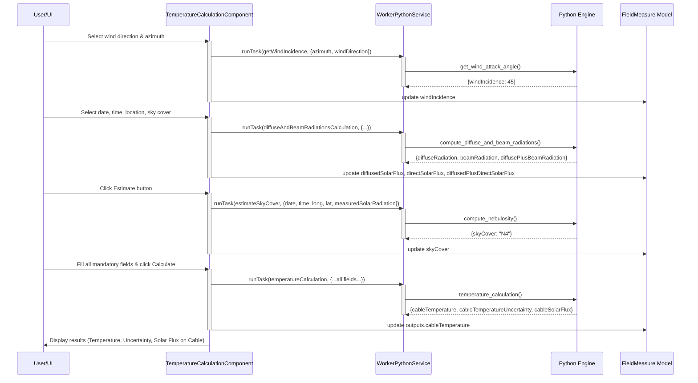

# Temperature Calculation

## Purpose

The **Temperature calculation** tab computes the steady-state cable temperature under measured field conditions, including ambient temperature, transit current, wind speed/direction, solar radiation, and sky cover. The component leverages four worker tasks to:

1. Calculate wind incidence angle relative to the cable
2. Compute diffuse and beam solar radiations from geometry and sky cover  
3. Estimate sky cover from measured solar radiation
4. Run the final thermal equilibrium calculation via mechaphlowers

## Component & Files

The temperature calculation feature is implemented in:

- `src/app/features/studio/field-measuring/presentation/components/temperature-calculation/temperature-calculation.component.ts`
- `src/app/features/studio/field-measuring/presentation/components/temperature-calculation/temperature-calculation.component.html`
- `src/app/features/studio/field-measuring/presentation/constants.ts` (bounds and options)
- `src/app/features/studio/field-measuring/presentation/helpers.ts` (utility functions)
- `src/app/shared/domain/models/field-measure.model.ts` (FieldMeasure and TemperatureCalculationResult types)

## Worker Tasks

The component orchestrates four Python worker tasks via `WorkerPythonService`. Each task is mapped to a Python function in `stellar-engine/src/stellar_engine/tools/temperature.py`.

### Task: getWindIncidence

**Triggered by:**  
An effect that fires whenever `windDirection` or `azimuth` changes and the worker is ready. User selects "Auto" mode for wind incidence (manual mode displays 90°).

**Input type:** `TaskInputs[Task.getWindIncidence]`

| Field | Type | Unit | Meaning |
|-------|------|------|---------|
| `azimuth` | number | degrees | Cable orientation (0° = North/South, 90° = East/West, etc.) |
| `windDirection` | string | — | Cardinal direction ("North", "North-East", etc.) from WIND_DIRECTION_OPTION_KEYS |

**Output type:** `TaskOutputs[Task.getWindIncidence]`

| Field | Type | Unit | Meaning |
|-------|------|------|---------|
| `windIncidence` | number | degrees | Angle of wind attack on cable (0°–90°, computed from cable azimuth and wind direction) |

**Python implementation:**  
Maps wind direction name to azimuth degree (e.g., "North-East" → 45°), then calls `ThermalEngine.compute_wind_attack_angle()` from mechaphlowers to compute angle between wind and cable.

---

### Task: diffuseAndBeamRadiationsCalculation

**Triggered by:**  
An effect that fires whenever `date`, `time`, `longitude`, `latitude`, or `skyCover` changes and the worker is ready. Runs automatically to populate solar radiation display fields.

**Input type:** `TaskInputs[Task.diffuseAndBeamRadiationsCalculation]`

| Field | Type | Unit | Meaning |
|-------|------|------|---------|
| `date` | Date \| null | — | Measurement date (e.g., 2025-06-21) |
| `time` | Date \| null | — | Measurement time as Date object (time part only, UTC) |
| `longitude` | number | degrees | Geographic longitude |
| `latitude` | number | degrees | Geographic latitude |
| `skyCover` | SkyCover | — | Sky cover enum (N0–N8, where N0=clear, N8=fully covered) |

**Output type:** `TaskOutputs[Task.diffuseAndBeamRadiationsCalculation]`

| Field | Type | Unit | Meaning |
|-------|------|------|---------|
| `diffuseRadiation` | number | W/m² | Diffuse (scattered) solar radiation on horizontal plane |
| `beamRadiation` | number | W/m² | Direct (beam) solar radiation on horizontal plane |
| `diffusePlusBeamRadiation` | number | W/m² | Total global horizontal irradiance |

**Python implementation:**  
Converts inputs to numpy datetime64 and calls `ThermalEngine.diffuse_and_beam_solar_radiations()` from mechaphlowers, which computes ESRA (Estrada Solar Radiation Analysis) model based on time, location, and sky cover. Returns NaN if computation time is night (raises `NightTimeError` internally, caught by component).

---

### Task: estimateSkyCover

**Triggered by:**  
User clicks the **Estimate** button next to the **Solar beam radiation (not required)** field. Requires `date`, `time`, `longitude`, `latitude`, and a valid measured solar radiation value (0–2000 W/m²).

**Input type:** `TaskInputs[Task.estimateSkyCover]`

| Field | Type | Unit | Meaning |
|-------|------|------|---------|
| `date` | Date \| null | — | Measurement date |
| `time` | Date \| null | — | Measurement time (UTC) |
| `longitude` | number | degrees | Geographic longitude |
| `latitude` | number | degrees | Geographic latitude |
| `measuredSolarRadiation` | number | W/m² | Measured global solar irradiance (from user input or estimated) |

**Output type:** `TaskOutputs[Task.estimateSkyCover]`

| Field | Type | Unit | Meaning |
|-------|------|------|---------|
| `skyCover` | SkyCover | — | Inferred sky cover value (N0–N8) |

**Python implementation:**  
Calls `ThermalEngine.nebulosity()` from mechaphlowers to inverse-solve for sky cover, given measured radiation. Raises `NightTimeError` if time is during night, caught and displayed as a localized user error. If result is NaN or out of bounds, raises `ValueError`.

---

### Task: temperatureCalculation

**Triggered by:**  
User clicks the **Calculate** button after filling all mandatory fields. The form is valid only when:
- Cable name is set
- Transit (A) is set and within [0, 4000] A
- Sky cover is selected
- Measured solar flux (if present) is within [0, 2000] W/m²

**Input type:** `TaskInputs[Task.temperatureCalculation]`

| Field | Type | Unit | Meaning |
|-------|------|------|---------|
| `cableName` | string | — | Cable identifier from catalog (e.g., "ASTER 600") |
| `ambientTemperature` | number | °C | Ambient air temperature (defaults to 0) |
| `longitude` | number | degrees | Geographic longitude (defaults to 0) |
| `latitude` | number | degrees | Geographic latitude (defaults to 0) |
| `altitude` | number | m | Ground altitude above sea level (defaults to 0) |
| `azimuth` | number | degrees | Cable orientation (defaults to 0) |
| `transit` | number | A | Current magnitude in conductor (0–4000 A) |
| `date` | Date \| null | — | Measurement date |
| `time` | Date \| null | — | Measurement time (UTC) |
| `windSpeed` | number | km/h or m/s | Wind speed (defaults to 0); unit specified separately |
| `windSpeedUnit` | "kmh" \| "ms" | — | Unit of wind speed |
| `windDirection` | string | — | Cardinal direction ("North", "North-East", etc., defaults to "North") |
| `skyCover` | SkyCover | — | Sky cover (N0–N8) |

**Output type:** `TaskOutputs[Task.temperatureCalculation]`

| Field | Type | Unit | Meaning |
|-------|------|------|---------|
| `cableTemperature` | number | °C | Steady-state cable temperature under given conditions |
| `cableTemperatureUncertainty` | number | °C | Uncertainty range (e.g., ±1.06°C) |
| `cableSolarFlux` | number \| null | W/m² | Currently always null in returned data |

**Python implementation:**  
Builds a `TemperatureCalculationInputs` dataclass and passes to `temperature_calculation()`, which:
1. Creates a `ThermalEngine` instance  
2. Retrieves cable properties from `engine.cable_array`  
3. Sets thermal engine with geometry, coordinates, temperature, wind speed/angle, nebulosity  
4. Calls `thermal_engine.steady_temperature(return_uncertainty=True)` from mechaphlowers  
5. Returns cable core temperature and uncertainty

The thermal model accounts for Joule heating (I²R), solar absorption, and convective/radiative cooling, with uncertainty propagation from input measurement errors.

---

## Data Flow & Sequence



---

## FieldMeasure Data Model

The component reads and writes to the following `FieldMeasure` interface fields (defined in `src/app/shared/domain/models/field-measure.model.ts`):

### Read (inputs)

- `cableName: string | null` — Selected conductor name
- `ambientTemperature: number | null` — User-entered or inherited from earlier tab
- `longitude, latitude, altitude: number | null` — Geographic coordinates from "Terrain data" tab
- `azimuth: number | null` — Cable orientation from "Terrain data" tab
- `date, time: Date | null` — Measurement date/time from "Terrain data" tab
- `windSpeed: number | null`, `windSpeedUnit: 'kmh' | 'ms'` — Wind conditions
- `windDirection: string | null` — Cardinal direction from dropdown
- `windIncidenceMode: 'auto' | 'perpendicular'` — User-selected mode
- `skyCover: SkyCover | null` — Sky cover enum (N0–N8)
- `measuredDiffusedPlusDirectSolarFlux: number | null` — User-entered or estimated solar radiation

### Write (outputs)

- `windIncidence: number | null` — Computed by `getWindIncidence` task
- `diffusedSolarFlux: number | null` — Computed by `diffuseAndBeamRadiationsCalculation` task
- `directSolarFlux: number | null` — Computed by `diffuseAndBeamRadiationsCalculation` task
- `diffusedPlusDirectSolarFlux: number | null` — Computed by `diffuseAndBeamRadiationsCalculation` task
- `outputs.cableTemperature: TemperatureCalculationResult | null` — Final result from `temperatureCalculation` task
  - `cableTemperature: number` — Steady-state temperature (°C)
  - `cableTemperatureUncertainty: number` — Uncertainty bound (°C)
  - `cableSolarFlux: number | null` — Currently always null

---

## Validation & Error Handling

### Form Validity

The **Calculate** button is disabled until:

```typescript
isFormValid = computed(() => {
  const data = this.measureData();
  return (
    data.cableName !== null &&
    data.transit !== null &&
    data.skyCover !== null &&
    !this.isTransitOutOfBounds() &&
    !this.isMeasuredSolarFluxOutOfBounds()
  );
});
```

### Input Bounds

**Transit (A):**  
- Min: 0 A  
- Max: 4000 A  
- Validation constant: `TRANSIT_BOUNDS = { min: 0, max: 4000 }`
- Error message: "Minimum transit value: 0 A." or "Maximum transit value: 4000 A."

**Measured solar flux (W/m²):**  
- Min: 0 W/m²  
- Max: 2000 W/m²  
- Validation constant: `MEASURED_SOLAR_FLUX_BOUNDS = { min: 0, max: 2000 }`
- Error message displayed on field if out of bounds

### User-Facing Error Messages

**Wind incidence (auto mode):**  
- **Missing inputs warning:** "Wind direction and azimuth are required." (shown as `p-message` severity="warn" if `windIncidenceMode === 'auto'` but azimuth or windDirection is null)

**Sky cover estimation:**  
- Button disabled if: `longitude`, `latitude`, `date`, `time`, or `measuredDiffusedPlusDirectSolarFlux` is missing, or measured solar flux is out of bounds
- Error on click: "Sky cover could not be estimated from the provided inputs. Please check the values and try again." (if Python raises `NightTimeError` or validation fails)
- More specific Python errors may be localized by `formatPythonError()` (e.g., `NightTimeError` → custom message)

**Temperature calculation:**  
- Error on click: "An error occurred while calculating the temperature" (generic message if `temperatureCalculation` task fails)

### Mandatory Fields

Displayed banner at top of form:  
**"All fields are mandatory for temperature calculation."**

---

## Integration with "Parameter at 15°C without wind" Tab

After a successful temperature calculation, the user may advance to the **Parameter at 15°C without wind** tab. If that tab is set to **Auto** mode, it reads:

- `cableTemperature` (from `outputs.cableTemperature.cableTemperature`)  
- `cableTemperatureUncertainty` (from `outputs.cableTemperature.cableTemperatureUncertainty`)  
- Cable name from `cableName`

as calibration reference values to compute the parameter at standard conditions. The uncertainty value flows directly into parameter uncertainty bounds.

---

## Tests

### Angular Component Tests

- `src/app/features/studio/field-measuring/presentation/components/temperature-calculation/temperature-calculation.component.spec.ts`  
  Tests cover:
  - Form validity logic
  - Wind incidence auto-computation and manual modes
  - Solar radiation effect (diffuse + beam)
  - Sky cover estimation trigger and error handling
  - Temperature calculation result display
  - Bound validation (transit, solar flux)
  - Localized error/warning messages

### Python Engine Tests

- `stellar-engine/test/tools/test_temperature.py`  
  Tests cover:
  - `get_wind_attack_angle()` — wind incidence angle computation
  - `temperature_calculation()` — steady-state cable temperature result
  - `compute_diffuse_and_beam_radiations()` — ESRA solar radiation model
  - `compute_nebulosity()` — sky cover estimation from measured radiation
  - Night-time error handling  
  - Date/time type validation
  - Sky cover range validation (N0–N8)

---

## Notes

- The component uses Angular's new control flow (`@if`, `@switch`, `@for`) and signals (`signal`, `computed`, `effect`, `toSignal`).  
- Async tasks are managed via `isCalculating`, `isEstimatingSkyCover`, `isWindIncidenceLoading` signals.  
- All user-facing labels and error messages are fetched via Transloco i18n from `public/i18n/en.json`.  
- The "measured solar flux" input is marked **not required** in the UI ("Solar beam radiation (not required)"), but if provided, it bounds the form validity and is used for sky cover estimation.
