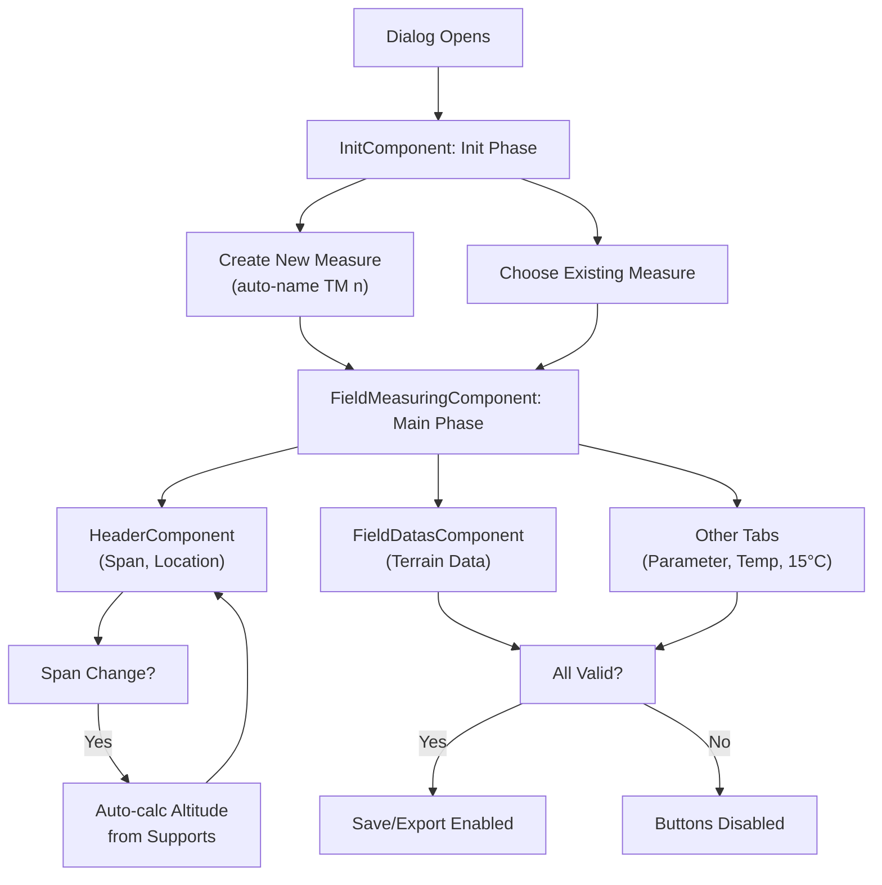

# Terrain Data Tab

## Purpose

The **Terrain Data** tab captures environmental and location data recorded during a field measurement session. It forms part of the **Field Measuring** tool, which computes the base parameter and related thermal properties from on-site observations.

## Component Tree and Files

The terrain data tab is implemented by the following components and support files (relative paths from `src/app/features/studio/field-measuring/`):

- **Main dialog**: `presentation/components/field-measuring/field-measuring.component.ts` (tabs, validation, save/export)
- **Terrain Data tab**: `presentation/components/field-datas/field-datas.component.ts` and `.html`
- **Shared header** (above all tabs): `presentation/components/header/header.component.ts` and `.html`
- **Init screen** (create/select measure): `presentation/components/init/init.component.ts` and `.html`
- **Domain model**: `domain/types.ts` (exports `FieldMeasure` interface)
- **Helpers**: `presentation/helpers.ts` (e.g., `createInitialMeasureData`, `buildTimeModeOptions`, option builders)
- **Constants**: `presentation/constants.ts` (field bounds, option keys, export mappings)
- **Export helpers**: `presentation/field-measure-export.helpers.ts` (JSON export structure)

## Workflow

1. **Init Phase**: User opens the Field Measuring tool. The `InitComponent` allows creating a new measurement (with auto-generated name) or selecting an existing one.
2. **Main Phase**: Once a measure is selected or created, `FieldMeasuringComponent` displays a dialog with four tabs. The **Terrain Data** tab is shown by default.
3. **Data Entry**: User fills in location and environmental fields via `HeaderComponent` (shared) and `FieldDatasComponent` (tab-specific).
4. **Validation**: `FieldMeasuringComponent` computes `isFormValid` by checking all mandatory fields and their bounds.
5. **Save**: Calls `PlotService.modifySection()` to persist the measure to the section's `field_measures` array.
6. **Export**: Calls `buildFieldMeasureExportJson()` to generate a JSON export (if all tabs pass validation).

## Data Model

The measure data is typed as `FieldMeasure` (from `domain/types.ts`), which includes:

- **UUID**: Unique identifier (auto-generated via `uuidv4()`).
- **Name**: User-entered name; must be unique within the section.
- **Metadata** (read-only from section): `link`, `voltage`, `spanType`, `phaseNumber`, `numberOfConductors`.
- **Terrain data** (Terrain Data tab):
  - `date` (Date): measurement date
  - `time` (Date): measurement time
  - `season` ('summer' | 'winter'): inferred from DST
  - `ambientTemperature` (number, °C): range -50 to 99
  - `windSpeed` (number): range 0 to 50
  - `windSpeedUnit` ('kmh' | 'ms'): km/h or m/s
  - `windDirection` (string): one of 8 compass directions (North, North-East, …)
  - `skyCover` (SkyCover enum N0–N8): nebulosity scale
- **Location data** (Header, shared):
  - `span` (number[] | null): `[leftSupportIndex, rightSupportIndex]`
  - `longitude` (number, degrees): range -180 to 180
  - `latitude` (number, degrees): range -90 to 90
  - `altitude` (number, m): range -100 to 9000; auto-calculated from span's support heights
  - `azimuth` (number, degrees): range -180 to 180
- **Outputs** (computed): `papoto` (PapotoResult | null), `cableTemperature` (TemperatureCalculationResult | null), `parameter15C` (Parameter15CResult | null)

Additional fields exist for other tabs (parameter calculation, temperature, parameter at 15°C); see the model for full details.

## Field Bindings and Events

### HeaderComponent

**Inputs:**
- `measureData: InputSignal<FieldMeasure>` – current measure data
- `fieldChange: OutputSignal<{ field: keyof FieldMeasure; value: any }>` – emitted when user changes a field

**Behavior:**
- Displays non-editable info: Link, Voltage, Span Type, Phase Number, Cable Amount.
- Span dropdown: auto-populated from section's supports; auto-selects first span on dialog open (if none selected).
- When span changes: altitude is recalculated as the average of the two support attachment heights.
- Longitude/Latitude/Altitude/Azimuth: number inputs with mandatory badges and range validation.
- On span or reference-support change, the component also attempts to auto-fill longitude/latitude/azimuth from the study localization for that span.

**Automatic localization resolution:**
- The logic lives in `HeaderComponent.fillLocalization()` and uses the same worker contract as the section-data view: `Task.computeLocalization`.
- `buildSectionLocalizationPayload()` builds the payload from the section's `start_latitude`, `start_longitude`, `start_azimuth`, and each support's `spanLength` / `spanAngle`.
- `getSpanLocalization()` selects the corresponding support localization from the computed arrays, preferring the selected reference support and falling back to the left support when needed.
- If no finite values are available, the app shows the translated info message `field-measuring.header.localization-not-available` (text: “Localization not available in study”).

### FieldDatasComponent

**Inputs:**
- `measureData: InputSignal<FieldMeasure>` – current measure data
- `isNameAlreadyTaken: InputSignal<boolean>` – signals duplicate-name error

**Outputs:**
- `fieldChange: OutputSignal<{ field: keyof FieldMeasure; value: any }>` – emitted on input change

**Fields:**
- **Measure name**: text input; uniqueness validated at the parent level.
- **Date**: date picker (format: dd/mm/yy).
- **Time / Season**: season toggle (Summer/Winter) + time picker (24-hour format).
- **Ambient temperature**: number input (°C), range -50 to 99.
- **Wind speed**: number input (0–50) + unit toggle (km/h or m/s).
- **Wind direction**: dropdown (8 compass directions).
- **Sky cover**: dropdown (N0–N8 nebulosity scale).

All fields display a mandatory-field info message (`field-measuring.field-datas.mandatory-msg`).

### InitComponent

**Purpose:** Create a new measure or select an existing one before entering the main dialog.

**Flows:**
1. **Create**: Enter name (auto-populated as "TM n+1" where n = measure count) → click "Create a new measurement" → transition to main phase.
2. **Choose**: Select from dropdown of existing measures → click "Choose" → transition to main phase.

**Validation:**
- Name must be provided and unique (checked against existing measures).
- Duplicate names show error message: `field-measuring.shared.measure-name-unique-error`.

## Validation Rules

### Field Bounds (FieldMeasuringComponent.isFormValid)

All fields are mandatory and checked for range:
- `name`: non-empty, unique
- `span`: must be set
- `longitude`: -180 to 180
- `latitude`: -90 to 90
- `altitude`: -100 to 9000
- `azimuth`: -180 to 180
- `windSpeed`: 0 to 50
- `ambientTemperature`: -50 to 99
- `windDirection`, `skyCover`: required
- `transit` (optional field in other tabs): if present, 0–4000 Amperes

**Export Validation:** The export button is enabled only if `isFormValid()` AND all other tabs (Parameter Calculation, Temperature Calculation, Parameter at 15°C) are also valid.

**Uniqueness Check:** `isNameAlreadyTaken` computed property checks if `measureData().name` matches any existing measure (excluding self by UUID).

## Save and Export

### Save

- **Handler**: `FieldMeasuringComponent.onSave()`
- **Condition**: enabled when `isFormValid() && hasUnsavedChanges()`
- **Action**: calls `PlotService.modifySection({ field_measures: [...updated...] })` to persist
- **Snapshot**: `lastSavedMeasureData` signal is updated; `hasUnsavedChanges` is recomputed

### Export

- **Handler**: `FieldMeasuringComponent.onExport()`
- **Condition**: enabled when `isFormValid() && isParameterCalculationValid && isTemperatureCalculationValid && isParameterAt15CValid`
- **Output**: JSON file (via `buildFieldMeasureExportJson()`) with study/section metadata and measure data
- **Filename**: `Export Mesure de terrain_<measure name>_<section name>_<date>.json`

## Mermaid Diagram: Workflow

## Tests

The following spec files cover the terrain data functionality:

- `presentation/components/field-datas/field-datas.component.spec.ts` – Terrain Data tab
- `presentation/components/header/header.component.spec.ts` – Header (location & span)
- `presentation/components/init/init.component.spec.ts` – Init screen (create/select)
- `presentation/components/field-measuring/field-measuring.component.spec.ts` – Dialog, validation, save/export
- `presentation/field-measure-export.helpers.spec.ts` – JSON export structure
- `presentation/components/temperature-calculation/temperature-calculation.component.spec.ts` – Linked tab
- `presentation/components/parameter-calculation-15-without-wind/parameter-calculation-15-without-wind.component.spec.ts` – Linked tab
- `presentation/components/calculus-setting/calculus-setting.component.spec.ts` – Linked tab
