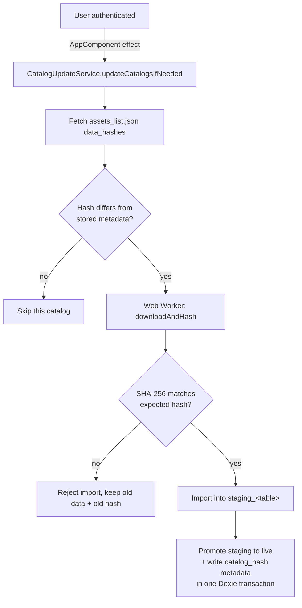

# Processus de mise à jour du catalogue

Les données de référence du catalogue (câbles, chaînes, attaches, lignes, équipes de
maintenance, configuration des obstacles) sont stockées hors ligne dans Dexie/IndexedDB et
actualisées par un mécanisme **indépendant de la mise à jour de l'application** décrite dans
[Processus de mise à jour de l'application](application_update.md). Les catalogues doivent
continuer à se mettre à jour même si l'utilisateur refuse (ou n'a pas encore accepté) une mise
à jour de l'application, afin que personne ne reste bloqué avec des données de référence
obsolètes en attendant le téléchargement d'un gros bundle applicatif.

## Aperçu

Fichiers sources :

- `stellar/src/app/shared/catalog/services/catalog-update.service.ts` — orchestrateur.
- `stellar/src/app/shared/catalog/csv-import/internal/verified-download.helpers.ts` — téléchargement + hachage SHA-256.
- `stellar/src/app/shared/catalog/csv-import/internal/run-worker-import.helpers.ts` — import en staging + promotion atomique.
- `stellar/src/app/infrastructure/database/app-database.versions.ts` — schéma de la table de staging (`STAGING_TABLE_PREFIX`).
- `stellar/scripts/create_assets_list_for_service_worker.py` — génère `data_hashes` dans `assets_list.json`.

Les fichiers de données du catalogue se trouvent dans `stellar/public/data/*.csv` et
`stellar/public/data/obstacle_configuration.json`. Ils sont exclus du manifeste des ressources
de l'application (`files`) — le service worker ne les précache ni ne les télécharge jamais
(voir [Processus de mise à jour de l'application](application_update.md)) — et reçoivent à la
place une entrée SHA-256 par fichier sous `data_hashes` dans `assets_list.json`.

## Mécanisme de mise à jour

### 1. Déclenchement — uniquement après authentification

`CatalogUpdateService.updateCatalogsIfNeeded()` est déclenché une seule fois par
`AppComponent`, dès que `AuthService.currentUser()` devient vrai, avant la logique de
première installation/mise à jour disponible de l'application. C'est un strict no-op (aucun
appel réseau, aucun import) tant que l'utilisateur n'est pas authentifié.

### 2. Comparaison de hash — seuls les catalogues modifiés sont téléchargés

Pour chacun des six catalogues (`maintenance-teams.csv`, `lines.csv`, `cables.csv`,
`chains.csv`, `attachments.csv`, `obstacle_configuration.json`), le service compare le hash
issu de `data_hashes` de `assets_list.json` à `metadata.get('catalog_hash:<filename>')` déjà
stocké dans Dexie. Un catalogue n'est téléchargé et importé que si le hash est manquant ou
différent. Si le manifeste n'expose aucun `data_hashes` (repli legacy), chaque catalogue est
réimporté sans condition.

### 3. Téléchargement vérifié — un seul fetch, SHA-256 incrémental

`downloadAndHash()` télécharge le catalogue une seule fois (`cache: 'no-store'`), alimentant
un hacheur SHA-256 incrémental (`hash-wasm`) morceau par morceau au fur et à mesure que le
corps de la réponse est streamé, et renvoie à la fois le `Blob` brut et le condensé
hexadécimal résultant. Si `expectedHash` est fourni et ne correspond pas, l'import est rejeté
**avant** que quoi que ce soit ne soit écrit dans Dexie — les données de catalogue précédentes
et leur hash enregistré restent intacts.

### 4. Import en staging, puis promotion atomique

Le contenu vérifié est analysé (PapaParse pour le CSV, `JSON.parse` pour la configuration des
obstacles) et écrit uniquement dans les tables `staging_<table>` — jamais directement dans les
tables live. Une fois le staging entièrement peuplé, `promoteStagingToLive()` copie le staging
vers la ou les tables live par lots bornés et écrit `catalog_hash:<filename>` dans `metadata`,
le tout au sein d'une **seule transaction Dexie**. Les données d'un catalogue et son hash
enregistré changent donc toujours ensemble, ou pas du tout ; un import échoué/interrompu
laisse les données de catalogue précédentes pleinement utilisables hors ligne.

### 5. Isolation par catalogue

Un échec sur un catalogue (erreur réseau, hash non concordant, erreur de parsing) est
journalisé via `LoggerService` et signalé à l'utilisateur via `NotificationService`, mais ne
bloque jamais la mise à jour des autres catalogues.

## Documentation associée

- [Processus de mise à jour de l'application](application_update.md) — service worker,
  activation du cache versionné, et les trois intentions de mise à jour autorisées
  (`confirmUpdate`, `forceUpdateFromAdmin`, `installFirstLaunch`).
- [Base de données hors ligne](offline_database.md) — conventions Dexie/`StorageService`.
