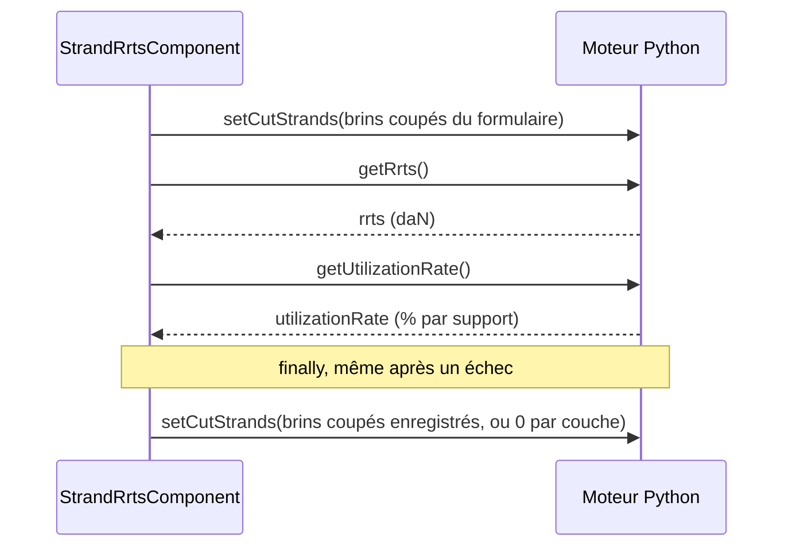

# CRR de brins coupés — conception technique

L'outil **CRR de brins coupés** calcule la charge de rupture résiduelle (CRR, *RRTS* en anglais
et dans le code) du câble de la section une fois certains de ses brins coupés, et le taux de
travail max qui en découle. L'utilisateur saisit les brins coupés de chaque couche du câble, la
boîte de dialogue lance le calcul dans le moteur Python, et une seule entrée peut être enregistrée
par section. En parallèle, la présence du personnel du cas de charge sélectionné règle la
**haute sécurité** du moteur, qui pèse sur chaque taux de travail renvoyé par le moteur, y compris
celui du studio.

---

## Fichiers clés en un coup d'œil

Les chemins sont relatifs à `src/app/`, sauf `stellar-engine/`, relatif à la racine du dépôt.

| Fichier | Rôle |
|---|---|
| `features/studio/core/presentation/components/top-toolbar/top-toolbar.component.ts` | Point d'entrée : entrée **CRR de brins coupés** du menu **Outils** |
| `features/studio/toolbar/presentation/services/toolbar-dialog.service.ts` | Enregistre l'outil `'strand-rrts'` et l'héberge dans la boîte de dialogue de la barre d'outils |
| `features/studio/toolbar/presentation/components/strand-rrts/strand-rrts.component.ts` | Boîte de dialogue : formulaire, calcul, enregistrement et suppression, brins coupés du moteur |
| `features/studio/toolbar/presentation/components/strand-rrts/strand-rrts.helpers.ts` | Statut du nouveau taux de travail max, et conversion des brins coupés du formulaire vers l'entrée du moteur et vers l'entrée enregistrée |
| `features/studio/toolbar/presentation/components/strand-rrts/strand-rrts.constantes.ts` | Bornes et valeurs par défaut du formulaire, clés catalogue des nombres de brins, icônes de statut |
| `features/studio/toolbar/presentation/components/strand-rrts/strand-rrts.interfaces.ts` | Types de la valeur du formulaire, des résultats et du statut |
| `shared/domain/models/section.model.ts` | Entrée enregistrée, stockée sur la section |
| `core/services/section/section-geometry.helpers.ts` | `sanitizeSectionGeometry()` supprime une entrée dont la portée n'existe plus |
| `core/services/plot/plot.service.ts` | Haute sécurité de l'étude moteur |
| `core/services/worker_python/tasks/types.ts` | Entrées et sorties des tâches |
| `core/services/worker_python/tasks/python-scripts/api.py` | Points d'entrée des tâches |
| `stellar-engine/src/stellar_engine/core/cut_strands.py` | Fonctions du moteur |

---

## Côté moteur

### Le modèle

Le calcul relève de mechaphlowers : `CableArray` le délègue à son modèle de résistance à la
traction, `AdditiveLayerRts`, qui lit les colonnes du catalogue de câbles `rts_cable`,
`rts_layer_1` à `rts_layer_8`, `nb_strand_layer_1` à `nb_strand_layer_8` et `safety_coefficient`.

$$RRTS = RTS_{cable} - \sum_{i=1}^{8} cut\_strands_i \times rts\_layer_i$$

$$utilization\_rate_{span} = \frac{T_{max,span} \times safety\_coefficient}{RRTS} \times 100$$

- `safety_coefficient` vaut `1.5` par défaut quand le catalogue n'en donne pas. Avec la haute
  sécurité active, il est multiplié par `options.data.safety_security_factor` (`1.5`).
- La CRR est globale à la section : des brins coupés sur une portée abaissent la résistance
  utilisée pour toutes les portées. C'est pourquoi la portée, le support de référence et la
  distance d'une entrée ne prennent aucune part au calcul.
- Un `rts_cable` manquant, ou un `rts_layer_i` manquant sur une couche avec des brins coupés,
  lève `RtsDataNotAvailable`.

Les brins coupés et la haute sécurité sont un **état de l'étude moteur** : ils restent en place
jusqu'à être réglés de nouveau, et chaque taux d'utilisation calculé ensuite les utilise, y
compris celui de `refreshProjection()`. L'étude moteur créée par `Task.initLit` démarre avec les
valeurs par défaut de mechaphlowers, sans brins coupés et sans haute sécurité, mais l'application
applique juste après la haute sécurité du cas de charge sélectionné : elle est active pour une
nouvelle étude, qui n'a pas de cas de charge sélectionné (voir *Haute sécurité*).

### Tâches

Définies dans `stellar_engine/core/cut_strands.py` et exposées par `api.py` :

| Tâche | Fonction Python | Entrée | Sortie |
|---|---|---|---|
| `setCutStrands` | `set_cut_strands` | `{ cutStrands: number[] }`, une valeur par couche du catalogue (8) | `{ success: true }` |
| `getRrts` | `get_rrts` | — | `{ rrts }`, en **daN** (mechaphlowers renvoie des N) |
| `getUtilizationRate` | `get_utilization_rate` | — | `{ utilizationRate: number[] }`, en %, un par support, `NaN` pour le dernier, qui ne commence aucune portée |
| `setHighSafety` | `set_high_safety` | `{ highSafety: boolean }` | `{ success: true }` |
| `getCutStrands` | `get_cut_strands` | — | `{ cutStrands: number[] }`, non utilisée par l'application |

`set_cut_strands` lève une `ValueError`, construite à partir de `_Errors.cut_strands_*`, quand
l'entrée ne contient pas une valeur par couche du catalogue, ou quand une valeur n'est pas finie,
n'est pas entière, est négative ou dépasse le nombre de brins de sa couche.

Les erreurs du moteur ne rejettent pas : `WorkerPythonService.runTask()` se résout avec
`{ result, error }`. Le `runTask()` privé de la boîte de dialogue lève une exception sur `error`,
de sorte qu'une séquence de tâches s'arrête à celle qui échoue.

L'application charge le **wheel** de stellar-engine, pas ses sources : après une modification de
`cut_strands.py`, reconstruisez-le avec `npm run set-up-mechaphlowers:engine-only` (voir le
{doc}`Guide de configuration de Mechaphlowers <../installation/setup-mechaphlowers-guide>`).

---

## Modèle de données

Défini dans `shared/domain/models/section.model.ts`.

```typescript
// Linked to the span starting at spanUuid, or to the whole section when spanUuid is null
interface RrtsCutStrandsData {
  spanUuid: string | null;
  supportRef: 'LEFT' | 'RIGHT' | null;
  distanceSupportRef: number | null;
  // Cut strands per cable layer, index 0 = layer 1
  cutStrands: number[];
  addMarking: boolean;
}

interface Section {
  // …
  /** Saved RRTS cut strands, a single one per section */
  rrts_cut_strands?: RrtsCutStrandsData | null;
}
```

- Une section contient **une seule** entrée : l'enregistrement la remplace, la suppression la met
  à `null`.
- Comme pour les obstacles et les sols, une portée est identifiée par l'uuid de son support
  gauche. Sans portée, l'entrée s'applique à la section entière, avec `supportRef: null`,
  `distanceSupportRef: null` et `addMarking: false`.
- `cutStrands` contient une valeur pour **chaque** couche du catalogue, `0` pour les couches sans
  brins, comme l'exige le tableau d'entrée de `setCutStrands` : une entrée enregistrée part telle
  quelle vers le moteur. Le formulaire ne contient que les couches avec des brins :
  `toCatalogCutStrands()` répartit ses valeurs sur les 8 couches du catalogue.
- Les résultats (CRR, nouveau taux de travail max) ne sont pas persistés. Ils sont recalculés à
  l'ouverture de la boîte de dialogue sur une entrée enregistrée.

### Géométrie de la section

`sanitizeSectionGeometry()`, appliquée par `SectionService.createOrUpdateSection()`, supprime
l'entrée quand son `spanUuid` ne commence plus de portée : le support a été supprimé, ou il est
devenu le dernier de la section. `removedGeometryBoundObjects` vaut alors `true`, et la page de
l'étude affiche l'avertissement `study.notifications.geometry-objects-updated`. Une entrée liée à
la section entière (`spanUuid: null`) est toujours conservée.

---

## La boîte de dialogue

### Hébergement

L'entrée du menu **Outils** appelle `ToolbarDialogService.openTool('strand-rrts')`, et la boîte
de dialogue de la barre d'outils affiche `StrandRrtsComponent` via `ngComponentOutlet`. Le
composant transmet ses templates `#header` et `#footer` à la boîte de dialogue avec
`ToolbarDialogService.setTemplates()` : le titre va dans l'en-tête, **Supprimer** et
**Enregistrer** dans le pied.

Le composant est créé à l'ouverture de la boîte de dialogue et détruit à sa fermeture : les
saisies et les résultats non enregistrés ne survivent pas à une fermeture.

### Informations

| Champ | Source |
|---|---|
| Nom du câble | `section.cable_name` |
| Taux de travail max actuel | `maxOf(litData.output_parameters.utilization_rate)` : le **Taux de travail** du studio en mode **Max canton** |
| Présence du personnel | `personnelPresence` du cas de charge sélectionné, lu sur la copie de la section dans l'étude, comme le fait la barre de menu ; `true` sans cas de charge sélectionné |

`section` est `PlotSpanService.section()` et `litData` est `PlotService.litData()`.

### Formulaire

| Contrôle | Règles |
|---|---|
| `span` | Facultatif, effaçable. Options issues de `PlotSpanService.getSpanOptionsWithIndex()`, valeur `{ index, uuid }` |
| `supportRef` | `LEFT` ou `RIGHT`, options issues de `PlotSpanService.getSupportOptions()`. Mis à `LEFT` quand une portée est sélectionnée alors qu'il est vide, conservé lors d'un changement de portée |
| `distanceSupportRef` | Facultatif. De 0 à `DISTANCE_MAX` (5 000 m, fixe, pas la longueur de la portée), 2 décimales |
| `cutStrands` | `FormArray`, un contrôle par couche avec des brins. Obligatoire, de 0 au nombre de brins de la couche, entier (`maxDecimalsValidator(0)`), `DEFAULT_CUT_STRANDS` (0) par défaut |
| `addMarking` | Booléen |

- `supportRef`, `distanceSupportRef` et `addMarking` sont désactivés sans portée. Un abonnement à
  `span.valueChanges` les active quand une portée est sélectionnée, et les réinitialise et les
  désactive quand elle est effacée.
- `layers()` est un `computed` sur une `resource` qui charge le câble du catalogue
  (`CablesService.getCable()`). Il contient une entrée par `nb_strand_layer_n` supérieur à 0,
  chacune avec son propre `FormControl`, et un effect les place dans le formulaire avec
  `form.setControl('cutStrands', …)`. Sans aucune couche (câble en cours de chargement, pas de
  données de brins, échec de lecture du catalogue), un message remplace les champs et
  **Calculer** est désactivé.
- Les messages d'erreur s'affichent dès qu'un contrôle est `dirty`, à la saisie plutôt qu'à la
  perte du focus, via `getNumberInputErrorParams()`.

### Chargement de l'entrée enregistrée

`savedEntry` est un `computed` sur `section.rrts_cut_strands`, comparé avec `isEqual` de lodash :
l'objet section est remplacé après chaque enregistrement, et seul un changement de contenu
compte. Un effect sur `savedEntry()` et `layers()` la charge dans le formulaire :

1. Appliquer `supportRef`, `distanceSupportRef` et `addMarking` avec `patchValue`.
2. Régler `span` en dernier, pour que les règles de la portée s'appliquent aux valeurs
   enregistrées : les champs dépendants sont désactivés pour une entrée liée à la section entière,
   et une entrée liée à une portée sans support de référence reçoit `LEFT`.
3. Régler le contrôle de chaque couche à partir de `entry.cutStrands[layer - 1]`.
4. Une fois les couches chargées, et si rien n'a encore été calculé, lancer `calculate()`. Il
   obtient les résultats à afficher, qui ne sont pas enregistrés, puis renvoie au moteur les brins
   coupés enregistrés, comme tout calcul : dès lors, le moteur contient les valeurs enregistrées,
   sans écart entre l'entrée enregistrée et l'étude moteur.

Après un enregistrement, l'effect charge de nouveau l'entrée, mais ne calcule pas :
`calculatedValue` est renseigné, les résultats affichés ont été calculés à partir de cette même
entrée, et `save()` l'a déjà envoyée au moteur (voir *Enregistrement et suppression*).

Les effects s'exécutent dans l'ordre de leur création : l'effect qui place les contrôles des brins
coupés dans le formulaire est déclaré en premier, pour que les contrôles existent au chargement de
l'entrée.

### Calcul



- `calculate()` s'arrête immédiatement si le formulaire est invalide, sans couches, ou pendant un
  traitement en cours.
- `newWorkLoad` vaut `maxOf(utilizationRate.filter(Number.isFinite))` : le `NaN` du dernier
  support est écarté, et la valeur est `null` quand il ne reste aucun taux.
- En cas de succès, `results` est renseigné et `calculatedValue` garde un instantané de
  `form.getRawValue()`.
- En cas d'échec à n'importe quelle étape, y compris la restauration des brins coupés
  enregistrés, `results` et `calculatedValue` sont vidés, l'erreur est journalisée via
  `LoggerService`, et un toast `failed-to-calculate` s'affiche.

**Invariant :** en dehors d'un calcul, le moteur contient les brins coupés **enregistrés** (`0`
par couche sans entrée enregistrée), jamais ceux en cours de saisie, de sorte que le studio
n'affiche jamais de brins coupés non enregistrés. `applySavedCutStrands()` les restaure dans le
`finally`, et l'enregistrement et la suppression envoient le nouvel état enregistré.

### Statut du nouveau taux de travail max

`getWorkLoadStatus()` associe la valeur à une icône de `WORK_LOAD_ICONS`, avec les mêmes seuils
de 75 % et 100 % que le **Taux de travail** du studio :

| Nouveau taux de travail max | Statut | Icône | Couleur |
|---|---|---|---|
| `null` | `null` | `counter_0` | gris |
| 0 à 75 % | `ok` | `check` | vert (`--main-success`) |
| au-dessus de 75 %, jusqu'à 100 % | `warning` | `exclamation` | orange (`--main-warning`) |
| en dessous de 0 % ou au-dessus de 100 % | `error` | `close_small` | rouge (`--main-error`) |
| `NaN` | `unknown` | `question_mark` | gris. `maxOf()` ne renvoie jamais `NaN`, la boîte de dialogue n'y arrive donc pas |

Chaque icône porte un libellé aria (`studio.rrts-cut-strands.result-new-working-load-*`). Les
résultats sont affichés dans un élément `<output>` qui reste sur la page même sans résultats :
les lecteurs d'écran n'annoncent que le contenu ajouté à une région live qui existe déjà.

### Enregistrement et suppression

- **Enregistrer** n'est actif que tant que `calculatedValue` est profondément égal à la valeur
  brute actuelle du formulaire (`canSave`). Toute modification après un calcul, y compris la
  portée, la distance ou le marquage, demande un nouveau calcul, de sorte qu'une entrée enregistrée
  ne contredit jamais les résultats affichés.
- `save()` persiste la section avec
  `rrts_cut_strands: toCutStrandsData(calculatedValue, layers)` via
  `SectionService.createOrUpdateSection()`, la règle sur `PlotSpanService.section`, affiche un
  toast `saved`, puis envoie au moteur les nouveaux brins coupés enregistrés.
- `delete()` fait de même avec `rrts_cut_strands: null` : le moteur revient à `0` par couche.
- Si le moteur rejette le nouvel état enregistré, l'entrée reste enregistrée (ou supprimée), et un
  toast `failed-to-sync` distinct signale que le studio n'a pas été mis à jour.
- Si la persistance échoue, ni la section ni le moteur ne changent, et un toast `failed-to-save`
  ou `failed-to-delete` s'affiche.
- `isBusy` (calcul, enregistrement ou suppression en cours) désactive **Calculer**,
  **Enregistrer** et **Supprimer** : chacun d'eux règle les brins coupés du moteur, ils s'exécutent
  donc un par un.

---

## Haute sécurité

La haute sécurité appartient à l'étude moteur, pas à la boîte de dialogue. Elle suit la présence
du personnel du cas de charge sélectionné, et s'applique à chaque taux de travail renvoyé par le
moteur, y compris le **Taux de travail** du studio. `PlotService` la gère :

- `selectedChargeHighSafety`, un `computed`, renvoie le `personnelPresence` du cas de charge
  correspondant à `section.selected_charge_uuid`, ou `true` sans cas de charge sélectionné : le
  personnel est alors considéré comme présent, le cas le plus sûr.
- `initSectionStudio()` l'applique juste après `Task.initLit`, qui crée l'étude moteur avec la
  valeur par défaut de mechaphlowers, sans haute sécurité. Une nouvelle étude n'a pas de cas de
  charge sélectionné, elle passe donc en haute sécurité. La valeur est lue en `untracked` à ce
  moment-là, car le cas de charge sélectionné a pu changer pendant `initLit`.
- Un effect appelle `syncHighSafety()` quand la valeur change. La section du studio est rechargée
  depuis la base de données après chaque modification de cas de charge (sélection, création,
  duplication, suppression, édition dans le tableau de charges), cet unique effect les couvre donc
  toutes. Il ne fait rien hors du studio, avant qu'une étude moteur existe
  (`highSafety === null`), ou quand la valeur ne change pas ; sinon, il envoie `setHighSafety`,
  puis rafraîchit la projection.
- `applyHighSafety()` met la valeur en cache **avant** d'envoyer la tâche : le worker exécute les
  tâches dans l'ordre, la dernière demande l'emporte donc. En cas d'erreur, il ne revient en
  arrière que si aucune demande plus récente ne l'a remplacée.
- Le cache est remis à `null` par `resetAll()` et au début de `initSectionStudio()`.

L'indicateur de personnel de la barre de menu suit la même valeur par défaut : sans cas de charge
sélectionné, il affiche **Personnel présent**.

---

## Tests

| Fichier | Couvre |
|---|---|
| `strand-rrts.component.spec.ts` | Informations, contrôles affichés, champs dépendants de la portée, calcul (séquence de tâches, restauration de l'état enregistré, erreurs, verrou d'occupation, calcul à l'ouverture), enregistrement, suppression, résultats |
| `strand-rrts.helpers.spec.ts` | Seuils de statut, répartition des brins coupés sur les couches du catalogue, forme enregistrée |
| `core/services/plot/plot.service.spec.ts` | `high safety` : après `initLit`, valeur par défaut sans cas de charge, modifications de cas de charge, demandes concurrentes |
| `core/services/section/section-geometry.helpers.spec.ts` | `RRTS cut strands` : entrées supprimées avec leur portée, entrées liées à la section entière conservées |
| `stellar-engine/test/core/test_cut_strands.py` | Validation des entrées, CRR en daN, taux d'utilisation |

Lancez les tests front-end avec `npx vitest run <file>`, et les tests du moteur avec `make test`
dans `stellar-engine/`.

---

## Limitations connues

- Les brins coupés enregistrés ne sont pas envoyés au moteur quand le studio charge une section :
  tant que la boîte de dialogue n'a pas calculé, enregistré ou supprimé, le moteur contient `0`
  par couche. Les rejouer au chargement est laissé à une suite.
- Régler les brins coupés du moteur ne rafraîchit pas la projection : le **Taux de travail** du
  studio, et le taux de travail max actuel de la boîte de dialogue, ne les prennent en compte
  qu'au prochain `refreshProjection()`.
- La portée, le support de référence, la distance et le marquage sont seulement stockés : aucun
  repère n'est dessiné sur le graphique du studio, et l'indicateur de brin coupé du studio
  (`isGlobalCutStrand`) est toujours codé en dur à `false`. Les deux sont laissés à un ticket
  ultérieur.
- Le bouton **Détail des couches** est un emplacement réservé désactivé.
- `DISTANCE_MAX` est fixé à 5 000 m, pas à la longueur de la portée sélectionnée.
