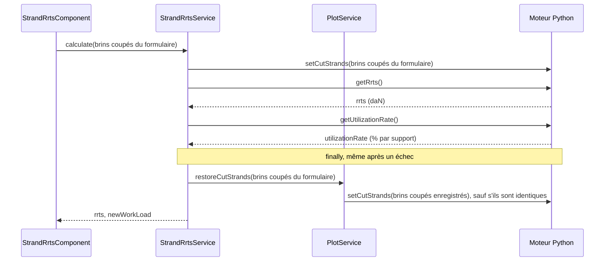

# CRR de brins coupés — conception technique

L'outil **CRR de brins coupés** calcule la charge de rupture résiduelle (CRR, *RRTS* en anglais
et dans le code) du câble de la section une fois certains de ses brins coupés, et le taux de
travail max qui en découle. L'utilisateur saisit les brins coupés des trois premières couches du câble,
la boîte de dialogue lance le calcul dans le moteur Python, et une seule entrée peut être enregistrée
par section. En parallèle, la présence du personnel du cas de charge sélectionné règle la
**haute sécurité** du moteur, qui pèse sur chaque taux de travail renvoyé par le moteur, y compris
celui du studio.

---

## Fichiers clés en un coup d'œil

Les chemins sont relatifs à `src/app/`, sauf `stellar-engine/`, relatif à la racine du dépôt.

| Fichier | Rôle |
|---|---|
| `features/studio/core/presentation/components/top-toolbar/top-toolbar.component.ts` | Point d'entrée : entrée **CRR de brins coupés** du menu **Outils** |
| `features/studio/toolbar/presentation/services/toolbar-dialog.service.ts` | Enregistre l'outil `'strand-rrts'`, l'héberge dans la boîte de dialogue de la barre d'outils, et lui transmet son mode (`StrandRrtsContext`) |
| `features/studio/toolbar/presentation/components/strand-rrts/strand-rrts.component.ts` | Boîte de dialogue : formulaire, calcul, enregistrement et suppression, mode consultation |
| `features/studio/toolbar/presentation/components/strand-rrts/strand-rrts.helpers.ts` | Statut du nouveau taux de travail max, et conversion des brins coupés du formulaire vers l'entrée du moteur et vers l'entrée enregistrée |
| `features/studio/toolbar/presentation/components/strand-rrts/strand-rrts.constantes.ts` | Bornes et valeurs par défaut du formulaire, couches affichées, icônes de statut |
| `features/studio/toolbar/presentation/components/strand-rrts/strand-rrts.interfaces.ts` | Types de la valeur du formulaire et du statut |
| `features/studio/toolbar/application/services/strand-rrts.service.ts` | Exécute le calcul CRR dans le moteur, puis fait rendre au moteur les brins coupés enregistrés par `PlotService` |
| `features/studio/toolbar/application/services/strand-rrts.interfaces.ts` | Type des résultats |
| `features/studio/core/presentation/pages/studio-page/studio-page.component.ts` | Affiche l'indicateur de brin coupé |
| `shared/domain/models/section.model.ts` | Entrée enregistrée, stockée sur la section |
| `shared/domain/helpers/cut-strands.helpers.ts` | Clés catalogue des nombres de brins, entrée du moteur d'une entrée enregistrée, présence d'au moins un brin coupé |
| `core/services/section/section-geometry.helpers.ts` | `sanitizeSectionGeometry()` supprime une entrée dont la portée n'existe plus, ou enregistrée sur un autre câble |
| `shared/components/studio/section/helpers/createCutStrandsAnnotations.ts` | Marquage dessiné sur le graphique du studio |
| `shared/components/studio/section/helpers/createCutStrandsAnnotations.constantes.ts` | Couleur, icône, décalages en pixels et motif des pointillés du marquage, libellé au survol |
| `shared/components/studio/section/helpers/createCutStrandsAnnotations.interfaces.ts` | Charge utile du clic sur le marquage |
| `shared/components/studio/section/helpers/spanAnchor.ts` | Point d'une portée à une distance d'un support, partagé avec les annotations de modification de câble |
| `shared/components/studio/section/section-plot.component.ts` | Transmet l'entrée enregistrée au graphique, ouvre l'outil au clic sur le marquage, en mode consultation dans un aperçu |
| `core/services/plot/plot-span.service.ts` | `savedCutStrands` : l'entrée enregistrée, partagée par le studio et la boîte de dialogue |
| `core/services/plot/plot.service.ts` | Haute sécurité et brins coupés enregistrés de l'étude moteur, indicateur de brin coupé |
| `core/services/worker_python/tasks/types.ts` | Entrées et sorties des tâches |
| `core/services/worker_python/tasks/python-scripts/api.py` | Points d'entrée des tâches |
| `stellar-engine/src/stellar_engine/core/cut_strands.py` | Fonctions du moteur |

---

## Côté moteur

### Le modèle

Le calcul relève de mechaphlowers : `CableArray` le délègue à son modèle de résistance à la
traction, `AdditiveLayerRts`, qui lit les colonnes du catalogue de câbles `rts_cable`,
`rts_layer_1` à `rts_layer_8`, `nb_strand_layer_1` à `nb_strand_layer_8` et `safety_coefficient`.

$$RRTS = RTS_{cable} - \sum_{i=1}^{8} cut\_strands_i \times rts\_layer_i$$

$$utilization\_rate_{span} = \frac{T_{max,span} \times safety\_coefficient}{RRTS} \times 100$$

- `safety_coefficient` vaut `1.5` par défaut quand le catalogue n'en donne pas. Avec la haute
  sécurité active, il est multiplié par `options.data.safety_security_factor` (`1.5`).
- La CRR est globale à la section : des brins coupés sur une portée abaissent la résistance
  utilisée pour toutes les portées. C'est pourquoi la portée, le support de référence et la
  distance d'une entrée ne prennent aucune part au calcul.
- Un `rts_cable` manquant, ou un `rts_layer_i` manquant sur une couche avec des brins coupés,
  lève `RtsDataNotAvailable`.

Les brins coupés et la haute sécurité sont un **état de l'étude moteur** : ils restent en place
jusqu'à être réglés de nouveau, et chaque taux d'utilisation calculé ensuite les utilise, y
compris celui de `refreshProjection()`. L'étude moteur créée par `Task.initLit` démarre avec les
valeurs par défaut de mechaphlowers, sans brins coupés et sans haute sécurité, mais l'application
applique juste après la haute sécurité du cas de charge sélectionné : elle est active pour une
nouvelle étude, qui n'a pas de cas de charge sélectionné (voir *Haute sécurité*). Les brins coupés
enregistrés suivent juste après (voir *Brins coupés enregistrés dans l'étude moteur*).

### Tâches

Définies dans `stellar_engine/core/cut_strands.py` et exposées par `api.py` :

| Tâche | Fonction Python | Entrée | Sortie |
|---|---|---|---|
| `setCutStrands` | `set_cut_strands` | `{ cutStrands: number[] }`, une valeur par couche du catalogue (8) | `{ success: true }` |
| `getRrts` | `get_rrts` | — | `{ rrts }`, en **daN** (mechaphlowers renvoie des N) |
| `getUtilizationRate` | `get_utilization_rate` | — | `{ utilizationRate: number[] }`, en %, un par support, `NaN` pour le dernier, qui ne commence aucune portée |
| `setHighSafety` | `set_high_safety` | `{ highSafety: boolean }` | `{ success: true }` |
| `getCutStrands` | `get_cut_strands` | — | `{ cutStrands: number[] }`, non utilisée par l'application |

`set_cut_strands` lève une `ValueError`, construite à partir de `_Errors.cut_strands_*`, quand
l'entrée ne contient pas une valeur par couche du catalogue, ou quand une valeur n'est pas finie,
n'est pas entière, est négative ou dépasse le nombre de brins de sa couche.

Les erreurs du moteur ne rejettent pas : `WorkerPythonService.runTask()` se résout avec
`{ result, error }`. Le `runTask()` privé de `StrandRrtsService` lève une exception sur `error`,
de sorte qu'un calcul s'arrête à la tâche qui échoue.

L'application charge le **wheel** de stellar-engine, pas ses sources : après une modification de
`cut_strands.py`, reconstruisez-le avec `npm run set-up-mechaphlowers:engine-only` (voir le
{doc}`Guide de configuration de Mechaphlowers <../installation/setup-mechaphlowers-guide>`).

---

## Modèle de données

Défini dans `shared/domain/models/section.model.ts`.

```typescript
// Linked to the span starting at spanUuid, or to the whole section when spanUuid is null
interface RrtsCutStrandsData {
  spanUuid: string | null;
  supportRef: 'LEFT' | 'RIGHT' | null;
  distanceSupportRef: number | null;
  // Cut strands per cable layer, index 0 = layer 1
  cutStrands: number[];
  addMarking: boolean;
}

interface Section {
  // …
  /** Saved RRTS cut strands, a single one per section */
  rrts_cut_strands?: RrtsCutStrandsData | null;
}
```

- Une section contient **une seule** entrée : l'enregistrement la remplace, la suppression la met
  à `null`.
- Comme pour les obstacles et les sols, une portée est identifiée par l'uuid de son support
  gauche. Sans portée, l'entrée s'applique à la section entière, avec `supportRef: null`,
  `distanceSupportRef: null` et `addMarking: false`.
- `cutStrands` contient une valeur pour **chaque** couche du catalogue, `0` pour les couches sans
  brins, comme l'exige le tableau d'entrée de `setCutStrands` : une entrée enregistrée part telle
  quelle vers le moteur, via `toEngineCutStrands()`, qui donne `0` sur chaque couche sans entrée. Le
  formulaire ne contient que les couches avec des brins parmi les `MAX_SHOWN_LAYER` (3) premières :
  `toCatalogCutStrands()` répartit ses valeurs sur les 8 couches du catalogue, avec `0` pour toutes
  les autres.
- Les résultats (CRR, nouveau taux de travail max) ne sont pas persistés. Ils sont recalculés à
  l'ouverture de la boîte de dialogue sur une entrée enregistrée.

### Géométrie et câble de la section

`sanitizeSectionGeometry()`, appliquée par `SectionService.createOrUpdateSection()`, supprime
l'entrée :

- quand son `spanUuid` ne commence plus de portée : le support a été supprimé, ou il est devenu le
  dernier de la section. Une entrée liée à la section entière (`spanUuid: null`) est conservée ;
- quand le câble de la section change : les brins coupés comptent des brins des couches du câble
  sur lequel ils ont été enregistrés. `createOrUpdateSection()` transmet la section stockée, et
  l'entrée n'est supprimée que si c'est celle qui est stockée : une entrée qui arrive avec le
  nouveau câble, dans une section importée, est conservée.

`removedGeometryBoundObjects` vaut alors `true`, et la page de l'étude affiche l'avertissement
`study.notifications.geometry-objects-updated`.

---

## La boîte de dialogue

### Hébergement

L'entrée du menu **Outils** appelle `ToolbarDialogService.openTool('strand-rrts')`, et la boîte
de dialogue de la barre d'outils affiche `StrandRrtsComponent` via `ngComponentOutlet`. Le
composant transmet ses templates `#header` et `#footer` à la boîte de dialogue avec
`ToolbarDialogService.setTemplates()` : le titre va dans l'en-tête, **Supprimer** et
**Enregistrer** dans le pied.

`openTool('strand-rrts', { mode })` prend un `StrandRrtsContext`, conservé dans
`ToolbarDialogService.strandRrtsContext` jusqu'à la fermeture de la boîte de dialogue. Sans
contexte, l'outil s'ouvre en mode édition. En **mode consultation** (`isViewMode()`), ouvert depuis
le marquage d'un aperçu de section (voir *Marquage sur le graphique du studio*), la boîte de
dialogue affiche l'entrée enregistrée sans moyen de la modifier :

- chaque champ est en lecture seule (`readonly` sur les champs, les listes et la case à cocher), et
  la portée ne peut pas être effacée ;
- les boutons **Détail des couches** et **Calculer** ne sont pas affichés, et le pied n'est pas
  transmis à la boîte de dialogue : **Supprimer** et **Enregistrer** n'apparaissent pas non plus ;
- le calcul s'exécute toujours à l'ouverture : les résultats de l'entrée enregistrée sont affichés.

Le composant est créé à l'ouverture de la boîte de dialogue et détruit à sa fermeture : les
saisies et les résultats non enregistrés ne survivent pas à une fermeture.

### Informations

| Champ | Source |
|---|---|
| Nom du câble | `section.cable_name` |
| Taux de travail max actuel | `maxOf(litData.output_parameters.utilization_rate)` : le **Taux de travail** du studio en mode **Max canton** |
| Présence du personnel | `personnelPresence` du cas de charge sélectionné, lu sur la copie de la section dans l'étude, comme le fait la barre de menu ; `true` sans cas de charge sélectionné |

`section` est `PlotSpanService.section()` et `litData` est `PlotService.litData()`.

### Formulaire

| Contrôle | Règles |
|---|---|
| `span` | Facultatif, effaçable. Options issues de `PlotSpanService.getSpanOptionsWithIndex()`, valeur `{ index, uuid }` |
| `supportRef` | `LEFT` ou `RIGHT`, options issues de `PlotSpanService.getSupportOptions()`. Mis à `LEFT` quand une portée est sélectionnée alors qu'il est vide, conservé lors d'un changement de portée |
| `distanceSupportRef` | Facultatif. De 0 à `DISTANCE_MAX` (5 000 m, fixe, pas la longueur de la portée), 2 décimales |
| `cutStrands` | `FormArray`, un contrôle par couche avec des brins parmi les `MAX_SHOWN_LAYER` (3) premières. Obligatoire, de 0 au nombre de brins de la couche, entier (`maxDecimalsValidator(0)`), `DEFAULT_CUT_STRANDS` (0) par défaut |
| `addMarking` | Booléen |

- `supportRef`, `distanceSupportRef` et `addMarking` sont désactivés sans portée. Un abonnement à
  `span.valueChanges` les active quand une portée est sélectionnée, et les réinitialise et les
  désactive quand elle est effacée.
- `layers()` est un `computed` sur une `resource` qui charge le câble du catalogue
  (`CablesService.getCable()`). Il contient une entrée par `nb_strand_layer_n` supérieur à 0 parmi
  les `MAX_SHOWN_LAYER` premières, chacune avec son propre `FormControl`, et un effect les place dans le formulaire avec
  `form.setControl('cutStrands', …)`. Sans aucune couche (câble en cours de chargement, pas de
  données de brins, échec de lecture du catalogue), un message remplace les champs et
  **Calculer** est désactivé.
- Les messages d'erreur s'affichent dès qu'un contrôle est `dirty`, à la saisie plutôt qu'à la
  perte du focus, via `getNumberInputErrorParams()`.

### Chargement de l'entrée enregistrée

`savedEntry` est `PlotSpanService.savedCutStrands`, un `computed` sur `section.rrts_cut_strands`
comparé avec `isEqual` de lodash : l'objet section est remplacé après chaque enregistrement, et
seul un changement de contenu compte. `PlotService` lit le même `computed`. Un effect sur
`savedEntry()` et `layers()` charge l'entrée dans le formulaire :

1. Appliquer `supportRef`, `distanceSupportRef` et `addMarking` avec `patchValue`.
2. Régler `span` en dernier, pour que les règles de la portée s'appliquent aux valeurs
   enregistrées : les champs dépendants sont désactivés pour une entrée liée à la section entière,
   et une entrée liée à une portée sans support de référence reçoit `LEFT`.
3. Régler le contrôle de chaque couche à partir de `entry.cutStrands[layer - 1]`.
4. Une fois les couches chargées, et si rien n'a encore été calculé, lancer `calculate()`. Il
   obtient les résultats à afficher, qui ne sont pas enregistrés, puis fait reprendre au moteur les
   brins coupés enregistrés, comme tout calcul.

Après un enregistrement, l'effect charge de nouveau l'entrée, mais ne calcule pas :
`calculatedValue` est renseigné, et les résultats affichés ont été calculés à partir de cette même
entrée.

Les effects s'exécutent dans l'ordre de leur création : l'effect qui place les contrôles des brins
coupés dans le formulaire est déclaré en premier, pour que les contrôles existent au chargement de
l'entrée.

### Calcul



- `calculate()` s'arrête immédiatement si le formulaire est invalide, sans couches, ou pendant un
  traitement en cours.
- `newWorkLoad` vaut `maxOf(utilizationRate.filter(Number.isFinite))` : le `NaN` du dernier
  support est écarté, et la valeur est `null` quand il ne reste aucun taux.
- En cas de succès, `results` est renseigné et `calculatedValue` garde un instantané de
  `form.getRawValue()`.
- En cas d'échec d'une tâche du calcul, `results` et `calculatedValue` sont vidés, l'erreur est
  journalisée via `LoggerService`, et un toast `failed-to-calculate` s'affiche.
- Rendre au moteur les brins coupés enregistrés revient à `PlotService`, qui signale lui-même ses
  échecs (voir *Brins coupés enregistrés dans l'étude moteur*) : les résultats d'un calcul réussi
  sont conservés.

**Invariant :** en dehors d'un calcul, le moteur contient les brins coupés **enregistrés** (`0`
par couche sans entrée enregistrée), jamais ceux en cours de saisie, de sorte que le studio
n'affiche jamais de brins coupés non enregistrés.

### Statut du nouveau taux de travail max

`getWorkLoadStatus()` associe la valeur à une icône de `WORK_LOAD_ICONS`, avec les mêmes seuils
de 75 % et 100 % que le **Taux de travail** du studio :

| Nouveau taux de travail max | Statut | Icône | Couleur |
|---|---|---|---|
| `null` | `null` | `counter_0` | gris |
| 0 à 75 % | `ok` | `check` | vert (`--main-success`) |
| au-dessus de 75 %, jusqu'à 100 % | `warning` | `exclamation` | orange (`--main-warning`) |
| en dessous de 0 % ou au-dessus de 100 % | `error` | `close_small` | rouge (`--main-error`) |
| `NaN` | `unknown` | `question_mark` | gris. `maxOf()` ne renvoie jamais `NaN`, la boîte de dialogue n'y arrive donc pas |

Chaque icône porte un libellé aria (`studio.rrts-cut-strands.result-new-working-load-*`). Les
résultats sont affichés dans un élément `<output>` qui reste sur la page même sans résultats :
les lecteurs d'écran n'annoncent que le contenu ajouté à une région live qui existe déjà.

### Enregistrement et suppression

- **Enregistrer** n'est actif que tant que `calculatedValue` est profondément égal à la valeur
  brute actuelle du formulaire, marquage mis à part (`canSave`). Toute modification des brins
  coupés, de la portée, du support de référence ou de la distance après un calcul en demande un
  nouveau, de sorte qu'une entrée enregistrée ne contredit jamais les résultats affichés.
  `addMarking` ne prend aucune part au calcul : le changer laisse **Enregistrer** disponible.
- `save()` persiste la section avec
  `rrts_cut_strands: toCutStrandsData(form.getRawValue(), layers)` (la valeur calculée, avec le
  marquage tel qu'il est maintenant) via `SectionService.createOrUpdateSection()`, la règle sur
  `PlotSpanService.section`, affiche un toast `saved`, puis attend
  `PlotService.syncCutStrands()`.
- `delete()` fait de même avec `rrts_cut_strands: null`.
- Attendre `syncCutStrands()` garde la boîte de dialogue occupée jusqu'à ce que l'étude moteur et
  les sorties du studio suivent le nouvel état enregistré, de sorte qu'aucun calcul de la boîte de
  dialogue ne s'intercale. Si le moteur le rejette, l'entrée reste enregistrée (ou supprimée), et
  `PlotService` affiche un toast `failed-to-sync`.
- Si la persistance échoue, la section ne change pas, le moteur n'est pas touché, et un toast
  `failed-to-save` ou `failed-to-delete` s'affiche.
- `isBusy` (calcul, enregistrement ou suppression en cours) désactive **Calculer**,
  **Enregistrer** et **Supprimer**, ils s'exécutent donc un par un.

---

## Brins coupés enregistrés dans l'étude moteur

Les brins coupés enregistrés appartiennent à l'étude moteur, comme la haute sécurité : `PlotService`
les applique, pour que le studio les affiche sans que la boîte de dialogue soit ouverte.

- `savedCutStrands`, un `computed` comparé avec `isEqual`, est l'entrée du moteur de l'entrée
  enregistrée : `toEngineCutStrands(PlotSpanService.savedCutStrands())`. Un changement du marquage
  ou de la localisation seuls ne le modifie pas.
- `initSectionStudio()` les applique juste après la haute sécurité, avant la première projection :
  une nouvelle étude moteur n'a pas de brins coupés, rien n'est donc envoyé sans entrée
  enregistrée, ou avec `0` sur chaque couche. Ils sont lus en `untracked` à ce moment-là, car
  l'entrée a pu changer pendant `initLit`. L'aperçu de la section les reçoit aussi.
- `syncCutStrands()` met l'étude moteur à jour quand l'entrée enregistrée change : un effect
  l'appelle à chaque changement de `savedCutStrands`, et la boîte de dialogue l'attend après un
  enregistrement ou une suppression. Elle ne fait rien hors du studio, avant que
  `initSectionStudio()` ait créé l'étude moteur, ou tant que l'étude moteur appartient encore à la
  section précédente (`currentSectionUuid`) : à l'ouverture du studio, la section peut être
  brièvement celle de l'aperçu, et `initSectionStudio()` applique de toute façon l'entrée de la
  nouvelle section. Sinon, elle envoie `setCutStrands` quand l'étude moteur contient d'autres brins
  coupés, puis rafraîchit la projection quand les sorties ont été calculées sans ceux enregistrés.
  Elle ne rafraîchit pas quand le studio a été quitté (`resetAll()`), ou qu'une demande plus
  récente a remplacé celle-ci, entre-temps.
- `restoreCutStrands(calculated)`, appelée par `StrandRrtsService` après chaque calcul, note que
  l'étude moteur contient les brins coupés calculés, puis la ramène de la même façon à ceux
  enregistrés, dans le studio comme dans un aperçu. Un calcul fait avec ceux enregistrés ne demande
  aucune tâche.
- `applyCutStrands()` met la valeur en cache **avant** d'envoyer la tâche, comme
  `applyHighSafety()`. En cas d'erreur, elle ne revient en arrière que si aucune demande plus
  récente ne l'a remplacée, journalise l'erreur, et affiche un toast `failed-to-sync` dans le
  studio. La demande suivante retente : enregistrer de nouveau la même entrée, par exemple.
- Le cache est remis à `null` par `resetAll()` et au début de `initSectionStudio()`.
- `refreshProjection()` note les brins coupés avec lesquels les sorties sont calculées
  (`projectedCutStrands`). `isCutStrandApplied`, un `computed` sur ceux-ci avec `hasCutStrand()`,
  vaut `true` quand au moins une couche a un brin coupé : il ne change qu'une fois que les sorties
  en tiennent compte.
- `StudioPageComponent.isGlobalCutStrand` lit `isCutStrandApplied`, et pilote l'icône de ciseaux à
  côté du **Taux de travail** du studio : rouge quand un brin est coupé (`--main-error`), grise
  sinon (`--grey-400`). Le **Taux de travail** lui-même n'a besoin d'aucun branchement : il lit
  `utilization_rate`, qui porte les brins coupés, en mode **Portée** comme en mode **Max canton**.

---

## Marquage sur le graphique du studio

Une entrée enregistrée dont `addMarking` vaut `true` dessine un marquage sur le graphique du
studio, en 2D comme en 3D. `addMarking` ne peut être coché qu'une fois une portée sélectionnée : un
marquage a donc toujours une portée, mais `createCutStrandsAnnotations()` ne dessine rien pour une
entrée qui n'en a pas.

`SectionPlotComponent` transmet le `rrts_cut_strands` de la section à `createPlot()`, qui ajoute
le marquage à la mise en page 2D et à la scène 3D. Il suit l'entrée enregistrée, pas le
formulaire : le marquage apparaît à l'enregistrement de la boîte de dialogue, et disparaît quand
l'entrée est supprimée ou enregistrée sans la case cochée. Rien n'est dessiné quand la portée est
hors des supports affichés (`startSupport` ≤ indice de portée < `endSupport`).

### Où il s'accroche

| Distance au support de référence | Point d'ancrage |
|---|---|
| Vide | Le point le plus haut du support de référence (`supportRef`, gauche par défaut) : le marquage se tient au-dessus du support lui-même |
| Renseignée | Le point du câble situé à cette distance du support de référence |

Le point du câble vient de `resolveAnchorCoord()` (`spanAnchor.ts`), la recherche qu'utilisent les
annotations de modification de câble. Elle interpole la polyligne de la portée à l'abscisse x de la
distance, mesurée depuis le premier point de la polyligne (`LEFT`) ou le dernier (`RIGHT`). C'est
une solution provisoire, voir *Limitations connues*. Aucune tâche du moteur n'intervient pour
l'instant.

### Son apparence

- Une icône de ciseaux, à `CUT_STRANDS_OFFSET_Y` pixels au-dessus de son point d'ancrage, en
  `#7D5A9F` (primary 600), avec un libellé **Brins coupés** au survol
  (`shared.studio.cut-strands-marking`).
- Un trait en pointillés de la même couleur reliant le point d'ancrage à l'icône.
- Un clic sur l'icône ouvre l'outil CRR, via le gestionnaire de `plotly_clickannotation` de
  `SectionPlotComponent` et la charge utile `{ type: 'cutStrands' }` de l'icône. Les tirets ne
  capturent aucun événement.

Le graphique de section affiche aussi la **Vue graphique** du formulaire de section, sur la page
de l'étude : `StudioComponent` transmet son entrée `isPreview` à `SectionPlotComponent`. Ce
formulaire modifie une copie de la section, et la page de l'étude héberge elle aussi une boîte de
dialogue de barre d'outils : un clic y ouvre donc l'outil en mode consultation,
`openTool('strand-rrts', { mode: isPreview() ? 'view' : 'edit' })`.

Les deux décalages sont en pixels, pas en unités de données : l'écart reste le même à n'importe
quel niveau de zoom ou angle de caméra. Cela exclut les outils habituels pour le trait en
pointillés :

- En 2D, `createCutStrandsShapes()` le dessine comme une seule forme Plotly (*shape*), une `line`
  dimensionnée en pixels (`xsizemode` et `ysizemode` à `pixel`) et ancrée sur le point de données
  (`xanchor`, `yanchor`), en pointillés selon le motif `CUT_STRANDS_DASH_LENGTH` et
  `CUT_STRANDS_DASH_GAP`.
- En 3D, les formes n'existent pas, et la flèche d'une annotation Plotly ne peut pas être en
  pointillés. Le trait est donc une série d'annotations réduites à une flèche, une par tiret : la
  queue de chacune est à `end` pixels au-dessus de l'ancrage, et son `standoff` éloigne sa pointe de
  `start` pixels de celui-ci.

---

## Haute sécurité

La haute sécurité appartient à l'étude moteur, pas à la boîte de dialogue. Elle suit la présence
du personnel du cas de charge sélectionné, et s'applique à chaque taux de travail renvoyé par le
moteur, y compris le **Taux de travail** du studio. `PlotService` la gère :

- `selectedChargeHighSafety`, un `computed`, renvoie le `personnelPresence` du cas de charge
  correspondant à `section.selected_charge_uuid`, ou `true` sans cas de charge sélectionné : le
  personnel est alors considéré comme présent, le cas le plus sûr.
- `initSectionStudio()` l'applique juste après `Task.initLit`, qui crée l'étude moteur avec la
  valeur par défaut de mechaphlowers, sans haute sécurité. Une nouvelle étude n'a pas de cas de
  charge sélectionné, elle passe donc en haute sécurité. La valeur est lue en `untracked` à ce
  moment-là, car le cas de charge sélectionné a pu changer pendant `initLit`.
- Un effect appelle `syncHighSafety()` quand la valeur change. La section du studio est rechargée
  depuis la base de données après chaque modification de cas de charge (sélection, création,
  duplication, suppression, édition dans le tableau de charges), cet unique effect les couvre donc
  toutes. Il ne fait rien hors du studio, avant qu'une étude moteur existe
  (`highSafety === null`), ou quand la valeur ne change pas ; sinon, il envoie `setHighSafety`,
  puis rafraîchit la projection.
- `applyHighSafety()` met la valeur en cache **avant** d'envoyer la tâche : le worker exécute les
  tâches dans l'ordre, la dernière demande l'emporte donc. En cas d'erreur, il ne revient en
  arrière que si aucune demande plus récente ne l'a remplacée.
- Le cache est remis à `null` par `resetAll()` et au début de `initSectionStudio()`.

L'indicateur de personnel de la barre de menu suit la même valeur par défaut : sans cas de charge
sélectionné, il affiche **Personnel présent**.

---

## Tests

| Fichier | Couvre |
|---|---|
| `strand-rrts.component.spec.ts` | Informations, contrôles affichés, champs dépendants de la portée, calcul (séquence de tâches, état enregistré rendu, erreurs, verrou d'occupation, calcul à l'ouverture), enregistrement (marquage mis à part, studio attendu), suppression, mode consultation, résultats |
| `strand-rrts.helpers.spec.ts` | Seuils de statut, répartition des brins coupés sur les couches du catalogue, forme enregistrée |
| `strand-rrts.service.spec.ts` | Calcul : séquence de tâches, CRR, taux le plus élevé, dernier support ignoré, brins coupés enregistrés rendus même après un échec |
| `shared/domain/helpers/cut-strands.helpers.spec.ts` | Entrée du moteur d'une entrée enregistrée, présence d'au moins un brin coupé |
| `studio-page.component.spec.ts` | `isGlobalCutStrand` suit `PlotService`, et l'icône de ciseaux avec lui |
| `createCutStrandsAnnotations.spec.ts` | Marquage : rien à dessiner, ancrage avec et sans distance depuis chaque support, correspondance des axes, icône, charge utile du clic, tirets en 3D, forme en 2D |
| `createPlot.spec.ts`, `section-plot.component.spec.ts`, `studio.component.spec.ts` | Le marquage atteint la mise en page 2D et la scène 3D, l'entrée enregistrée atteint `createPlot()`, un clic ouvre l'outil, en mode consultation dans un aperçu |
| `toolbar-dialog.service.spec.ts` | Le contexte de l'outil CRR, conservé jusqu'à la fermeture de la boîte de dialogue |
| `core/services/plot/plot.service.spec.ts` | `high safety` : après `initLit`, valeur par défaut sans cas de charge, modifications de cas de charge, demandes concurrentes. `cut strands` : au chargement du studio, après un enregistrement ou une suppression, section précédente, échecs et nouvelles tentatives, studio quitté, après un calcul |
| `core/services/section/section-geometry.helpers.spec.ts`, `section.service.spec.ts` | `RRTS cut strands` : entrées supprimées avec leur portée ou leur câble, entrées liées à la section entière et entrées d'un nouveau câble conservées |
| `stellar-engine/test/core/test_cut_strands.py` | Validation des entrées, CRR en daN, taux d'utilisation |

Lancez les tests front-end avec `npx vitest run <file>`, et les tests du moteur avec `make test`
dans `stellar-engine/`.

---

## Limitations connues

- Le marquage d'une distance est placé en TypeScript, par `resolveAnchorCoord()`, et diffère de
  l'endroit où le moteur place une charge à la même distance. Le moteur convertit la distance en un
  rapport de la longueur de portée entre supports, appliqué entre les points d'attache ; la
  recherche la lit comme un décalage en x dans le repère du graphique. Sur une section synthétique,
  l'écart avec le nœud de charge du moteur était d'environ 1 m en ligne droite, et allait jusqu'à
  environ 14 m sur les portées qui ne sont pas parallèles à l'axe x du graphique (angle de ligne).
  Sans distance, le placement n'est pas concerné. Les annotations de modification de câble
  partagent la fonction et le défaut. Déplacer le placement dans le moteur, avec mechaphlowers, fait
  l'objet d'un ticket distinct.
- Seules les trois premières couches sont affichées, mais le studio applique une entrée enregistrée
  telle quelle : une entrée enregistrée avant cette limite, avec des brins coupés sur une couche
  suivante, reste en vigueur jusqu'à un nouvel enregistrement, et la boîte de dialogue n'affiche
  pas ces valeurs.
- Le marquage est dessiné à partir de l'entrée enregistrée seule, quels que soient ses brins
  coupés : une entrée qui coche **Ajouter un marquage** avec `0` brin coupé sur chaque couche est
  tout de même marquée.
- Le marquage est maintenu à une distance fixe en pixels de son ancrage : quand l'ancrage est près
  du haut du graphique, l'icône peut en sortir.
- Le trait en pointillés traverse le numéro du support quand le marquage s'accroche à un support.
- Le bouton **Détail des couches** est un emplacement réservé désactivé.
- En mode consultation, le calcul à l'ouverture s'exécute dans l'étude moteur de l'aperçu,
  construite à partir du formulaire de section tel qu'il est en cours de modification : ses
  résultats suivent les modifications non enregistrées du formulaire.
- `DISTANCE_MAX` est fixé à 5 000 m, pas à la longueur de la portée sélectionnée.
