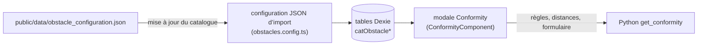

# Configurer la conformité

La vérification de conformité d’un obstacle est **entièrement pilotée par un seul fichier de paramètrage**,
`public/data/obstacle_configuration.json`. Il déclare quels types d’obstacle peuvent être vérifiés,
quelles règles réglementaires leur sont applicables, les distances légales par tension, les conditions
climatiques de chaque règle et les zones de vent. Aucun changement de code n’est nécessaire pour ajouter
un type d’obstacle, une règle ou une zone de vent.

Cette page décrit le fichier. La manière dont le moteur l’utilise est décrite dans {doc}`conformity` ;
le point de vue utilisateur est présenté dans le {doc}`guide utilisateur <../user_guide/conformity>`.

---

## Du fichier à la vérification



- Le fichier est similaire à un **catalogue** : il est rafraîchi par la mise à jour du catalogue, pas par la
  mise à jour de l’application (voir {doc}`app/catalog_update`). Son SHA-256 est listé dans
  `data_hashes` de `assets_list.json`, généré par `npm run create-assets-list-for-service-worker`
  (partie de `npm run build`).
- L’import est un import JSON en **mode remplacement** (`createObstaclesConfig()` dans
  `src/app/shared/catalog/csv-import/configs/obstacles.config.ts`) : les six tables ci-dessous sont
  vidées et réécrites dans une transaction Dexie unique, donc le fichier est la source de vérité.
- La charge utile est vérifiée par `assertObstacleConfigurationJson()` avant toute écriture. Un
  fichier invalide est rejeté avec une erreur du type
  `Obstacle configuration: obstacles[3].redZone must be a boolean`, et le catalogue précédent reste en place.

| Partie JSON | Table Dexie | Entité |
|---|---|---|
| `obstacles[]` (nom, détails) | `catObstacleTypes` | `CatalogObstacleTypeEntity` |
| `obstacles[]` (`redZone`, `conformity`) | `catObstacleConfigurations` | `CatalogObstacleConfigurationEntity` |
| `obstacles[].distances[]` | `catObstacleDistances` | `CatalogObstacleDistanceEntity` |
| `rules[]` | `catObstacleRuleDefinitions` | `CatalogObstacleRuleDefinitionEntity` |
| `windZone.values[]` | `catObstacleWindZones` | `CatalogObstacleWindZoneEntity` |
| `repartitionTemperatureFields`, `lateralTemperatureFields`, `windZone.default`, `intermediatePointPositions` | `catObstacleConformityConfig` (une ligne, clé `main`) | `CatalogObstacleConformityConfigEntity` |

Les entités sont dans `src/app/infrastructure/database/entities/`, et le mapping JSON→entité dans
`src/app/shared/catalog/csv-import/configs/obstacles.config.helpers.ts`.

---

## Structure du fichier

```json
{
  "obstacles": [ /* une entrée par type d’obstacle */ ],
  "rules": [ /* une entrée par règle réglementaire */ ],
  "repartitionTemperatureFields": { "defaultValue": 70 },
  "lateralTemperatureFields": { "defaultValue": 65, "ruleType": "RULE_2", "message": "..." },
  "windZone": { "default": "200", "values": [ /* zones de vent */ ] },
  "intermediatePointPositions": [0.33, 0.66]
}
```

Les six clés de premier niveau sont obligatoires.

---

## Types d’obstacle : `obstacles[]`

```json
{
  "obstacleType": "vegetation",
  "obstacleName": "Vegetation",
  "details": "Isolated tree or vegetation (...)",
  "redZone": true,
  "conformity": "vegetation",
  "distances": [
    {
      "ruleType": "RULE_1",
      "active": true,
      "overhang": { "63": 1.1, "90": 1.2, "150": 1.3, "225": 1.4, "400": 1.5 },
      "lateral":  { "63": 0.6, "90": 0.7, "150": 0.8, "225": 0.9, "400": 1.0 }
    }
  ]
}
```

| Champ | Type | Signification |
|---|---|---|
| `obstacleType` | chaîne | Identifiant technique, stocké dans `Obstacle.type`. Doit être unique. |
| `obstacleName` | chaîne | Libellé affiché dans le menu déroulant des types d’obstacle. |
| `details` | chaîne | Description du type d’obstacle. |
| `redZone` | booléen | Indique si la case **Présence de zone rouge** est affichée dans la modale Conformité pour ce type d’obstacle. Voir [Zone rouge](#conformity-config-red-zone). |
| `conformity` | `"overhang"`, `"cable_track"`, `"vegetation"` ou `null` | Type de graphique, qui sélectionne également la manière dont le moteur construit la zone. Voir [Types de graphique](#conformity-config-graph-types). |
| `distances` | tableau | Distances légales par règle. Un tableau vide rend le type d’obstacle **non éligible**. |

### Éligibilité

Le bouton **Conformité** du formulaire d’obstacle vérifie, dans `ObstaclesFormComponent.openConformityModal()`,
que l’obstacle est enregistré, que l’étude a un niveau de tension électrique et que
`catObstacleDistances` contient **au moins une ligne** pour ce type d’obstacle. Un type d’obstacle avec
`"distances": []` (zones de grande hauteur, proximité d’un silo dans le fichier livré) est donc refusé
avec *obstacle type '…' is not eligible for conformity control*.

Un type avec des distances mais `"conformity": null` ouvre la modale, mais le calcul est refusé avec
*Cannot calculate conformity: obstacle type has no conformity configuration*. Il est conseillé de conserver `distances` vide
**et** `conformity` à `null` ensemble.

(conformity-config-graph-types)=
### Types de graphique

| `conformity` | Figure | Distances à fournir |
|---|---|---|
| `overhang` | Ligne horizontale | `overhang` uniquement : `lateral` vaut `null` |
| `vegetation` | Tranchée | `overhang` et `lateral` |
| `cable_track` | Disques | `overhang` et `lateral` |

Le type pilote aussi le tableau : les colonnes **latérales** sont masquées pour `overhang`, et le
bloc **Cas distance minimale** n’est affiché que pour `cable_track`.

:::{warning}
Le moteur construit un scénario pour une direction uniquement lorsque sa distance n’est pas `null`.
Un obstacle `cable_track` sans distances latérales obtiendrait des points intermédiaires sans distance,
ce que la figure ne peut pas dessiner. Donnez toujours les deux distances aux obstacles `vegetation`
et `cable_track`.
:::

### Distances : `distances[]`

| Champ | Type | Signification |
|---|---|---|
| `ruleType` | chaîne | Doit correspondre à `ruleType` d’une entrée de `rules[]`. |
| `active` | booléen | La règle est **pré-sélectionnée** dans la multiselect de conformité. L’utilisateur peut toujours sélectionner une règle inactive. |
| `overhang` | carte ou `null` | Distance minimale verticale (m) par tension. `null` : la règle n’a pas de contrainte de surplomb. |
| `lateral` | carte ou `null` | Distance minimale horizontale (m) par tension. `null` : la règle n’a pas de contrainte latérale. |

Une table de distances est indexée par la tension en kV, **sous forme de chaîne** : `"63"`, `"90"`,
`"150"`, `"225"`, `"400"`. Le moteur choisit l’entrée correspondant à la tension de la section
(`voltage_idr`, par exemple `"400 KV"`). **Une table non nulle doit contenir les cinq clés** : une clé manquante
fait échouer le calcul. Une autre tension n’est pas prise en charge par le moteur : il faudrait
alors une nouvelle entrée dans `ElectricTensionMapper` (`stellar-engine/src/stellar_engine/entities/conformity.py`).

L’ordre des entrées de `distances[]` n’a pas d’importance : les règles atteignent le moteur dans
l’ordre renvoyé par Dexie, c’est-à-dire l’ordre de la clé primaire `[obstacle_type+rule_type]`
(alphabétique par `ruleType`). Cet ordre est la priorité d’empilement de la figure.

---

## Règles : `rules[]`

```json
{
  "ruleType": "RULE_2",
  "ruleName": "RULE_2",
  "color": "#FFA500",
  "lateralPoint":  { "temperature": null, "pressure": "WindZoneInput", "redZone": true },
  "overhangPoint": { "temperature": null, "pressure": 0,              "redZone": false }
}
```

| Champ | Type | Signification |
|---|---|---|
| `ruleType` | chaîne | Identifiant technique, clé primaire de `catObstacleRuleDefinitions`. |
| `ruleName` | chaîne | Libellé affiché dans la multiselect et les en-têtes de tableau. |
| `color` | chaîne | Couleur de la zone, **`#rrggbb`** (6 chiffres hexadécimaux : la figure le parse pour construire un `rgba()`). |
| `lateralPoint` | point | Condition climatique du câble pour le contrôle **latéral**. |
| `overhangPoint` | point | Condition climatique du câble pour le contrôle **de surplomb**. |

Une règle référencée par `distances[]` mais absente de `rules[]` affiche son `ruleType` comme libellé,
et n’a **aucun résultat** : elle n’est jamais envoyée au moteur comme condition climatique, donc sa colonne
reste vide avec la conformité *Inconnu*.

### Point de scénario climatique

Chaque point définit **l’état du câble** dans lequel sa position est mesurée.

| Champ | Valeur | Effet |
|---|---|---|
| `temperature` | nombre (°C) | Température fixe de la règle. |
| | `null` | La température saisie par l’utilisateur est utilisée : **Température de répartition** pour `overhangPoint`, **Température de distance latérale** pour `lateralPoint`. |
| `pressure` | nombre (Pa) | Pression de vent fixe de la règle. |
| | `"WindZoneInput"` | La pression de la zone de vent choisie par l’utilisateur. |
| `redZone` | booléen | Transmis au moteur, non utilisé. Voir [Zone rouge](#conformity-config-red-zone). |

La chaîne complète de surcharge, avec les cas testés par le moteur, est dans
{ref}`conformity-overwrite-rules`.

---

## Zones de vent : `windZone`

```json
"windZone": {
  "default": "200",
  "values": [
    { "label": "200",     "normal": 200, "redZone": 300 },
    { "label": "300",     "normal": 300, "redZone": 400 },
    { "label": "300-400", "normal": 300, "redZone": 400 }
  ]
}
```

| Champ | Signification |
|---|---|
| `default` | Libellé sélectionné à l’ouverture de la modale. Il doit correspondre à l’un des `label`s. |
| `values[].label` | Libellé affiché dans la liste **Zone de vent**. Unique. |
| `values[].normal` | Pression du vent (Pa) de la zone. |
| `values[].redZone` | Pression du vent (Pa) de la zone lorsque l’obstacle est dans une zone rouge. |

(conformity-config-red-zone)=
### Zone rouge

La zone rouge correspond à une **augmentation de la pression du vent**, et elle est entièrement
résolue par l’application avant d’appeler le moteur :

1. Le type d’obstacle a `"redZone": true` : la case **Présence de zone rouge** est affichée.
2. L’utilisateur sélectionne une zone de vent et coche, ou non, la case.
3. `ConformityComponent.effectiveWindPressure` prend `values[].redZone` si la case est cochée et
   `values[].normal` sinon.
4. Cette valeur est envoyée sous `form.windPressure`. Elle remplace toutes les pressions
   `"WindZoneInput"` des règles, **pour toutes les règles sélectionnées**.

Le moteur valide seulement `redZonePresence` et transmet la valeur `redZone` des points climatiques ;
il n’applique aucune logique de zone rouge. Les flags `rules[].lateralPoint.redZone` et
`rules[].overhangPoint.redZone` sont requis par le schéma et conservés dans le catalogue, mais aucun code
ne les lit : ils ne restreignent pas les règles qui reçoivent la pression de zone rouge.

---

## Paramètres scalaires

| Clé | Signification |
|---|---|
| `repartitionTemperatureFields.defaultValue` | Valeur initiale (°C) de **Température de répartition**. |
| `lateralTemperatureFields.defaultValue` | Valeur initiale (°C) de **Température de distance latérale**. Nombre fini obligatoire. |
| `lateralTemperatureFields.ruleType` | Règle dont le nom préfixe le libellé **Température de distance latérale**. Son `lateralPoint.temperature` n’est que la valeur initiale de secours, lorsque `defaultValue` manque dans la configuration enregistrée. |
| `lateralTemperatureFields.message` | Indication affichée sous **Température de distance latérale**. |
| `intermediatePointPositions` | Fractions dans `]0, 1[` localisant les états intermédiaires du câble pour le type de graphique `cable_track`. `[0.33, 0.66]` donne quatre points intermédiaires. Ignoré pour les autres types de graphique. |

:::{note}
La température latérale initiale est `lateralTemperatureFields.defaultValue`, quelle que soit la
`temperature` de la règle `lateralTemperatureFields.ruleType` (`null` pour `RULE_2` dans le fichier livré).
Une règle avec une `lateralPoint.temperature` fixe ignore le champ lors du calcul.
:::

Les deux champs de température acceptent des valeurs de 0 à 250 °C avec au plus 2 décimales
(`CONFORMITY_BOUNDS` dans `conformity.constantes.ts`).

---

## How to

### Ajouter un type d’obstacle

1. Ajoutez une entrée à `obstacles[]` avec un nouveau `obstacleType`, un type de graphique `conformity` et
   une entrée `distances[]` par règle, avec les cinq tensions.
2. Vérifiez que chaque `ruleType` existe dans `rules[]`.

### Ajouter une règle

1. Ajoutez une entrée à `rules[]` avec un nouveau `ruleType` et une `color` non utilisée par les autres règles.
2. Ajoutez une entrée `distances[]` avec ce `ruleType` à chaque type d’obstacle qui doit être vérifié.

### Modifier une distance ou une condition climatique

Modifiez la valeur. Rien d’autre n’est nécessaire : la prochaine mise à jour du catalogue réécrit
les tables.

### Vérifier le changement

- `npm run test -- obstacles.config` lance la spécification d’import (validation et mapping).
- `npm run test -- conformity` lance les spécifications de la modale et de la figure.
- Ouvrez l’étude, un obstacle du type concerné, puis la modale **Conformité** : la multiselect liste
  les règles de `distances[]` avec les règles `active` pré-sélectionnées.

---

## Documentation associée

- {doc}`conformity` — le module Python de conformité et la couche TypeScript pilotée par sa sortie.
- {doc}`app/catalog_update` — comment le catalogue atteint la base de données hors ligne.
- {doc}`../user_guide/conformity` — la vérification de conformité telle que la voit l’utilisateur.
