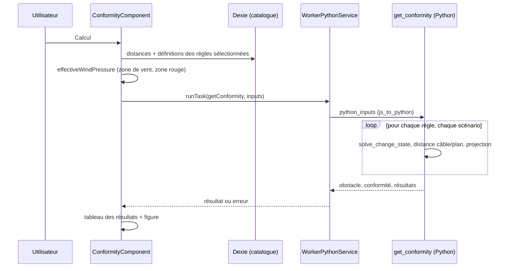

# Conformité — module moteur et couche applicative

La vérification de conformité permet de savoir si un obstacle (arbre, bâtiment, route,
sol…) reste suffisamment éloigné du câble d’une portée, dans les conditions climatiques
fixées par les règles réglementaires. L’application collecte les entrées et les données du
catalogue, le moteur Python simule le câble dans chaque condition climatique et mesure sa
distance par rapport à l’obstacle, puis l’application affiche le résultat sous forme de tableau
et de figure en coupe.

Cette page couvre les deux aspects :

- [Le module Python](#conformity-python-module) : entrées, règles de surcharge, scénarios,
  calcul et sortie.
- [La couche TypeScript](#conformity-typescript-layer) : comment la sortie pilote le tableau,
  la figure et le formulaire.

Le fichier de catalogue qui configure cette vérification est décrit dans {doc}`configure_conformity` ;
le point de vue utilisateur est présenté dans le {doc}`guide utilisateur <../user_guide/conformity>`.

---

## Fichiers clés en un coup d’œil

Les chemins sont relatifs à `src/app/`, sauf pour `stellar-engine/`, relatif à la racine du dépôt.

| Fichier | Objet |
|---|---|
| `stellar-engine/src/stellar_engine/core/conformity/simulation.py` | `get_conformity()` : point d’entrée, orchestre le calcul complet |
| `stellar-engine/src/stellar_engine/core/conformity/request.py` | `ConformityRequest` : analyse et validation de chaque entrée |
| `stellar-engine/src/stellar_engine/core/conformity/scenarios.py` | Points climatiques, **règles de surcharge** et constructeur de scénarios |
| `stellar-engine/src/stellar_engine/core/conformity/strategies.py` | Par type de graphique : rayon, valeurs de conformité, verdict, géométrie de la zone |
| `stellar-engine/src/stellar_engine/core/conformity/runner.py` | `ScenarioRunner` : résout les scénarios sur une copie d’étude et projette le câble |
| `stellar-engine/src/stellar_engine/core/conformity/compute.py` | `ConformityTableResult`, construit à partir des résultats des scénarios |
| `stellar-engine/src/stellar_engine/core/conformity/writer.py` | Sérialisation du résultat |
| `stellar-engine/src/stellar_engine/entities/conformity.py` | Classes d’entrée avec validation, énumérations de type de graphique et de point de scénario, mappe de tension |
| `stellar-engine/src/stellar_engine/entities/errors.py` | `ConformityInputError`, `ObstacleNotFoundError`, `SupportOutOfRangeError` |
| `stellar-engine/test/core/conformity/` | Tests du module (`conftest.py` contient les usines de données) |
| `core/services/worker_python/tasks/python-scripts/api.py` | Point d’entrée de la tâche `get_conformity()`, convertit les entrées JS |
| `core/services/worker_python/tasks/types.ts` | `ConformityTaskInput` et `ConformityTaskOutput` |
| `features/studio/obstacles/presentation/components/conformity/conformity.component.ts` | La modale : formulaire, construction des entrées, résultats |
| `features/studio/obstacles/presentation/components/conformity/conformity.component.html` | Formulaire, tableau de résultats, conteneur de figure |
| `features/studio/obstacles/presentation/components/conformity/conformity.constantes.ts` | Lignes du tableau, bornes du formulaire |
| `features/studio/obstacles/presentation/components/conformity/conformity.model.ts` | `ConformityRuleResult`, `ResultRow`, `ConformityOption` |
| `features/studio/obstacles/presentation/components/conformity/conformity-plot.model.ts` | `ConformityPlotResponse` : contrat des données de la figure |
| `features/studio/obstacles/presentation/components/conformity/helpers/createConformityPlot.ts` | Rendu Plotly de la figure |
| `features/studio/obstacles/presentation/components/obstaclesForm/obstaclesForm.component.ts` | Vérifications d’éligibilité et hôte de la modale |
| `shared/domain/models/obstacle.model.ts` | `ConformityFormData`, données saisies enregistrées avec l’obstacle |

---

## Vue d’ensemble



Le moteur ne connaît rien du catalogue : il reçoit déjà filtrées et résolues les règles, les
distances et les valeurs du formulaire. L’application sélectionne et résout ; le moteur simule
et mesure.

---

(conformity-python-module)=
## Le module Python

### Structure

| Module | Contenu |
|---|---|
| `entities/conformity.py` | Entrées : `RuleDistanceInput`, `ConformityParametersInput`, `ElectricTensionMapper`, `TensionRules`. Énumérations : `ConformityPlot` (types de graphique), `ScenarioPoint` et `LATERAL_SIDE_POINTS`. |
| `core/conformity/request.py` | `ConformityRequest.from_dict()` : analyse et valide chaque entrée. |
| `core/conformity/scenarios.py` | `TargetState`, `Scenario`, `ClimaticPoint`, `RuleClimaticCondition` (tous figés) et `ScenarioBuilder`, qui ne modifie jamais ses entrées. |
| `core/conformity/strategies.py` | `PlotStrategy` et ses trois implémentations (`CableTrackStrategy`, `VegetationStrategy`, `OverhangStrategy`), `get_strategy()`. |
| `core/conformity/runner.py` | `find_obstacle_point()`, `ScenarioOutcome`, `ScenarioRunner`. |
| `core/conformity/plot_data.py` | `Point2D`, `ZoneCorner`, `ZonePlot`, `ZoneConformity`, `ObstacleOutput`. |
| `core/conformity/compute.py` | `ConformityTableResult` (construit par `from_outcomes()`), `ConformityResult`. |
| `core/conformity/writer.py` | `ConformityWriter`, `TableResultWriter`. |
| `core/conformity/simulation.py` | `get_conformity()` : orchestrateur seulement. |

La tâche `get_conformity` de `api.py` convertit l’objet JS avec `js_to_python()`, appelle
`conformity_simulation.get_conformity(python_inputs, study)` sur l’étude globale du moteur et
renvoie son dictionnaire.

(conformity-input-contract)=
### Contrat d’entrée

`get_conformity(python_inputs, study)` lit six clés :

```python
{
    "obstacle": {                       # l’objet de domaine Obstacle
        "uuid": "…", "supportIndex": 0, "name": "…", "type": "vegetation",
        "altitudeType": "absolute", "lateralDistanceType": "SPAN_AXIS",
        "referenceSupport": "LEFT", "positions": [{"x": 10, "y": 5, "z": 65}],
    },
    "pointIndex": 0,                    # index 0-based dans obstacle.positions
    "electricTension": "400 KV",
    "form": {
        "windZone": "200", "windPressure": 200, "windMinus": False,
        "redZonePresence": False, "repartitionTemperature": 70,
        "lateralDistanceTemperature": 68, "selectedConformityRules": ["RULE_1"],
        "conformityPlot": "vegetation", "intermediatePoints": [],
    },
    "rulesClimaticConditions": [
        {
            "ruleType": "RULE_1", "ruleName": "RULE_1",
            "lateralPoint":  {"temperature": 17,   "pressure": "WindZoneInput", "red_zone": False},
            "overhangPoint": {"temperature": None, "pressure": 0,               "red_zone": False},
        }
    ],
    "rulesDistances": [
        {
            "ruleType": "RULE_1",
            "lateral":  {"63": 0.6, "90": 0.7, "150": 0.8, "225": 0.9, "400": 1.0},
            "overhang": {"63": 1.1, "90": 1.2, "150": 1.3, "225": 1.4, "400": 1.5},
        }
    ],
}
```

| Clé | Utilisée pour | Validation |
|---|---|---|
| `obstacle.uuid` | Trouve l’obstacle dans l’étude. | `ConformityInputError` si absent ou pas une chaîne ; `ObstacleNotFoundError` si l’étude ne contient pas l’obstacle. |
| `obstacle.name` | Nomme l’obstacle dans la sortie (`"<name> point <pointIndex + 1>"`). Retombe sur l’UUID si absent. | — |
| `pointIndex` | Index 0-based, dans les positions de l’obstacle, du point pour lequel la conformité est calculée. Optionnel, `0` par défaut. | `ConformityInputError` si ce n’est pas un entier non négatif ou est hors de l’intervalle des positions (`out of range`). |
| `obstacle.supportIndex` | Sélectionne la travée : le plan de la portée utilise les appuis `supportIndex` et `supportIndex + 1`, et la courbe du câble aussi. | `ConformityInputError` si ce n’est pas un entier non négatif ; `SupportOutOfRangeError` si aucune travée n’existe à cet index. |
| `electricTension` | Libellé tel que `"400 KV"`, converti par `ElectricTensionMapper` en code `"400"` (`63`, `90`, `150`, `225`, `400`). | `ConformityInputError` si absent, non chaîne ou inconnu. |
| `form` | `ConformityParametersInput.from_dict()`. Voir ci-dessous. | `ConformityInputError` si un champ manque ou a un type incorrect. |
| `rulesClimaticConditions` | Une `RuleClimaticCondition` par règle : `ruleType`, `ruleName`, `lateralPoint`, `overhangPoint` (chacun avec `temperature`, `pressure`, `red_zone`). | `ConformityInputError` si vide, en cas de doublon sur `ruleType`, champ manquant ou type incorrect pour `temperature` (nombre ou `null`), `pressure` (nombre ou `"WindZoneInput"`) ou `red_zone` (booléen). |
| `rulesDistances` | `RuleDistanceInput` : `ruleType`, `lateral`, `overhang` (code tension → distance). Une distance `null` devient `{}` avec un avertissement. | `ConformityInputError` si vide, en cas de doublon sur `ruleType`, champ manquant, distance non numérique ou carte de distances sans la tension de `electricTension`. |

Champs du formulaire :

| Champ | Type | Rôle |
|---|---|---|
| `windPressure` | nombre | Pression (Pa) donnée à chaque point `"WindZoneInput"`. Résolue par l’application. |
| `windMinus` | booléen | Inverse la pression latérale. |
| `repartitionTemperature` | nombre | Température des points de surplomb sans température. |
| `lateralDistanceTemperature` | nombre | Température des points latéraux sans température. |
| `conformityPlot` | `"vegetation"`, `"cable_track"`, `"overhang"` | Définit les scénarios intermédiaires, le rayon et la géométrie de la zone. |
| `intermediatePoints` | nombre[] | Fractions localisant les états intermédiaires, uniquement pour `cable_track`. Chaque valeur est un nombre entre 0 et 1. Optionnel, `[]` par défaut. |
| `windZone`, `redZonePresence` | chaîne, booléen | Requis et vérifiés par type, **non utilisés par le calcul**. Voir [Zone rouge](#conformity-red-zone). |
| `selectedConformityRules` | chaîne[] | Requis et vérifiés par type, **non utilisés comme filtre** : le moteur calcule les règles qu’il reçoit. |

Une liste `rulesDistances` vide, ou `rulesClimaticConditions` vide, déclenche un
`ConformityInputError`. L’application ne peut pas atteindre ce cas : la modale ne s’ouvre pas
pour un type d’obstacle sans distances.

(conformity-overwrite-rules)=
### Règles de surcharge

Le catalogue fixe une partie de la condition climatique de chaque règle, et l’utilisateur fournit
le reste. Ces règles décident quelle valeur l’emporte. Elles sont appliquées par `ClimaticPoint`,
`RuleClimaticCondition.build_rules_climatic_conditions()` et `ScenarioBuilder`, et chacune est
couverte par un test de `test_conformity_scenarios.py`. Le constructeur ne modifie jamais les
règles, de sorte que la construction de scénarios répétée donne la même liste.

| # | Entrée | Règle |
|---|---|---|
| 1 | `pressure` vaut `"WindZoneInput"` | Remplacé par `form.windPressure`. |
| 2 | `pressure` est un nombre | Conserve la valeur : **jamais écrasée**. |
| 3 | `overhangPoint.temperature` vaut `null` | Remplacé par `form.repartitionTemperature`. |
| 4 | `overhangPoint.temperature` est un nombre | Conservé. |
| 5 | `lateralPoint.temperature` vaut `null` | Remplacé par `form.lateralDistanceTemperature`, pour les scénarios `lateral` et `lateral_inverse`. |
| 6 | `lateralPoint.temperature` est un nombre | Conservé pour les deux scénarios latéraux. |
| 7 | `form.windMinus` vaut `true` | La pression latérale est **négative**, après la règle 1. La pression de surplomb n’est jamais négative. |
| 8 | Scénario latéral construit | Un scénario `lateral_inverse` est ajouté avec la pression latérale **opposée**, même température, même distance. |
| 9 | Distance `lateral` vaut `null` | Aucun scénario latéral ni `lateral_inverse`. |
| 10 | Distance `overhang` vaut `null` | Aucun scénario `overhang`. |
| 11 | `form.conformityPlot` vaut `cable_track` et la distance `lateral` est renseignée | Des scénarios intermédiaires sont ajoutés (voir ci-dessous). Sinon `intermediatePoints` est ignoré. |
| 12 | Distance de sécurité | `rule.lateral[code]` ou `rule.overhang[code]`, avec `code` issu de `electricTension`. |
| 13 | Règle sans ligne de distance | Ignorée avec un avertissement : aucun scénario. |

`windPressure` est résolu **à chaque appel** : une règle `"WindZoneInput"` est construite à partir
de la pression donnée à ce moment, rien n’est conservé entre deux appels (`test_get_conformity_does_not_leak_wind_pressure`).

Exemple détaillé, `cable_track`, pression latérale 30 Pa, pression de surplomb 0, fractions
`[0.33, 0.66]`. Pour une fraction $f$, les deux pressions intermédiaires sont interpolées entre la
pression de surplomb et la pression latérale et son opposée :

$$p = p_{overhang}\,(1-f) \pm p_{lateral}\,f$$

| Scénario | Pression du vent (Pa) |
|---|---|
| `lateral_inverse` | -30 |
| `intermediate` (f = 0.66, vers l’opposé) | -19.8 |
| `intermediate` (f = 0.33, vers l’opposé) | -9.9 |
| `overhang` | 0 |
| `intermediate` (f = 0.33) | 9.9 |
| `intermediate` (f = 0.66) | 19.8 |
| `lateral` | 30 |

Avec `windMinus`, les mêmes sept pressions sont produites et les signes de `lateral` et
`lateral_inverse` sont inversés (`test_cable_track_intermediate_wind_pressures`). La température
d’un scénario intermédiaire est celle du point latéral, et sa distance de sécurité est celle du
côté latéral.

#### Surcharges effectuées par l’application

Avant d’appeler le moteur, l’application décide aussi certaines valeurs :

| Valeur | Règle |
|---|---|
| `form.windPressure` | La pression de la `redZone` de la zone de vent sélectionnée lorsque **la présence de zone rouge** est cochée, sinon la pression normale. `null` si aucune zone de vent n’est sélectionnée, ce que le moteur rejette. |
| `form.intermediatePoints` | `intermediatePointPositions` du catalogue, quel que soit le type de graphique. |
| `form.conformityPlot` | La `conformity` du type d’obstacle dans le catalogue. |
| `rulesDistances`, `rulesClimaticConditions` | Seulement les règles **sélectionnées**, prises du catalogue telles quelles. |
| Valeurs initiales du formulaire | D’abord les données enregistrées, puis les valeurs par défaut du catalogue, voir [Remplissage du formulaire](#conformity-form-population). |

(conformity-red-zone)=
### Zone rouge

La zone rouge est **implémentée dans la couche TypeScript**, pas dans le moteur, et elle atteint
le moteur sous la forme d’une pression de vent :

- le catalogue donne à chaque zone de vent une pression `normal` et une pression `redZone` ;
- `ConformityComponent.effectiveWindPressure` choisit l’une ou l’autre selon la case **Présence
  de zone rouge**, affichée uniquement si le type d’obstacle a `redZone: true` ;
- la pression choisie est envoyée sous `form.windPressure` et remplace la pression `"WindZoneInput"`
  de chaque règle.

Le moteur n’a donc pas besoin de logique spécifique de zone rouge. Il valide `form.redZonePresence`
(booléen) et transmet le drapeau `red_zone` dans `ClimaticPoint`, sans modifier un scénario. Les
flags `rules[].lateralPoint.redZone` et `rules[].overhangPoint.redZone` ne sont lus par aucun code :
la pression de zone rouge s’applique à toutes les règles sélectionnées.

### Scénarios

`ScenarioBuilder.build_all()` construit, pour chaque règle, la liste des objets `Scenario` que la
simulation exécute. Un scénario contient la règle, le `conformity_point`, la distance de sécurité et
le `TargetState` (température en °C, pression de vent en Pa).

| `conformity_point` | Construit quand | Distance utilisée |
|---|---|---|
| `lateral` | la distance latérale est renseignée | latérale |
| `lateral_inverse` | la distance latérale est renseignée | latérale |
| `overhang` | la distance de surplomb est renseignée | surplomb |
| `intermediate` | `cable_track` et distance latérale renseignée, deux par fraction de `intermediatePoints` | latérale |

Scénarios par règle : `2 + 1` pour une règle avec les deux distances, `2` latérales seules, `1`
surplomb seule, plus `2 × len(intermediatePoints)` pour `cable_track`. Avec `[0.33, 0.66]`, une
règle `cable_track` a 7 scénarios et une règle `vegetation` 3 (`test_both_lateral_and_overhang_produces_three_scenarios`,
`test_cable_track_with_intermediate_points_produces_intermediate_scenarios`).

### Calcul

`get_conformity()` exécute ces étapes :

1. **Analyse et validation** de toutes les entrées en amont : `ConformityRequest.from_dict()` lève
   un `ConformityInputError` avant tout calcul. Les distances des règles donnent les `TensionRules`
   par règle (distances à la tension de l’étude).
2. **Choix de la stratégie** du type de graphique (`get_strategy()`) : le rayon, la conformité et la logique de zone
   ne sont pas ramifiés ailleurs selon le type de graphique.
3. **Recherche du point d’obstacle** sélectionné par `pointIndex`, puis création de `ScenarioRunner`.
   Il travaille sur une **copie profonde de l’étude**, de sorte que l’étude de l’appelant n’est pas
   modifiée. Il définit le plan : la portée utilise les appuis de terrain `supportIndex` et
   `supportIndex + 1`, et le plan est **vertical et perpendiculaire à l’axe de la portée, passant par
   le point de l’obstacle** (`u_plane` est horizontal dans ce plan, `v_plane` vertical). L’origine du
   plan est le début de l’axe de la portée, à l’altitude 0.
4. **Construction des scénarios** avec `ScenarioBuilder`.
5. **Exécution de chaque scénario** avec `ScenarioRunner.run()` :
   - `solve_change_state(wind_pressure, new_temperature)` déplace le câble vers l’état du scénario,
     avec **vent horaire** (convention du reste de l’application) et **sans givre** ;
   - la courbe du câble de la portée est donnée au moteur de distance, qui l’intersecte avec le plan
     et trouve le point du câble le plus proche du point d’obstacle ;
   - le point du câble est projeté dans le plan. Un état climatique (pression du vent,
     température) est résolu **une seule fois**, même quand plusieurs règles ou scénarios le partagent.
6. **Construction des résultats de chaque règle**, dans l’ordre de `rulesDistances` : les points
   (avec leur rayon), la zone (`strategy.zone()`), et le tableau (`ConformityTableResult.from_outcomes()`,
   qui prend le point le plus proche de chaque côté et applique les règles de conformité de la stratégie).
   Une règle sans condition climatique n’a ni point ni tableau de valeurs `null`.
7. **Sérialisation** avec `ConformityWriter`.

L’étude donnée à `get_conformity()` n’est jamais modifiée.

### Sortie

```python
{
    "obstacle": {"name": "<obstacle name> point 1", "points": [{"x": 20.0, "y": 30.0}]},
    "conformity": {                       # une entrée par règle, dans l’ordre de rulesDistances
        "RULE_1": {
            "zonePlot": {
                "zonePoints": [{"LowerLeft": {"x": 9.0, "y": 47.2}}, {"LowerRight": {"x": 12.2, "y": 47.2}},
                               {"UpperRight": {"x": 12.2, "y": 51.1}}, {"UpperLeft": {"x": 9.0, "y": 51.1}}],
                "zoneBorder": [{"x": 9.0, "y": 51.1}, {"x": 9.0, "y": 47.2},
                               {"x": 12.2, "y": 47.2}, {"x": 12.2, "y": 51.1}],
            },
            "points": [{"x": 11.2, "y": 49.6, "radius": 1.0}, {"x": 10.0, "y": 48.7, "radius": 1.0}],
        }
    },
    "results": {"RULE_1": {"overhangCableAltitude": 49.6, "...": "..."}},
}
```

Les coordonnées sont celles du plan : `x` est la coordonnée horizontale dans le plan (distance
à l’axe de la portée dans la figure) et `y` est l’altitude.

#### `conformity[rule]`

- `points` : point du câble de **chaque scénario**, dans l’ordre d’exécution des scénarios. `radius`
  est la distance de sécurité du scénario pour `cable_track`, et `1.0` pour les autres types de graphes.
- `zonePlot` : la zone de la règle, voir ci-dessous. Les coins d’une zone `vegetation` ou
  `overhang` sont donnés dans l’ordre `LowerLeft`, `LowerRight`, `UpperRight`, `UpperLeft`.

#### Géométrie de la zone (`PlotStrategy.zone()`)

Avec $d_{lat}$ et $d_{over}$ les distances latérale et de surplomb de la règle (0 quand `null`) :

| Type de graphique | Zone | `zoneBorder` |
|---|---|---|
| `vegetation` | Boîte en U autour des points, prolongée de $d_{lat}$ à gauche et à droite et de $d_{over}$ au-dessus et au-dessous. | Côté gauche, bas, côté droit : `UpperLeft`, `LowerLeft`, `LowerRight`, `UpperRight` (tranchée). |
| `overhang` | Une ligne plate : $y$ est le point le plus bas moins $d_{over}$. Largeur : 2 fois la longueur du bras de la portée considérée. | Les quatre coins, tous à la même `y`. |
| `cable_track` | Aucune : `zonePoints` est vide (la figure ne le dessine jamais). | `[]` |

Quand la zone n’a pas de largeur (tous les points ont le même `x` et aucune distance latérale),
elle reçoit une largeur de 10 m centrée sur les points (`test_zero_width_zone_gets_minimum_width_centered_on_point`).
Une règle sans point n’a pas de zone : son `zonePlot` reste vide.

#### `results[rule]`

Construit par `ConformityTableResult` et `TableResultWriter`. Pilote l'affichage du tableau de résultats affiché à l'utilisateur.
Chaque clé est toujours présente, et une valeur non produite par les scénarios vaut `null`.

| Clé | Valeur |
|---|---|
| `overhangCableAltitude` | Altitude (`y` dans le plan) du point du câble dans le scénario `overhang`. |
| `lateralCableAltitude` | Altitude (`y` dans le plan) du point du câble dans le scénario `lateral`. |
| `overhangCableLineAxisDistance` | Distance à l’axe de la portée (`x` dans le plan, mesurée depuis l’axe de la portée) du point du câble dans le scénario `overhang`. |
| `lateralCableLineAxisDistance` | Distance à l’axe de la portée (`x` dans le plan, mesurée depuis l’axe de la portée) du point du câble dans le scénario `lateral`. |
| `overhangDistanceToComply`, `lateralDistanceToComply` | Distance de sécurité de la règle à la tension. |
| `overhangComplianceAltitude` | Écart entre l’obstacle et le point `overhang` moins `overhangDistanceToComply`, négatif quand l’obstacle est trop proche. Pour `vegetation` et `overhang`, l’écart est **signé**, donc aussi négatif quand l’obstacle est **au-dessus du câble**. Rempli pour `cable_track`, `vegetation` et `overhang`. Voir [Valeurs de conformité](#conformity-compliance-values). |
| `lateralComplianceLineAxisDistance` | Distance entre l’obstacle et le point latéral le plus proche moins `lateralDistanceToComply`, négative quand l’obstacle est trop proche. Rempli pour `cable_track` et `vegetation`. Voir [Valeurs de conformité](#conformity-compliance-values). |
| `overhangTemperature`, `lateralTemperature` | Température (°C) du scénario qui produit le point de surplomb / le côté latéral le plus proche. |
| `overhangWindPressure`, `lateralWindPressure` | Pression du vent (Pa) du scénario qui produit le point de surplomb / le côté latéral le plus proche. |
| `overhangMinimalDistance`, `lateralMinimalDistance` | Distance euclidienne, dans le plan de distance, entre l’obstacle et le point de surplomb / le côté latéral le plus proche. |
| `conformityCompliance` | `true` / `false`, ou `null` quand aucune des valeurs de conformité ci-dessus n’est renseignée. |

:::{note}
Le **côté latéral** regroupe les scénarios `lateral`, `lateral_inverse` et `intermediate`
(`LATERAL_SIDE_POINTS`). La température, la pression du vent et la distance minimale de chaque côté
viennent du point de ce côté le plus proche de l’obstacle (`ConformityTableResult.from_outcomes`),
donc `lateralWindPressure` est négative quand le point `lateral_inverse` est le plus proche.
:::

(conformity-compliance-values)=
#### Valeurs de conformité

Les valeurs de conformité sont calculées par type de graphique à partir du point d’obstacle et
des points projetés du câble, tous dans le plan (la `PlotStrategy` du type de graphique, appliquée
par `ConformityTableResult.from_outcomes()`). Les *points du côté latéral* sont les points des
scénarios `lateral`, `lateral_inverse` et `intermediate`.

| Type de graphique | `overhangComplianceAltitude` | `lateralComplianceLineAxisDistance` |
|---|---|---|
| `cable_track` | Distance euclidienne entre l’obstacle et le point de surplomb, moins la distance à respecter. | Distance euclidienne entre l’obstacle et le point latéral le plus proche, moins la distance à respecter. |
| `vegetation` | $y_{overhang} - y_{obstacle}$ moins la distance à respecter (signé : négatif quand l’obstacle est au-dessus du câble). | $\min \lvert x_{obstacle} - x_{side} \rvert$ sur les points du côté latéral, moins la distance à respecter. |
| `overhang` | Identique à `vegetation`. | `null`. |

Une valeur vaut `null` lorsque le point ou la distance dont elle a besoin manque (par exemple une
distance latérale `null`).

#### Conformité

`conformityCompliance` est dérivé de ces deux valeurs, et non de verdicts par scénario
(`PlotStrategy.is_compliant()`) :

| Type de graphique | `conformityCompliance` vaut `false` quand |
|---|---|
| `cable_track`, `overhang` | Une valeur renseignée est négative. Une valeur exactement égale à 0 est conforme. |
| `vegetation` | L’obstacle est **à l’intérieur de la U** (voir ci-dessous). |

Le verdict vaut `null` quand aucune valeur n’est renseignée.

Pour `vegetation`, l’obstacle est à l’intérieur de la U quand il est trop proche verticalement
(`overhangComplianceAltitude < 0`) **et** soit trop proche latéralement
(`lateralComplianceLineAxisDistance < 0`, ou aucune valeur latérale) soit horizontalement entre
les points du côté latéral. Sans valeur de surplomb, seule la valeur latérale est jugée. L’obstacle
peut donc être trop proche sur un seul axe et rester conforme, tant qu’il n’est pas à l’intérieur
de la U (`test_vegetation_u_shape_compliance_is_judged_per_rule`). La zone de la figure est un
outil visuel ; le verdict est donné par ce test.

### Erreurs

| Cas | Résultat |
|---|---|
| `electricTension` absent, non chaîne ou inconnu | `ConformityInputError` |
| Champ `form`, `rulesDistances` ou `rulesClimaticConditions` absent ou invalide, règles vides ou dupliquées, distance non numérique, carte de distances sans la tension | `ConformityInputError` |
| `obstacle.uuid` absent, `supportIndex` ou `pointIndex` invalide | `ConformityInputError` |
| `pointIndex` hors des positions de l’obstacle | `ConformityInputError` (`out of range`) |
| `conformityPlot` hors des trois types de graphique | `ConformityInputError` |
| `supportIndex` sans travée dans l’étude | `SupportOutOfRangeError` |
| `uuid` de l’obstacle absent de l’étude | `ObstacleNotFoundError` |

Toutes ces erreurs sont des `ValueError`, levées avant tout scénario, sauf les recherches d’obstacle
et de support qui nécessitent l’étude.

`WorkerPythonService.runTask()` ne rejette jamais : il résout avec `{ result, error }`, et le
composant transforme `error` en notification.

### Limites connues

Ce sont les comportements actuels de l’implémentation, utiles à connaître avant d’étendre le code.

- **Un point d’obstacle par appel.** Le plan de distance et les mesures utilisent la seule position
  sélectionnée par `pointIndex` : un obstacle avec plusieurs points requiert un calcul par point.
- `…CableLineAxisDistance` est la position du point du câble dans le plan, et non une distance
  par rapport à l’obstacle : la distance est dans les valeurs de conformité et `…MinimalDistance`.

### Tests

Exécutez-les depuis `stellar-engine/` :

```bash
uv run pytest test/core/conformity
```

| Fichier | Couvre |
|---|---|
| `test_conformity_scenarios.py` | Les [règles de surcharge](#conformity-overwrite-rules), le nombre de scénarios par règle, les pressions intermédiaires, le mappage de tension, `get_conformity()` de bout en bout (étude non modifiée, vent horaire, une résolution par état climatique, distances de l’axe de ligne sur sections inclinées), validation et erreurs de `ConformityRequest`. |
| `test_conformity_points.py` | Structure des sorties : une entrée `conformity` et `results` par règle dans l’ordre de `rulesDistances`, rayon par type de graphique, nombre de points, structure de zone, conformité est un booléen. |
| `test_conformity_compute.py` | Géométrie des zones des trois types de graphiques, largeur minimale de la zone, logique de conformité (y compris la forme U de la végétation et l’écart signé), valeurs des points les plus proches, `get_strategy()`. |
| `test_conformity_table_rules.py` | Valeurs du tableau et conformité par type de graphique, de bout en bout, pour plusieurs positions d’obstacle, et clés de sortie du contrat frontend. |
| `conftest.py` | Usines de génération de données : `make_form`, `make_rule`, `make_distances`, `make_obstacle`, `make_python_inputs`, ainsi que `build_scenarios`, `run_conformity` (sur une copie d’étude résolue une fois par module) et `study_angled`. |

`make_form()` utilise par défaut la zone de vent `"200"`, une pression 200, `windMinus` désactivé,
température de répartition 70, température latérale 68 et le graphique `vegetation`. Un nouveau test
construit ses entrées avec les usines et remplace seulement ce qu’il vérifie :

```python
python_inputs = make_python_inputs(
    "accessible_building",
    make_form(conformityPlot="cable_track", intermediatePoints=[0.33, 0.66]),
    [make_rule("RULE_1")],
    [make_distances("RULE_1")],
)
result = run_conformity(python_inputs)
```

L’application charge la **wheel** de `stellar-engine`, pas ses sources : après modification du module,
reconstruisez-la avec `npm run set-up-mechaphlowers:engine-only`.

---

(conformity-typescript-layer)=
## La couche TypeScript pilotée par la sortie Python

`ConformityComponent` est toute la couche. Elle vit dans la modale **Conformité** du formulaire
de l’obstacle, et la forme de la sortie Python décide ce qu’elle conserve, affiche et re-rend.

### Ouverture de la modale

`ObstaclesFormComponent.openConformityModal()` liste chaque condition non respectée et les affiche
dans une seule liste d’avertissements au lieu d’ouvrir la modale :

- l’obstacle est enregistré (il a un `uuid`) ;
- son type a au moins une ligne dans `catObstacleDistances` ;
- la section a un niveau de tension électrique (`voltage_idr`).

(conformity-form-population)=
### Remplissage du formulaire

Le formulaire contient `selectedPoint`, `windZone`, `windMinus`, `redZonePresence`,
`repartitionTemperature`, `lateralDistanceTemperature` et `conformity` (les règles sélectionnées).
L’effet `populateForm` le remplit selon ces priorités :

1. les **données enregistrées** de l’obstacle (`Obstacle.conformityData`, `ConformityFormData`) ;
2. sinon les **valeurs par défaut du catalogue** : `windZone.default`,
   `repartitionTemperatureFields.defaultValue`, `lateralTemperatureFields.defaultValue` (retombant
   sur la température latérale de la règle nommée par `lateralTemperatureFields.ruleType` lorsque
   la valeur par défaut manque), ainsi que les règles dont `active` vaut `true` ;
3. lorsque l’obstacle change, **tous** les champs sont réinitialisés et les résultats effacés. Pour
   le même obstacle, seuls les champs **encore vides** sont remplis, de sorte que les valeurs par
defaut arrivées tardivement depuis Dexie ne remplacent jamais ce que l’utilisateur a saisi.

La zone de vent, les deux cases à cocher, les champs de température et la multiselect sont
éditables ; les champs de l’obstacle sont de simples résumés en lecture seule. Le bouton
**Calculer** exige un formulaire valide, et un point sélectionné si l’obstacle a plusieurs points.
Les températures sont obligatoires, entre 0 et 250 °C, avec 2 décimales.

### Construction de l’entrée moteur

`calculate()` lit le formulaire et le catalogue, puis construit un `ConformityTaskInput`
(`types.ts`), exactement conforme au [contrat d’entrée](#conformity-input-contract) :

```ts
{
  obstacle,                                  // tout l’obstacle
  pointIndex,                                // point sélectionné (0 quand l’obstacle n’a qu’un point)
  electricTension: section.voltage_idr,
  form: { /* valeurs du formulaire, */ windPressure: effectiveWindPressure(),
          conformityPlot: conformityType, intermediatePoints },
  rulesClimaticConditions: rules.map(r => ({ ruleType, ruleName, lateralPoint, overhangPoint })),
  rulesDistances: distances.map(d => ({ ruleType, lateral, overhang }))
}
```

Les deux listes sont limitées aux règles **sélectionnées**. La couleur des règles n’est pas envoyée :
elle reste dans le composant (`_ruleColorsByType`) et sert au style de la figure.

### Ce qui est conservé de la sortie

La sortie est séparée en trois éléments stockés dans trois signaux, tous définis ensemble :

| Sortie | Signal | Utilisé par |
|---|---|---|
| `results` | `_conformityResults` (lu via `conformityResults`) | Le tableau. |
| `obstacle`, `conformity` | `_conformityPlotData` (`ConformityPlotResponse`) | La figure. |
| (couleur du catalogue) | `_ruleColorsByType` | La figure. |

La section des résultats n’est rendue que tant que `conformityResults()` n’est pas `null`.
Les résultats sont effacés à la fermeture de la modale et à l’ouverture d’un autre obstacle,
**et ne sont jamais persistés** : seules les valeurs du formulaire sont enregistrées (**Enregistrer**,
`ObstacleFormService.saveConformityData()`). Lors d’une réouverture, un obstacle avec des données
sauvegardées et un formulaire valide est **recalculé automatiquement** (`autoCalculate`).

### Tableau des résultats

Le tableau est piloté par `ConformityRuleResult` (`conformity.model.ts`, même forme que les
`results` Python) et par les lignes déclaratives de `conformity.constantes.ts`.

- **Colonnes** : pour chaque règle **sélectionnée dans la multiselect**, une colonne `overhang`
  et, sauf si le type d’obstacle vaut `overhang` (`showLateralColumn`), une colonne `lateral`.
- **Lignes** (`getConformityCommonRows()`) : chaque ligne associe un libellé et une unité à une
  clé `overhangKey` et `lateralKey` de `results`.

| Ligne | Clé `overhang` | Clé `lateral` |
|---|---|---|
| Altitude du câble | `overhangCableAltitude` | `lateralCableAltitude` |
| Distance à l’axe du câble | `overhangCableLineAxisDistance` | `lateralCableLineAxisDistance` |
| Distance à respecter | `overhangDistanceToComply` | `lateralDistanceToComply` |
| Conformité de l’altitude | `overhangComplianceAltitude` | — |
| Conformité de la distance à l’axe | — | `lateralComplianceLineAxisDistance` |

- **Ligne Conformité** : une seule cellule par règle (elle s’étend sur les deux colonnes), lue par
  `getConformityCompliance()` : `true` affiche *Oui*, `false` *Non*, `null` *Inconnu*.
- **Bloc Cas distance minimale**, uniquement pour `cable_track` (`getConformityCableTrackRows()`) :
  température, pression du vent et distance minimale, depuis `overhangTemperature` / `lateralTemperature`,
  `overhangWindPressure` / `lateralWindPressure` et `overhangMinimalDistance` / `lateralMinimalDistance`.
- Une valeur est lue via `getValue(rule, key)` : une valeur `null`, absente ou non numérique donne
  une **cellule vide**. Les nombres sont affichés avec `number: '1.0-2'`.

Comme les colonnes suivent la multiselect et les valeurs le dernier calcul, une règle sélectionnée
**après** le calcul a une colonne vide et une conformité *Inconnu*, jusqu’à ce que l’utilisateur
calcule à nouveau.

### La figure

`createConformityPlot()` dessine la coupe transversale de `conformity` et `obstacle` avec Plotly,
dans `#conformity-plot`. L’effet `renderPlot` relance le rendu quand les données de tracé, la
sélection des règles, les couleurs ou le type de graphique changent, de sorte que **cocher ou
décocher une règle ajoute ou retire immédiatement sa zone, sans nouveau calcul**.

- Seules les règles sélectionnées dans la multiselect sont dessinées. L’ordre des clés de `conformity`
  donne la priorité d’empilement : la première règle est dessinée au premier plan.
- **`overhang` et `vegetation`** : une zone remplie (`zonePlot.zonePoints`, couleur de règle, opacité 20 %),
  sa bordure claire (`zonePlot.zoneBorder`) et les points du câble sous forme de marqueurs.
- **`cable_track`** : aucune zone. Chaque entrée `points` est un **disque** opaque de la couleur de la règle,
  avec le `radius` en unités de données, et un marqueur au centre. Les zones sont ignorées.
- Le point de l’**obstacle** est toujours dessiné au-dessus, sous forme de losange.
- Les deux axes gardent la même échelle (`scaleanchor`), de sorte qu’un rayon en mètres est bien un vrai cercle.
- Au survol d’un point, sont affichés `x` et `y` en mètres.

La figure peut être agrandie pour remplir la modale ; le formulaire et le tableau sont alors
réduits et le tracé suit son conteneur avec un `ResizeObserver`.

### Erreurs

`calculate()` s’arrête et notifie via `NotificationService` lorsque le type d’obstacle n’a pas de
`conformity`. Pour les autres échecs, il définit aussi `calculationError` :

| Cas | Message |
|---|---|
| Le type d’obstacle n’a pas de `conformity` | `studio.conformity.no-conformity-config-error` (notification seulement) |
| `voltage_idr` manquant | *Electric tension manquante*, via `calculation-failed-error` |
| `runTask()` renvoie `error`, ou aucun résultat | le message du moteur, via `calculation-failed-error` |

L’état de chargement est exposé via `isCalculating`, et les résultats sont annoncés aux
technologies d’assistance par une zone live polie du type `<output>`.

### Tests

| Spécification | Couvre |
|---|---|
| `conformity.component.spec.ts` | Remplissage du formulaire, pression du vent et zone rouge, construction des entrées, résultats, données enregistrées, erreurs. |
| `helpers/createConformityPlot.spec.ts` | Traces et formes par type de graphique, sélection des règles, ordre d’empilement. |
| `obstacles.config.spec.ts` | Validation et mappage de `obstacle_configuration.json`. |
| `obstaclesForm.component.spec.ts` | Conditions d’éligibilité et ouverture de la modale. |

Exécutez une spécification avec `npm run test -- conformity.component`.

### Étendre la vérification

**Ajouter une ligne de résultat.** Ajoutez la clé dans `ConformityTableResult` et `TableResultWriter`
Python, dans `ConformityRuleResult` (`conformity.model.ts`) et `ConformityTaskOutput` (`types.ts`), puis
ajoutez un `ResultRow` dans `conformity.constantes.ts` avec son libellé dans `public/i18n/*.json`.

**Ajouter un type de graphique.** Ajoutez la valeur dans l’énumération Python `ConformityPlot` et une
implémentation `PlotStrategy` dans `strategies.py` (rayon, écarts, verdict, zone), enregistrée dans
`STRATEGIES`, dans `ObstacleConformityType` et `ALLOWED_CONFORMITY` (`obstacles.config.helpers.ts`),
et prenez en charge le cas dans `createConformityPlot()`.

---

## Documentation associée

- {doc}`configure_conformity` — le catalogue `obstacle_configuration.json`.
- {doc}`app/engine_worker` — comment les tâches atteignent le moteur Python.
- {doc}`../user_guide/conformity` — la vérification de conformité telle que la voit l’utilisateur.
