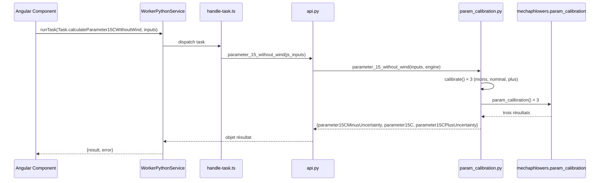

# Paramètre à 15 °C sans vent

## Objectif

L'onglet **Paramètre à 15 °C sans vent** calcule le paramètre du câble dans une condition standardisée (température de 15 °C, vent nul) à partir des entrées de mesure de terrain. Le calcul utilise la fonction `param_calibration` de mechaphlowers pour effectuer une unique étape de Newton-Raphson avec dérivée par différences finies, produisant trois résultats : une estimation centrale et des bornes d'incertitude (moins / plus).

## Composant et fichiers

- **Composant Angular** : `src/app/features/studio/field-measuring/presentation/components/parameter-calculation-15-without-wind/parameter-calculation-15-without-wind.component.ts` et `.html`
- **Modèle de données** : `src/app/shared/domain/models/field-measure.model.ts` (interfaces `FieldMeasure`, `Parameter15CResult`, `ManualParameterCalculation15CWithoutWind`)
- **Tâche du worker** : `src/app/core/services/worker_python/tasks/types.ts` (énumération `Task.calculateParameter15CWithoutWind`)
- **Dispatcheur de tâches** : `src/app/core/services/worker_python/tasks/handle-task.ts` (associe à la fonction Python `parameter_15_without_wind`)
- **API Python** : `src/app/core/services/worker_python/tasks/python-scripts/api.py`
- **Stellar Engine** : `stellar-engine/src/stellar_engine/tools/param_calibration.py` (fonction module `parameter_15_without_wind`)
- **Dataclass des entrées** : `stellar-engine/src/stellar_engine/entities/inputs.py` (classe `ParameterCalibrationInputs`)
- **Service de condition initiale** : `src/app/core/services/initial-condition/initial-condition.service.ts` (méthode `addInitialCondition`)

## Diagramme de séquence



## Entrées

Le composant accepte quatre valeurs de mesure et un indice de portée :

| Nom | Type | Source (Auto) | Source (Manuel) | Unité | Description |
|---|---|---|---|---|---|
| Paramètre mesuré | `number` | `outputs.papoto.parameter` | Saisie manuelle | m | Le fléchage ou l'extension mesuré du câble via PAPOTO ou autre méthode ; noté $P$ |
| Incertitude du paramètre | `number` | `outputs.papoto.uncertainty` | Saisie manuelle | m | Incertitude de mesure du paramètre ; notée $Inc_P$ |
| Température du câble | `number` | `outputs.cableTemperature.cableTemperature` | Saisie manuelle | °C | Température du câble au moment de la mesure ; notée $T$ |
| Incertitude de température | `number` | `outputs.cableTemperature.cableTemperatureUncertainty` | Saisie manuelle | °C | Incertitude de mesure de température ; notée $Inc_T$ |
| Indice de portée | `number` | `data.span[0]` (première portée sélectionnée) | Fixe | — | Indice de la portée utilisée pour l'étalonnage |

### Modes Auto et Manuel

- **Auto** : lit les quatre valeurs depuis les sorties des onglets précédents (`papoto`, `cableTemperature`)
- **Manuel** : l'utilisateur saisit les quatre valeurs via les champs d'entrée

Lors du passage de **Auto** à **Manuel**, seuls les champs restés non définis sont préremplis à partir des valeurs auto (tronquées) ; les valeurs manuelles existantes sont conservées.

## Calcul

Le calcul appelle `mechaphlowers.param_calibration()` **trois fois** :

| Résultat | Température mesurée | Paramètre mesuré |
|---|---|---|
| $P_{min}$ (`parameter15CMinusUncertainty`) | $T - 0.9 \times 1.65 \times Inc_T$ | $P - 0.5 \times 1.65 \times Inc_P$ |
| $P$ (`parameter15C`) | $T$ | $P$ |
| $P_{max}$ (`parameter15CPlusUncertainty`) | $T + 0.9 \times 1.65 \times Inc_T$ | $P + 0.5 \times 1.65 \times Inc_P$ |

Les constantes sont définies dans `stellar-engine/src/stellar_engine/tools/param_calibration.py` :

```python
COVERAGE_FACTOR = 1.65
TEMPERATURE_UNCERTAINTY_WEIGHT = 0.9
PARAMETER_UNCERTAINTY_WEIGHT = 0.5
```

### Algorithme (`mechaphlowers.param_calibration`)

Chaque appel à `mechaphlowers.param_calibration()` réalise :

1. **Construction d'un `BalanceEngine`** en utilisant le tableau de section et le tableau de câbles de l'étude
2. **Estimation de l'état dans la condition mesurée** via `solve_adjustment()` — ajuste itérativement le câble pour correspondre au paramètre mesuré à la température mesurée
3. **Calcul de l'état à 15 °C, sans vent** via `solve_change_state()` — calcule le paramètre d'équilibre dans la condition de référence (15 °C, sans vent)

La fonction utilise une dérivée par différences finies pour estimer la sensibilité du câble aux variations de paramètre.

## Sorties

| Nom | Type | Unité | Description |
|---|---|---|---|
| `parameter15CMinusUncertainty` | `number` | m | Paramètre à 15 °C avec borne inférieure d'incertitude |
| `parameter15C` | `number` | m | Estimation centrale du paramètre à 15 °C |
| `parameter15CPlusUncertainty` | `number` | m | Paramètre à 15 °C avec borne supérieure d'incertitude |

## Validation et gestion des erreurs

### Validation du formulaire

- **Mode Auto** : les quatre valeurs doivent être des nombres (ni null, ni undefined)
- **Mode Manuel** : les quatre champs saisis manuellement doivent être des nombres

L'état invalide est contrôlé par le signal `isFormValid()`.

### Gestion des erreurs

- **signal `parameter15CError`** : défini à `true` en cas d'échec de validation ou d'erreur de calcul Python
- **signal `isCalculating`** : défini à `true` pendant l'exécution de la tâche worker ; empêche les clics simultanés
- **notification utilisateur** : en cas d'échec de validation, l'interface affiche le message « All fields are mandatory for parameter calculation at 15°C »

## Création d'une condition initiale

Chacun des trois résultats dispose d'un bouton **Créer une condition initiale**. En cliquant dessus :

1. la modale de création de condition initiale s'ouvre avec `mode: 'create'`
2. `base_parameters` est prérempli avec la valeur du résultat sélectionné (déjà arrondie à 1 décimale au niveau Python)
3. `base_temperature` est prérempli à `15`
4. `InitialConditionService.addInitialCondition()` est appelé lorsque l'utilisateur confirme

La modale préremplit les autres champs (précontrainte du câble, conditions min/max) avec des valeurs par défaut ou existantes.

## Note de déploiement : mises à jour de Pyodide

Le worker Pyodide charge le wheel précompilée depuis `public/pyodide/stellar_engine-*-cp313-none-any.whl`, **et non** le dossier source `stellar-engine/`.

```{warning}
Après modification de `stellar-engine/`, il faut :

1. reconstruire la roue :
   ```bash
   python3 scripts/set_up_mechaphlowers_v2.py --engine-only
   ```

2. la recompiler pour Pyodide :
   ```bash
   uvx --from pyodide-build pyodide py-compile --compression-level 6 public/pyodide/stellar_engine-0.3.0-py3-none-any.whl
   ```

3. vérifier que `file_name` dans `src/app/core/services/worker_python/python-packages.json` se termine par `-cp313-none-any.whl`

Si la roue n'est pas mise à jour, Pyodide chargera un code périmé.
```

## Tests

- **Composant Angular** : `src/app/features/studio/field-measuring/presentation/components/parameter-calculation-15-without-wind/parameter-calculation-15-without-wind.component.spec.ts`
- **Module Python** : `stellar-engine/test/tools/test_param_calibration.py`
