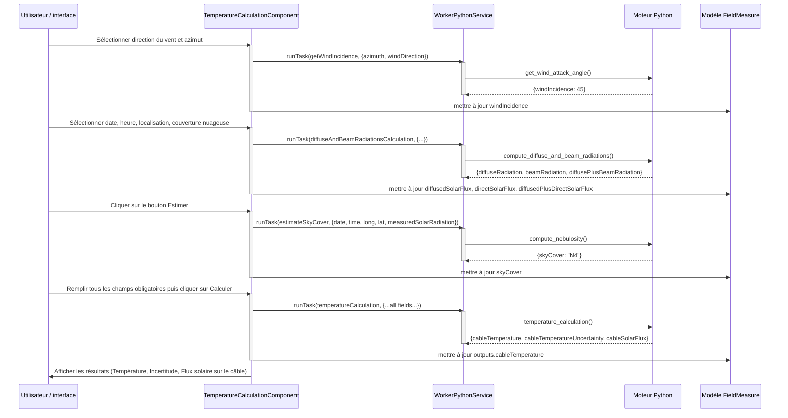

# Calcul de la température

## Objectif

L'onglet **Calcul de la température** calcule la température stationnaire du câble dans des conditions de terrain mesurées, comprenant la température ambiante, le courant de transit, la vitesse et la direction du vent, ainsi que le rayonnement solaire. Le composant exploite quatre tâches worker pour :

1. calculer l'angle d'incidence du vent par rapport au câble
2. calculer les rayonnements solaire diffus et direct à partir de la géométrie et de la couverture nuageuse
3. estimer la couverture nuageuse à partir du rayonnement solaire mesuré
4. exécuter le calcul final d'équilibre thermique via mechaphlowers

## Composant et fichiers

La fonctionnalité de calcul de température est implémentée dans :

- `src/app/features/studio/field-measuring/presentation/components/temperature-calculation/temperature-calculation.component.ts`
- `src/app/features/studio/field-measuring/presentation/components/temperature-calculation/temperature-calculation.component.html`
- `src/app/features/studio/field-measuring/presentation/constants.ts` (bornes et options)
- `src/app/features/studio/field-measuring/presentation/helpers.ts` (fonctions utilitaires)
- `src/app/shared/domain/models/field-measure.model.ts` (types `FieldMeasure` et `TemperatureCalculationResult`)

## Tâches du worker

Le composant orchestre quatre tâches Python via `WorkerPythonService`. Chaque tâche est mappée vers une fonction Python dans `stellar-engine/src/stellar_engine/tools/temperature.py`.

### Tâche : getWindIncidence

**Déclenchée par :**  
Un effet qui se déclenche chaque fois que `windDirection` ou `azimuth` change et que le worker est prêt. L'utilisateur sélectionne le mode « Auto » pour l'incidence du vent (le mode manuel affiche 90°).

**Type d'entrée :** `TaskInputs[Task.getWindIncidence]`

| Champ | Type | Unité | Signification |
|-------|------|------|---------|
| `azimuth` | number | degrés | Orientation du câble (0° = Nord/Sud, 90° = Est/Ouest, etc.) |
| `windDirection` | string | — | Direction cardinale (« North », « North-East », etc.) depuis `WIND_DIRECTION_OPTION_KEYS` |

**Type de sortie :** `TaskOutputs[Task.getWindIncidence]`

| Champ | Type | Unité | Signification |
|-------|------|------|---------|
| `windIncidence` | number | degrés | Angle d'attaque du vent sur le câble (0°–90°, calculé à partir de l'azimut du câble et de la direction du vent) |

**Implémentation Python :**  
Associe le nom de direction du vent à un azimut en degrés (par exemple, « North-East » → 45°), puis appelle `ThermalEngine.compute_wind_attack_angle()` de mechaphlowers pour calculer l'angle entre le vent et le câble.

---

### Tâche : diffuseAndBeamRadiationsCalculation

**Déclenchée par :**  
Un effet qui se déclenche chaque fois que `date`, `time`, `longitude`, `latitude` ou `skyCover` change et que le worker est prêt. Elle s'exécute automatiquement pour remplir les champs d'affichage du rayonnement solaire.

**Type d'entrée :** `TaskInputs[Task.diffuseAndBeamRadiationsCalculation]`

| Champ | Type | Unité | Signification |
|-------|------|------|---------|
| `date` | Date \| null | — | Date de mesure (par exemple, 2025-06-21) |
| `time` | Date \| null | — | Heure de mesure sous forme d'objet Date (partie heure seulement, UTC) |
| `longitude` | number | degrés | Longitude géographique |
| `latitude` | number | degrés | Latitude géographique |
| `skyCover` | SkyCover | — | Enum de couverture nuageuse (N0–N8, où N0 = ciel clair, N8 = entièrement couvert) |

**Type de sortie :** `TaskOutputs[Task.diffuseAndBeamRadiationsCalculation]`

| Champ | Type | Unité | Signification |
|-------|------|------|---------|
| `diffuseRadiation` | number | W/m² | Rayonnement solaire diffus (dispersé) sur plan horizontal |
| `beamRadiation` | number | W/m² | Rayonnement solaire direct (faisceau) sur plan horizontal |
| `diffusePlusBeamRadiation` | number | W/m² | Irradiance horizontale globale totale |

**Implémentation Python :**  
Convertit les entrées en `numpy.datetime64` et appelle `ThermalEngine.diffuse_and_beam_solar_radiations()` de mechaphlowers, qui calcule le modèle ESRA (Estrada Solar Radiation Analysis) en fonction du moment, de l'emplacement et de la couverture nuageuse. Retourne `NaN` si le calcul se fait la nuit (erreur `NightTimeError` levée internement, capturée par le composant).

---

### Tâche : estimateSkyCover

**Déclenchée par :**  
L'utilisateur clique sur le bouton **Estimate** à côté du champ **Solar beam radiation (not required)**. Nécessite `date`, `time`, `longitude`, `latitude` et une valeur de rayonnement solaire mesurée valide (0–2000 W/m²).

**Type d'entrée :** `TaskInputs[Task.estimateSkyCover]`

| Champ | Type | Unité | Signification |
|-------|------|------|---------|
| `date` | Date \| null | — | Date de mesure |
| `time` | Date \| null | — | Heure de mesure (UTC) |
| `longitude` | number | degrés | Longitude géographique |
| `latitude` | number | degrés | Latitude géographique |
| `measuredSolarRadiation` | number | W/m² | Irradiance solaire globale mesurée (issue de la saisie utilisateur ou estimée) |

**Type de sortie :** `TaskOutputs[Task.estimateSkyCover]`

| Champ | Type | Unité | Signification |
|-------|------|------|---------|
| `skyCover` | SkyCover | — | Valeur de couverture nuageuse inférée (N0–N8) |

**Implémentation Python :**  
Appelle `ThermalEngine.nebulosity()` de mechaphlowers pour résoudre inversement la couverture nuageuse, à partir du rayonnement mesuré. Lève `NightTimeError` si l'heure correspond à la nuit, capturée et affichée comme erreur utilisateur localisée. Si le résultat est `NaN` ou hors limites, lève `ValueError`.

---

### Tâche : temperatureCalculation

**Déclenchée par :**  
L'utilisateur clique sur le bouton **Calculer** après avoir rempli tous les champs obligatoires. Le formulaire est valide uniquement si :
- le nom du câble est renseigné
- le transit (A) est défini et dans [0, 4000] A
- la couverture nuageuse est sélectionnée
- le flux solaire mesuré (si présent) est dans [0, 2000] W/m²

**Type d'entrée :** `TaskInputs[Task.temperatureCalculation]`

| Champ | Type | Unité | Signification |
|-------|------|------|---------|
| `cableName` | string | — | Identifiant du câble depuis le catalogue (par exemple, « ASTER 600 ») |
| `ambientTemperature` | number | °C | Température de l'air ambiant (par défaut 0) |
| `longitude` | number | degrés | Longitude géographique (par défaut 0) |
| `latitude` | number | degrés | Latitude géographique (par défaut 0) |
| `altitude` | number | m | Altitude du sol au-dessus du niveau de la mer (par défaut 0) |
| `azimuth` | number | degrés | Orientation du câble (par défaut 0) |
| `transit` | number | A | Intensité du courant dans le conducteur (0–4000 A) |
| `date` | Date \| null | — | Date de mesure |
| `time` | Date \| null | — | Heure de mesure (UTC) |
| `windSpeed` | number | km/h ou m/s | Vitesse du vent (par défaut 0) ; l'unité est précisée séparément |
| `windSpeedUnit` | "kmh" \| "ms" | — | Unité de la vitesse du vent |
| `windDirection` | string | — | Direction cardinale (« North », « North-East », etc., par défaut « North ») |
| `skyCover` | SkyCover | — | Couverture nuageuse (N0–N8) |

**Type de sortie :** `TaskOutputs[Task.temperatureCalculation]`

| Champ | Type | Unité | Signification |
|-------|------|------|---------|
| `cableTemperature` | number | °C | Température stationnaire du câble dans les conditions données |
| `cableTemperatureUncertainty` | number | °C | Intervalle d'incertitude (par exemple ±1,06 °C) |
| `cableSolarFlux` | number \| null | W/m² | Toujours `null` dans les données renvoyées |

**Implémentation Python :**  
Construit un dataclass `TemperatureCalculationInputs` et le transmet à `temperature_calculation()`, qui :
1. crée une instance `ThermalEngine`
2. récupère les propriétés du câble dans `engine.cable_array`
3. configure le moteur thermique avec la géométrie, les coordonnées, la température, la vitesse et l'angle du vent, la nébulosité
4. appelle `thermal_engine.steady_temperature(return_uncertainty=True)` de mechaphlowers
5. renvoie la température de cœur du câble et son incertitude

Le modèle thermique prend en compte le chauffage Joule (I²R), l'absorption solaire et le refroidissement convectif / radiatif, avec propagation d'incertitude à partir des erreurs de mesure des entrées.

---

## Flux de données et séquence



---

## Modèle de données `FieldMeasure`

Le composant lit et écrit les champs suivants de l'interface `FieldMeasure` (définie dans `src/app/shared/domain/models/field-measure.model.ts`) :

### Lecture (entrées)

- `cableName: string | null` — nom du conducteur sélectionné
- `ambientTemperature: number | null` — saisi par l'utilisateur ou hérité depuis l'onglet précédent
- `longitude, latitude, altitude: number | null` — coordonnées géographiques depuis l'onglet « Données terrain »
- `azimuth: number | null` — orientation du câble depuis l'onglet « Données terrain »
- `date, time: Date | null` — date/heure de mesure depuis l'onglet « Données terrain »
- `windSpeed: number | null`, `windSpeedUnit: 'kmh' | 'ms'` — conditions de vent
- `windDirection: string | null` — direction cardinale depuis la liste déroulante
- `windIncidenceMode: 'auto' | 'perpendicular'` — mode sélectionné par l'utilisateur
- `skyCover: SkyCover | null` — enum de couverture nuageuse (N0–N8)
- `measuredDiffusedPlusDirectSolarFlux: number | null` — rayonnement solaire saisi ou estimé

### Écriture (sorties)

- `windIncidence: number | null` — calculé par la tâche `getWindIncidence`
- `diffusedSolarFlux: number | null` — calculé par la tâche `diffuseAndBeamRadiationsCalculation`
- `directSolarFlux: number | null` — calculé par la tâche `diffuseAndBeamRadiationsCalculation`
- `diffusedPlusDirectSolarFlux: number | null` — calculé par la tâche `diffuseAndBeamRadiationsCalculation`
- `outputs.cableTemperature: TemperatureCalculationResult | null` — résultat final de la tâche `temperatureCalculation`
  - `cableTemperature: number` — température stationnaire (°C)
  - `cableTemperatureUncertainty: number` — borne d'incertitude (°C)
  - `cableSolarFlux: number | null` — actuellement toujours `null`

---

## Validation et gestion des erreurs

### Validité du formulaire

Le bouton **Calculer** reste désactivé tant que :

```typescript
isFormValid = computed(() => {
  const data = this.measureData();
  return (
    data.cableName !== null &&
    data.transit !== null &&
    data.skyCover !== null &&
    !this.isTransitOutOfBounds() &&
    !this.isMeasuredSolarFluxOutOfBounds()
  );
});
```

### Bornes des entrées

**Transit (A) :**  
- Minimum : 0 A  
- Maximum : 4000 A  
- Constante de validation : `TRANSIT_BOUNDS = { min: 0, max: 4000 }`
- Message d'erreur : « Minimum transit value: 0 A. » ou « Maximum transit value: 4000 A. »

**Rayonnement solaire mesuré (W/m²) :**
- Minimum : 0 W/m²
- Maximum : 2000 W/m²
- Erreur locale : « Le rayonnement solaire mesuré doit être compris entre 0 et 2000 W/m². »

**Couverture nuageuse :**
- Valeur obligatoire dans `SkyCover`
- Si la mesure est effectuée de nuit, le bouton **Estimate** affiche une erreur locale depuis `NightTimeError`

### Comportement en erreur

Le composant capture les erreurs de worker et les messages de validation pour empêcher des calculs incohérents. Les erreurs sont affichées à l'utilisateur sous forme de message de notification ou de message d'état, tandis que les détails techniques sont enregistrés via le service de journalisation.

---

## Notes de mise en œuvre

- Le mode **Auto** pour l'incidence du vent est le comportement par défaut.
- Les champs de rayonnement solaire diffus/direct sont mis à jour automatiquement lorsque des changements de date, d'heure ou de couverture nuageuse surviennent.
- Le bouton **Estimate** s'appuie sur une résolution inverse de la nébulosité à partir d'un flux solaire mesuré.
- La tâche finale renvoie la température et l'incertitude, mais le flux solaire sur le câble est actuellement conservé pour compatibilité, sans valeur exploitable.
