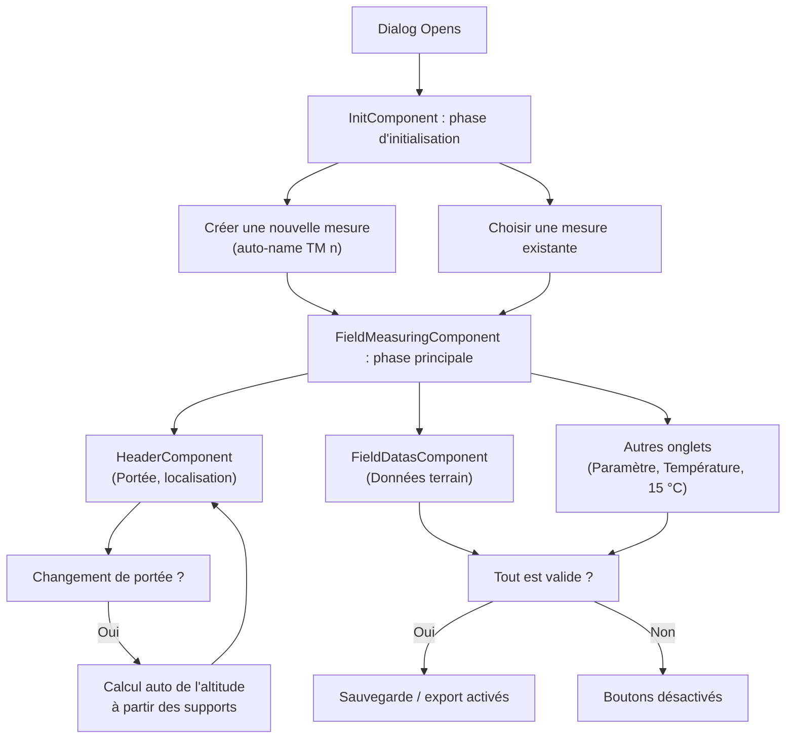

# Onglet Données terrain

## Objectif

L'onglet **Données terrain** collecte les données environnementales et de localisation enregistrées au cours d'une session de mesure sur site. Il fait partie de l'outil **Mesure de terrain**, qui calcule le paramètre de base et les propriétés thermiques associées à partir des observations sur site.

## Arborescence des composants et fichiers

L'onglet Données terrain est implémenté par les composants et fichiers suivants (chemins relatifs depuis `src/app/features/studio/field-measuring/`) :

- **Boîte de dialogue principale** : `presentation/components/field-measuring/field-measuring.component.ts` (onglets, validation, sauvegarde/export)
- **Onglet Données terrain** : `presentation/components/field-datas/field-datas.component.ts` et `.html`
- **En-tête partagé** (au-dessus de tous les onglets) : `presentation/components/header/header.component.ts` et `.html`
- **Écran d'initialisation** (créer/sélectionner une mesure) : `presentation/components/init/init.component.ts` et `.html`
- **Modèle de domaine** : `domain/types.ts` (exporte l'interface `FieldMeasure`)
- **Helpers** : `presentation/helpers.ts` (par exemple `createInitialMeasureData`, `buildTimeModeOptions`, générateurs d'options)
- **Constantes** : `presentation/constants.ts` (bornes, clés d'options, correspondances d'export)
- **Helpers d'export** : `presentation/field-measure-export.helpers.ts` (structure JSON d'export)

## Flux de travail

1. **Phase d'initialisation** : l'utilisateur ouvre l'outil de mesure de terrain. `InitComponent` permet de créer une nouvelle mesure (avec un nom généré automatiquement) ou de sélectionner une mesure existante.
2. **Phase principale** : une fois une mesure sélectionnée ou créée, `FieldMeasuringComponent` affiche une boîte de dialogue avec quatre onglets. L'onglet **Données terrain** est affiché par défaut.
3. **Saisie des données** : l'utilisateur remplit les champs de localisation et environnementaux via `HeaderComponent` (partagé) et `FieldDatasComponent` (spécifique à l'onglet).
4. **Validation** : `FieldMeasuringComponent` calcule `isFormValid` en contrôlant tous les champs obligatoires et leurs bornes.
5. **Sauvegarde** : appelle `PlotService.modifySection()` pour enregistrer la mesure dans le tableau `field_measures` de la section.
6. **Export** : appelle `buildFieldMeasureExportJson()` pour générer un export JSON (si tous les onglets passent la validation).

## Modèle de données

Les données de la mesure sont typées comme `FieldMeasure` (depuis `domain/types.ts`), qui inclut :

- **UUID** : identifiant unique (généré automatiquement via `uuidv4()`).
- **Nom** : nom saisi par l'utilisateur ; doit être unique dans la section.
- **Métadonnées** (lecture seule venant de la section) : `link`, `voltage`, `spanType`, `phaseNumber`, `numberOfConductors`.
- **Données terrain** (onglet Données terrain) :
  - `date` (Date) : date de mesure
  - `time` (Date) : heure de mesure
  - `season` ('summer' | 'winter') : déduit de l'heure d'été
  - `ambientTemperature` (number, °C) : plage -50 à 99
  - `windSpeed` (number) : plage 0 à 50
  - `windSpeedUnit` ('kmh' | 'ms') : km/h ou m/s
  - `windDirection` (string) : un des 8 points cardinaux (Nord, Nord-Est, …)
  - `skyCover` (enum SkyCover N0–N8) : échelle de nébulosité
- **Données de localisation** (en-tête partagé) :
  - `span` (number[] | null) : `[leftSupportIndex, rightSupportIndex]`
  - `longitude` (number, degrés) : plage -180 à 180
  - `latitude` (number, degrés) : plage -90 à 90
  - `altitude` (number, m) : plage -100 à 9000 ; calculée automatiquement à partir des hauteurs des supports de la portée
  - `azimuth` (number, degrés) : plage -180 à 180
- **Sorties** (calculées) : `papoto` (PapotoResult | null), `cableTemperature` (TemperatureCalculationResult | null), `parameter15C` (Parameter15CResult | null)

D'autres champs existent pour les autres onglets (calcul du paramètre, température, paramètre à 15 °C) ; voir le modèle complet pour le détail.

## Liaisons de champs et événements

### HeaderComponent

**Entrées :**
- `measureData: InputSignal<FieldMeasure>` – données courantes de la mesure
- `fieldChange: OutputSignal<{ field: keyof FieldMeasure; value: any }>` – émis lorsque l'utilisateur modifie un champ

**Comportement :**
- Affiche les informations non modifiables : Liaison, Tension, Type de portée, Numéro de phase, Nombre de câbles.
- Liste déroulante de la portée : préremplie à partir des supports de la section ; sélectionne automatiquement la première portée à l'ouverture de la boîte de dialogue (si aucune n'est sélectionnée).
- Lorsqu'une portée change : l'altitude est recalculée comme moyenne des hauteurs d'attache des deux supports.
- Longitude / Latitude / Altitude / Azimut : champs numériques avec badges obligatoires et validation de plage.
- Lorsqu'une portée ou un support de référence change, le composant tente aussi de préremplir la longitude / latitude / azimut à partir de la localisation de l'étude pour cette portée.

**Résolution automatique de localisation :**
- La logique est dans `HeaderComponent.fillLocalization()` et utilise le même contrat de worker que la vue de données de section : `Task.computeLocalization`.
- `buildSectionLocalizationPayload()` construit la charge utile à partir des `start_latitude`, `start_longitude`, `start_azimuth` de la section, ainsi que des `spanLength` / `spanAngle` de chaque support.
- `getSpanLocalization()` sélectionne la localisation correspondante du support calculé, en privilégiant le support de référence sélectionné puis le support gauche à défaut.
- Si aucune valeur finie n'est disponible, l'application affiche le message d'information traduit `field-measuring.header.localization-not-available` (texte : « Localization not available in study »).

### FieldDatasComponent

**Entrées :**
- `measureData: InputSignal<FieldMeasure>` – données courantes de la mesure
- `isNameAlreadyTaken: InputSignal<boolean>` – signale une erreur de nom en double

**Sorties :**
- `fieldChange: OutputSignal<{ field: keyof FieldMeasure; value: any }>` – émis lors d'un changement de champ

**Champs :**
- **Nom de la mesure** : champ texte ; unicité validée au niveau parent.
- **Date** : sélecteur de date (format jj/mm/aa).
- **Heure / Saison** : bascule de saison (Été / Hiver) + sélecteur d'heure (format 24 h).
- **Température ambiante** : champ numérique (°C), plage -50 à 99.
- **Vitesse du vent** : champ numérique (0–50) + bascule d'unité (km/h ou m/s).
- **Direction du vent** : liste déroulante (8 points cardinaux).
- **Couverture nuageuse** : liste déroulante (échelle N0–N8 de nébulosité).

Tous les champs affichent un message de champ obligatoire (`field-measuring.field-datas.mandatory-msg`).

### InitComponent

**Objectif :** Créer une nouvelle mesure ou sélectionner une mesure existante avant d'entrer dans la boîte de dialogue principale.

**Flux :**
1. **Créer** : saisir un nom (prérempli comme « TM n+1 » où n = nombre de mesures) → cliquer sur « Créer une nouvelle mesure » → passer à la phase principale.
2. **Choisir** : sélectionner dans la liste déroulante une mesure existante → cliquer sur « Choisir » → passer à la phase principale.

**Validation :**
- Le nom doit être fourni et unique (contrôlé par rapport aux mesures existantes).
- Les noms dupliqués affichent le message d'erreur : `field-measuring.shared.measure-name-unique-error`.

## Règles de validation

### Bornes des champs (`FieldMeasuringComponent.isFormValid`)

Tous les champs sont obligatoires et sont contrôlés pour leurs plages :
- `name` : non vide, unique
- `span` : doit être défini
- `longitude` : -180 à 180
- `latitude` : -90 à 90
- `altitude` : -100 à 9000
- `azimuth` : -180 à 180
- `windSpeed` : 0 à 50
- `ambientTemperature` : -50 à 99
- `windDirection`, `skyCover` : requis
- `transit` (champ optionnel dans d'autres onglets) : si présent, 0–4000 ampères

**Validation d'export** : le bouton d'export n'est activé que si `isFormValid()` ET tous les autres onglets (Calcul du paramètre, Calcul de la température, Paramètre à 15 °C) sont également valides.

**Contrôle d'unicité** : la propriété calculée `isNameAlreadyTaken` vérifie si `measureData().name` correspond à une mesure existante (en excluant l'élément courant par UUID).

## Sauvegarde et export

### Sauvegarde

- **Gestionnaire** : `FieldMeasuringComponent.onSave()`
- **Condition** : activé lorsque `isFormValid() && hasUnsavedChanges()`
- **Action** : appelle `PlotService.modifySection({ field_measures: [...updated...] })` pour enregistrer
- **Instantané** : `lastSavedMeasureData` est mis à jour ; `hasUnsavedChanges` est recalculé

### Export

- **Gestionnaire** : `FieldMeasuringComponent.onExport()`
- **Condition** : activé lorsque `isFormValid() && isParameterCalculationValid && isTemperatureCalculationValid && isParameterAt15CValid`
- **Sortie** : fichier JSON (via `buildFieldMeasureExportJson()`) contenant les métadonnées de l'étude / section et les données de mesure
- **Nom du fichier** : `Export Mesure de terrain_<measure name>_<section name>_<date>.json`

## Diagramme Mermaid : flux de travail

## Tests

Les fichiers de spécification suivants couvrent la fonctionnalité des données terrain :

- `presentation/components/field-datas/field-datas.component.spec.ts` – onglet Données terrain
- `presentation/components/header/header.component.spec.ts` – en-tête (localisation et portée)
- `presentation/components/init/init.component.spec.ts` – écran d'initialisation (créer/sélectionner)
- `presentation/components/field-measuring/field-measuring.component.spec.ts` – boîte de dialogue, validation, sauvegarde/export
- `presentation/field-measure-export.helpers.spec.ts` – structure de l'export JSON
- `presentation/components/temperature-calculation/temperature-calculation.component.spec.ts` – onglet lié
- `presentation/components/parameter-calculation-15-without-wind/parameter-calculation-15-without-wind.component.spec.ts` – onglet lié
- `presentation/components/calculus-setting/calculus-setting.component.spec.ts` – onglet lié
